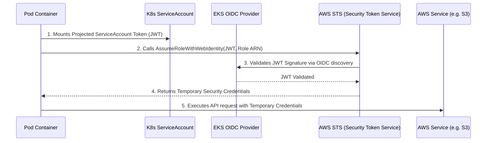

# Pattern: AWS EKS IAM Roles for Service Accounts (IRSA)

**Breadcrumbs:** [[0-Index|🏠 Index]] > Patterns > **AWS EKS IAM Roles for Service Accounts (IRSA)**

---

## 🏛️ Architectural Context

**IAM Roles for Service Accounts (IRSA)** is the industry-standard security pattern used to assign granular AWS IAM permissions directly to individual Kubernetes Pods, eliminating the need to assign broad IAM permissions to the EKS worker nodes (EC2 instance profiles).



### Core Components:
1.  **OpenID Connect (OIDC) Federated Identity:** EKS hosts an OIDC identity provider endpoint. AWS IAM trusts this provider.
2.  **Kubernetes ServiceAccount Annotation:** The ServiceAccount is annotated with `eks.amazonaws.com/role-arn: arn:aws:iam::<ACCOUNT_ID>:role/<ROLE_NAME>`.
3.  **EKS Pod Identity Webhook:** An admission controller mutates pods matching the ServiceAccount, injecting:
    *   `AWS_ROLE_ARN` and `AWS_WEB_IDENTITY_TOKEN_FILE` environment variables.
    *   A projected volume mounting the OIDC JWT token to `/var/run/secrets/eks.amazonaws.com/serviceaccount/token`.
4.  **AWS SDK (Application Layer):** Reads environment variables and automatically assumes the role via STS.

---

## ⚖️ Trade-offs & Alternatives

*   **Pros:**
    *   **Principle of Least Privilege:** Pod A (backend) can have access to S3, while Pod B (frontend) has zero AWS permissions, even if they run on the same worker node.
    *   **No Hardcoded Secrets:** Credentials are short-lived (STS tokens rotate automatically) and never committed to version control.
*   **Cons:**
    *   **Setup Overhead:** Requires configuring an OIDC provider in IAM and managing IAM trust relationships.
*   **Alternatives:**
    *   **EKS Pod Identities (AWS-managed alternative):** Simpler configuration bypassing OIDC trust policies, but requires EKS agent daemonsets on nodes.

---

## 🛠️ Verification & Practical Implementation

### 1. Annotate the ServiceAccount:
```yaml
apiVersion: v1
kind: ServiceAccount
metadata:
  name: s3-reader-sa
  namespace: default
  annotations:
    eks.amazonaws.com/role-arn: arn:aws:iam::123456789012:role/MyS3ReadOnlyRole
```

### 2. IAM Role Trust Policy (Allows EKS OIDC AssumeRole):
```json
{
  "Version": "2012-10-17",
  "Statement": [
    {
      "Effect": "Allow",
      "Principal": {
        "Federated": "arn:aws:iam::123456789012:oidc-provider/oidc.eks.us-east-1.amazonaws.com/id/EXAMPLEDOCUMENT"
      },
      "Action": "sts:AssumeRoleWithWebIdentity",
      "Condition": {
        "StringEquals": {
          "oidc.eks.us-east-1.amazonaws.com/id/EXAMPLEDOCUMENT:sub": "system:serviceaccount:default:s3-reader-sa"
        }
      }
    }
  ]
}
```

*Read more in [3-2_aws_iam.md](../Reference%20Notes/3-2_aws_iam.md) and [0-7_security_and_network_policies.md](../Reference%20Notes/0-7_security_and_network_policies.md)*
