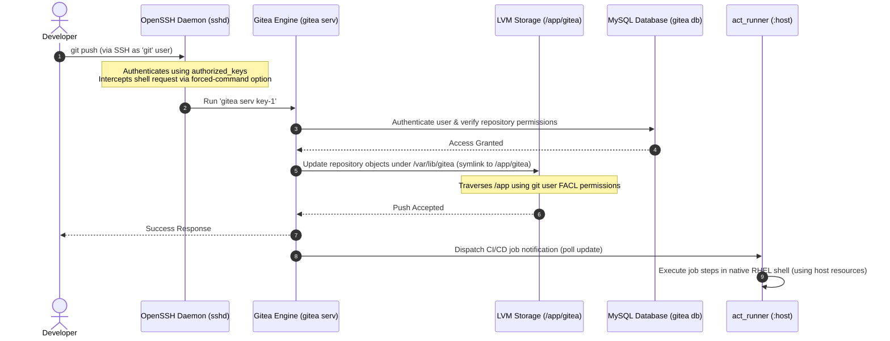

# Pattern: Air-Gapped Git Architecture on RHEL

**Breadcrumbs:** [[0-Index|🏠 Index]] > Patterns > **Air-Gapped Git Architecture on RHEL**

---

## 🏛️ Architectural Context

In highly restricted air-gapped environments, establishing a robust developer loop requires coordinating version control, access policies, storage performance, and build runners without external network routing. This pattern details how unprivileged process execution, SSH shell isolation, logical storage redirection, and host-native runners cooperate to build a resilient, secure Git loop on Red Hat Enterprise Linux (RHEL) 8.

### Interactive Component Coordination

The system leverages standard Linux constructs to form a secure execution path:
1. **Unprivileged Process Execution:** The Gitea daemon executes under a dedicated system user (`git`) with UID < 1000, separating the runtime context from the root operating system.
2. **SSH Shell Isolation:** OpenSSH intercepts developer connections. By using forced-command options (`command="gitea serv...",no-port-forwarding,no-X11-forwarding`), it multiplexes Git transactions through the single `git` Linux user without exposing an interactive shell.
3. **LVM Storage Redirection:** Gitea's standard FHS storage path (`/var/lib/gitea`) is symlinked to `/app/gitea` on a dedicated LVM logical volume (`/dev/vg_app/lv_app`), preventing raw repository pushes from exhausting the OS root partition space.
4. **MySQL Database Isolation:** Gitea maintains metadata inside a multi-tenant MySQL database configured with `utf8mb4_unicode_ci` to support Unicode characters. Database permissions are restricted strictly to the `gitea` database over local loopback (`gitea@localhost`).
5. **Host-Native Execution:** The CI/CD runner (`act_runner`) bypasses unreachable public container registries by executing jobs directly within the host's bash environment via the `rhel-native:host` label.



---

## 🔄 GitOps Declarative Workflows & API Reconciliation Mechanics

In an air-gapped architecture, the Gitea repository acts as the **GitOps Single Source of Truth**. Any commit pushed to the main branch represents a change to the declared desired state of the cluster. The host-native runner (`act_runner`) executes deployment pipelines that reconcile this declared state with the live cluster using the Kubernetes API:

### 1. Declarative Reconciliation vs. Imperative Actions
* **The GitOps Rule**: Imperative CLI commands (`kubectl run`, `kubectl create`) are forbidden in production as they bypass version control, leaving no audit trail. Instead, the GitOps pipeline executes declarative commands (`kubectl apply -f manifest.yaml`), allowing the control plane to compute the necessary changes.
* **Client-Side Pre-flight Validation**: Before the runner submits the manifest, `kubectl` performs local structural validation against cached OpenAPI schemas (located under `~/.kube/cache/schema`). 
  * *Version Skew Caveat*: In isolated air-gapped environments, client tools may suffer from version skew against the control plane, leading to false validation rejections. Pipelines can bypass this local pre-flight check using the `--validate=false` flag, sending the raw manifest directly to the API server's admission control chain.

### 2. The 3-Way Merge Engine
When `kubectl apply` is invoked by the runner, the Kubernetes API server does not overwrite the resource. It computes an API patch by comparing three sources:
1. **The Local File**: The configuration file checked out from the Gitea repository.
2. **The Live Object**: The active object state stored in `etcd`, which includes default values and mutations from admission controllers.
3. **The Last-Applied-Configuration**: A JSON serialization of the previously applied manifest stored under the `kubectl.kubernetes.io/last-applied-configuration` annotation inside the live object.

* **Handling Field Deletions**: If a GitOps commit deletes a field (e.g., a label or container port), the 3-Way Merge engine compares the local file (field absent) with the last-applied annotation (field present). Seeing it was previously declared but is now missing, the engine identifies the deletion intent and patches the live object in `etcd` to remove the field. Without this annotation, the engine could not distinguish between an intentional deletion and an ignored default, allowing deleted configuration to drift indefinitely.

### 3. Server-Side Apply (SSA) & Multi-Tenant Integrity
In modern clusters, the client-side merge is replaced by **Server-Side Apply (SSA)**, shifting reconciliation logic to the `kube-apiserver` (using `kubectl apply --server-side` or direct `PATCH` requests with `application/apply-patch+yaml` content type).
* **Field Ownership Tracking**: SSA tracks field managers inside `metadata.managedFields`. If Gitea's pipeline applies a manifest, it is recorded as the owner of those fields. If an operator attempts an out-of-band edit on a field owned by Gitea, the API server rejects it with a **Conflict** error, protecting GitOps governance.
* **Resolving etcd Metadata Size Limits**: Under client-side apply, the full JSON manifest must be stored in the metadata annotations. In complex GitOps architectures managing large Custom Resource Definitions (CRDs) or massive Deployments, these annotations can exceed `etcd` size constraints (typically 256KB for annotations, within the 1.5MB etcd object limit), causing deployment failures. SSA solves this by replacing the redundant JSON annotation string with compressed, indexed path footprints in `managedFields`.

### 4. Pod Spec Immutability and Recovery in GitOps
* **Immutability Boundary**: Pods are structurally immutable because their container runtime processes are bound directly to Linux kernel cgroups and namespaces. Only `spec.containers[*].image`, `spec.activeDeadlineSeconds`, and additions to `spec.tolerations` are mutable.
* **Recovery Playbook**: If a GitOps pipeline attempts to update an immutable field (e.g., mounting a new LVM volume or altering container ports), the API server returns a `403 Forbidden` error, stalling the deployment. To recover:
  1. The runner must capture the rejected configuration (similar to how manual errors are saved to `/tmp/kubectl-edit-xxxx.yaml`).
  2. The pipeline executes `kubectl replace --force -f manifest.yaml`.
  * *Signal Escalation*: This force-replace operation instantly deletes the old Pod object from etcd (`grace-period=0`), prompting the container runtime to issue an immediate `SIGKILL` (Signal 9) to PID 1—instantly destroying cgroups and namespaces—and immediately spawns the new Pod from the GitOps source.

---

## ⚖️ Trade-offs & Alternatives

Designing self-contained Git architectures involves evaluating security profiles, data consistency, and file system accessibility against deployment complexity:

### 1. Containerized Runners vs. Native Host Runners
* **Isolation & Sandboxing:** Containerized runners (Docker/Podman) run pipelines in isolated namespaces and cgroups, preventing one workflow from reading host files or processes. Host runners (`:host`) run build commands directly in the host OS shell. If a developer pushes a malicious workflow, they can execute Remote Code Execution (RCE) on the server.
* **Privilege Escalation:** If the runner service account has sudo permissions, a malicious pipeline can escalate privileges to `root` and fully compromise the server. Mitigations include running the runner daemon under a dedicated unprivileged user (e.g., `gitea-runner`) and strictly limiting sudo access to specified commands.
* **Workspace Cleanliness:** Containers start from a clean image and discard files on completion. Host runners persist leftover directories, dependencies, and build caches, risking dirty workspace states and disk capacity leaks.
* **Resource Contention:** Containers manage resources via daemon cgroups. Host runners can consume 100% of host CPU or RAM. This requires enforcing Systemd cgroup limits (`CPUQuota`, `MemoryLimit`, `TasksMax`) in the runner's service unit.

### 2. SQLite3 vs. MySQL/MariaDB Database Backend
* **Database Migration Overhead:** SQLite3 stores everything in a single database file (`gitea.db`). While simpler to set up initially, SQLite does not enforce strict data types, leading to mismatched column schemas during migration to a production MySQL database. Migrating later is error-prone and risks data corruption.
* **Concurrency & Locking:** SQLite locks the entire database file during writes, resulting in lock contention errors as developer count or API calls scale. MySQL supports row-level locking, enabling highly concurrent read/write operations.

### 3. File Access Control List (FACL) Traversal vs. Direct Permission Ownership Changes
* **Principle of Least Privilege:** Gitea's physical storage resides under `/app/gitea`, but the parent folder `/app` is owned by `root:root` with `700` (`drwx------`) permissions.
* **FACL Traversal:** Changing ownership of `/app` to the `git` user, or modifying its permissions to `755`, exposes the contents of the entire `/app` directory. A FACL traversal rule (`sudo setfacl -m u:git:x /app`) grants only the execute (`x`) permission to the `git` user, allowing it to traverse `/app` to access `/app/gitea` without reading or listing other files in the parent folder.

---

## 🛠️ Verification & Practical Implementation

### 1. Systemd Service Isolation Context
Processes managed by Systemd start without shell environment variables (e.g., `$HOME`, `$USER`). Gitea and Git commands depend on `$HOME` to locate `.gitconfig` and SSH directories. The service unit must explicitly inject these values.

Create `/etc/systemd/system/gitea.service`:
```ini
[Unit]
Description=Gitea (Git with a cup of tea)
After=network.target mysqld.service

[Service]
Type=simple
User=git
Group=git
WorkingDirectory=/var/lib/gitea
ExecStart=/usr/local/bin/gitea web --config /etc/gitea/app.ini
Restart=always
RestartSec=2s
Environment=USER=git HOME=/home/git GITEA_WORK_DIR=/var/lib/gitea

[Install]
WantedBy=multi-user.target
```

### 2. OpenSSH Daemon (`sshd_config`) Configuration
The SSH daemon must be configured to support Gitea's public-key authentication and enforce strict permissions to prevent authentication drops.

Enable key routing in `/etc/ssh/sshd_config`:
```ini
PubkeyAuthentication yes
AuthorizedKeysFile .ssh/authorized_keys
```

Enforce directory permission compliance (`StrictModes` protection):
```bash
# Set directory ownership and strict mode permissions
sudo chown -R git:git /home/git
sudo chmod 750 /home/git
sudo chmod 700 /home/git/.ssh
sudo chmod 600 /home/git/.ssh/authorized_keys

# Restore SELinux contexts for SSH home directories on RHEL 8
sudo restorecon -R -v /home/git/.ssh
```

### 3. MySQL Multi-Tenant Setup
Configure the dedicated MySQL database instance with correct unicode collations:
```sql
CREATE DATABASE gitea CHARACTER SET 'utf8mb4' COLLATE 'utf8mb4_unicode_ci';
CREATE USER 'gitea'@'localhost' IDENTIFIED BY 'StrongPassword123!';
GRANT ALL PRIVILEGES ON gitea.* TO 'gitea'@'localhost';
FLUSH PRIVILEGES;
```

### 4. Runner Registration & Daemon Resource Management
Register the runner mapping the `rhel-native` tag to the host executor:
```bash
sudo act_runner register \
  --instance http://127.0.0.1:3000/ \
  --token <REGISTRATION_TOKEN> \
  --name tat-test-vm-runner \
  --no-interactive \
  --labels "rhel-native:host"
```

Configure Systemd limits for the runner daemon in `/etc/systemd/system/act_runner.service`:
```ini
[Unit]
Description=Gitea Actions Runner
After=network.target

[Service]
ExecStart=/usr/local/bin/act_runner daemon
WorkingDirectory=/opt/act_runner
Restart=always
RestartSec=10s
# Resource Constraints to prevent DoS from native scripts
CPUQuota=50%
MemoryLimit=4G
TasksMax=500

[Install]
WantedBy=multi-user.target
```

### 5. Automated Verification
Verify the installation using the automated diagnostics script, which validates user accounts, storage links, permissions, FACL traversal, systemd configuration, network bindings, and SELinux contexts.

* Reference Guide: [Gitea Installation and Workflows Reference Note](../Reference%20Notes/gitea_installation_and_workflows.md#12-automated-system-architecture-and-security-audit)
* Diagnostics Script: [Gitea Setup Verification Script](../Reference%20Notes/scripts/verify_gitea_setup.sh)
* API Management & Immutability Reference: [Kubernetes API Management & Pod Immutability Reference Note](../Reference%20Notes/0-12_kubernetes_api_management_and_pod_immutability.md)
* API Immutability Verification Script: [API Immutability Verification Script](../Reference%20Notes/scripts/verify_api_immutability.sh)
