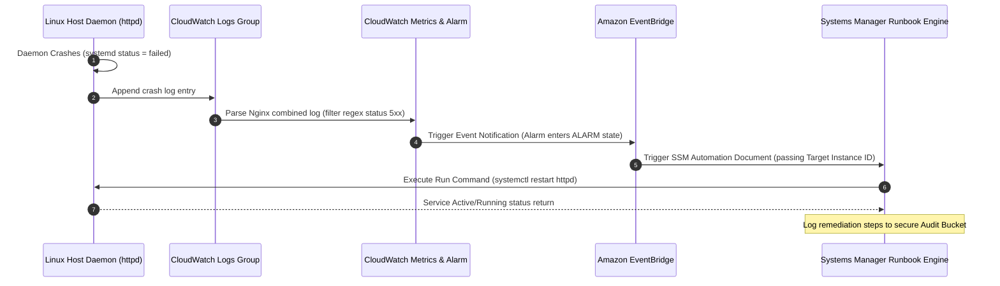

# Pattern: Automated Operations and Event-Driven Remediation

**Breadcrumbs:** [[Main Notes/0-Index|🏠 Index]] > Patterns > **Automated Operations and Event-Driven Remediation**

---

## 🏛️ Architectural Context

In modern distributed cloud systems, high availability and low Mean Time to Resolution (MTTR) require systems that detect, diagnose, and repair operational failures without manual human intervention. This pattern defines a closed-loop, event-driven remediation loop using Amazon CloudWatch, Amazon EventBridge, and AWS Systems Manager (SSM) Automation.

The system transitions from fault occurrence to resolution through decoupled event publishing and script execution:

---

## ⚖️ Trade-offs & Alternatives

| Strategy | Pros | Cons |
| :--- | :--- | :--- |
| **Event-Driven Auto-Remediation** (Recommended) | - Out-of-band execution reduces host resource pressure. - Decoupled event paths prevent agent deadlocks. - Full audit trails of every action are centralized. | - Complexity in writing custom runbook templates. - Requires correct configuration of EventBridge rules and IAM permissions. |
| **Local Cron / Shell Watchdogs** | - Extremely simple to configure on-host. - Low architectural dependencies. | - Watchdog processes can crash under OOM conditions. - Hard to audit execution history centrally. - Increases host resource footprint. |
| **Manual Responder Actions** | - Human review prevents infinite loops. - Allows context-dependent diagnostics. | - MTTR increases from seconds to hours. - High operational overhead. - Human error risk during manual console execution. |

---

## 🛠️ Verification & Practical Implementation

*   **Remediation Playbook implementation:** Refer to the hands-on project mapping in [[Project - AWS Systems Manager Automation and Remediation]].
*   **Log Metric Filter setup:** For configuring the log filters that feed the alert alarms, refer to [[Project - CloudWatch Log Streaming and Metric Filtering]].
*   **Infrastructure Configuration details:** Learn about host port-hardening and permission setups in [[Main Notes/aws-cloudops - Systems Manager and Runbooks.md]] and agent configuration structures in [[Main Notes/aws-cloudops - CloudWatch Agent and Metrics.md]].
