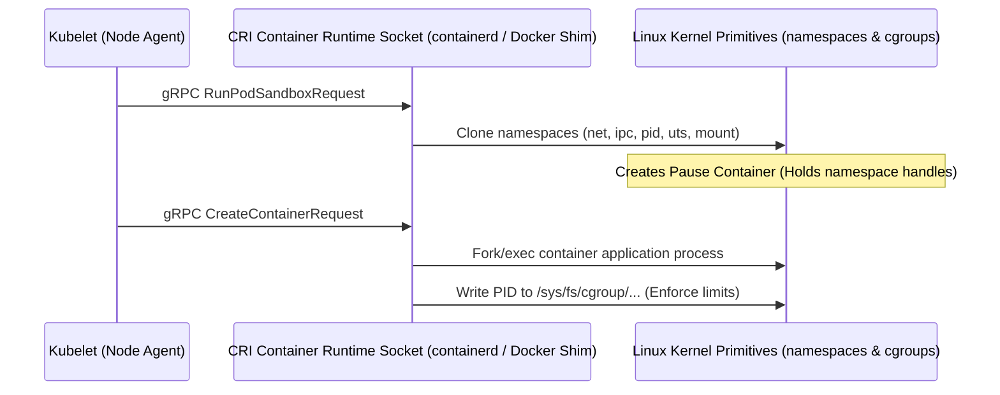

# Pattern: Container Runtime Socket Interface and OS Isolation

**Breadcrumbs:** [[0-Index|🏠 Index]] > Patterns > **Container Runtime Socket Interface and OS Isolation**

---

## 🏛️ Architectural Context
This pattern maps the interaction chain starting from a scheduling decision in the Kubernetes Control Plane down to the execution of container processes in isolated namespaces on the Linux host OS kernel.



1.  **Kubelet to CRI Socket:** The Kubelet watches the API server for assigned pods. Upon discovery, it invokes the local Container Runtime Interface (CRI) runtime service over a Unix domain socket (e.g., `unix:///var/run/containerd/containerd.sock`) using gRPC.
2.  **Namespace Sandboxing:** The CRI runtime delegates to a low-level OCI runtime (typically `runc`) to initialize a "Pod Sandbox" (historically the Pause Container), which holds the network, IPC, and UTS namespaces.
3.  **Process Isolation & Control:** The container application process is launched in the background, joined to the sandbox namespaces, and its process ID is written to the control group directory path (e.g., `/sys/fs/cgroup/memory/docker/<id>/cgroup.procs`) to restrict CPU, memory, and physical device resources.

---

## ⚖️ Trade-offs & Alternatives
*   **Alternative: VM Isolation (Kata Containers / Firecracker):** Instead of sharing the host OS kernel via namespaces/cgroups, Kata Containers spin up a lightweight virtual machine per pod.
    *   *Pros:* Hardware-level isolation barrier. Safe for untrusted tenant code execution.
    *   *Cons:* Higher startup latency, increased memory and CPU footprint overhead.
*   **Alternative: User-Space Kernel (gVisor):** Intercepts container system calls and filters them in user-space (`runsc`).
    *   *Pros:* High security without VM memory footprints.
    *   *Cons:* System call interception introduces I/O latency bottlenecks.

---

## 🛠️ Verification & Practical Implementation
1.  **Inspect CRI Socket Communication:**
    Verify Kubelet connection to Containerd socket:
    ```bash
    crictl --runtime-endpoint unix:///var/run/containerd/containerd.sock info
    ```
2.  **Verify Namespace Isolation on Host:**
    Find container process ID and inspect namespace links:
    ```bash
    ps -ef | grep nginx
    ls -la /proc/<pid>/ns/
    ```
3.  **Inspect Control Group Limits:**
    View enforced memory limit in cgroup directory:
    ```bash
    cat /sys/fs/cgroup/memory/docker/<container_id>/memory.limit_in_bytes
    ```
