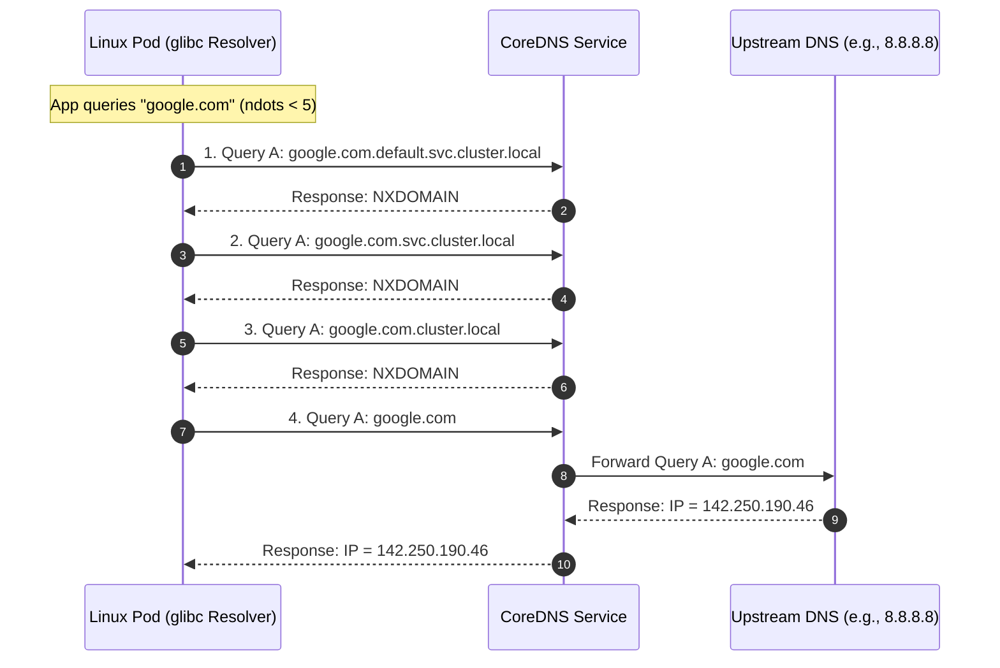

# Pattern: CoreDNS Latency and Search Paths

**Breadcrumbs:** [[0-Index|🏠 Index]] > Patterns > **CoreDNS Latency and Search Paths**

---

## 🏛️ Architectural Context

In Kubernetes, Pod name resolution is orchestrated by CoreDNS. To enable Pods to resolve internal Services by their short names (e.g., `db-service` instead of `db-service.namespace.svc.cluster.local`), Kubelet configures the container's resolver configuration (`/etc/resolv.conf`) with specific search domains and resolver options at runtime.

### The Linux Resolver & Kubelet Defaults
When a container starts, Kubelet injects the following configuration into `/etc/resolv.conf`:
```text
nameserver 10.96.0.10
search default.svc.cluster.local svc.cluster.local cluster.local
options ndots:5
```

The key parameters are:
1. **Search Domains**: A list of suffixes appended to DNS queries that are not fully qualified.
2. **`ndots:5` Option**: This is a `glibc` resolver directive. It tells the operating system that any domain name containing **fewer than 5 dots** must be treated as a relative name first. The resolver will sequentially append each search domain and query the nameserver. Only if all search domain queries fail (returning `NXDOMAIN`) will the resolver attempt to query the domain name as an absolute name.

### The Latency Amplification Problem
While `ndots:5` simplifies internal service discovery, it causes massive latency amplification for external domains (e.g., `google.com` or API endpoints like `sqs.us-east-1.amazonaws.com`).

Because `google.com` contains only 1 dot (which is less than 5), a query for it triggers the following sequence:



This results in **3 failed DNS queries** (generating extra packet roundtrips and loading the CoreDNS server) before the actual external query is dispatched. For highly chatty applications communicating with external APIs, this can add 10ms to 100ms of latency per connection and exhaust CoreDNS resources.

---

## ⚖️ Trade-offs & Alternatives

To mitigate search path latency, architects choose between three primary strategies:

### Approach A: Appending a Trailing Dot (Absolute Names)
Forces the application to query external domains with a trailing dot (e.g., `google.com.`).
* **Pros**: Direct external lookup bypasses the search paths entirely (0ms extra latency, 1 query total).
* **Cons**: Must be enforced at the application layer or hardcoded in configuration files. If developer teams forget to add the trailing dot, the latency remains.

### Approach B: Configuring Custom `dnsConfig` in Pod Spec
Override the default `/etc/resolv.conf` options for specific Pods by setting `ndots:1` (or `ndots:2`).
* **Pros**: Resolves external domains instantly. Highly effective for worker microservices that communicate primarily with external APIs.
* **Cons**: Short-name internal resolutions will fail. For example, a query for `db-service` will immediately check upstream and fail. The pod must resolve internal services using their Fully Qualified Domain Name (FQDN) (e.g., `db-service.default.svc.cluster.local.`).

### Approach C: Implementing NodeLocal DNSCache
Deploys a lightweight CoreDNS caching agent as a DaemonSet on every node. The NodeLocal DNSCache runs on a loopback interface (`169.254.20.10`) and intercepts all DNS queries from the local node.
* **Pros**: 
  * Caches `NXDOMAIN` responses locally, cutting down the networking trip to the central CoreDNS pods.
  * Significantly reduces cluster-wide network traffic and CoreDNS CPU load.
  * Avoids modifying application code or Pod specs.
* **Cons**: Adds operational overhead to manage the DaemonSet, custom iptables rules, and upgrade paths.

---

## 🛠️ Verification & Practical Implementation

### Step 1: Verify Pod Resolver Configuration
Run this command inside a running application container to audit its DNS options:
```bash
kubectl exec -it <pod-name> -- cat /etc/resolv.conf
```

### Step 2: Configure custom `dnsConfig` in a Pod Spec
To configure a workload to resolve external hosts instantly without search path overhead, apply `dnsConfig` under `spec.template.spec`:

```yaml
apiVersion: apps/v1
kind: Deployment
metadata:
  name: api-worker
  namespace: default
spec:
  replicas: 3
  selector:
    matchLabels:
      app: api-worker
  template:
    metadata:
      labels:
        app: api-worker
    spec:
      containers:
      - name: worker
        image: alpine:latest
        command: ["/bin/sh", "-c", "sleep 3600"]
      # Custom DNS override to mitigate ndots latency
      dnsPolicy: ClusterFirst
      dnsConfig:
        options:
        - name: ndots
          value: "1"
```

> [!WARNING]
> When `ndots:1` is active, any internal service communication (e.g., querying `postgres-svc`) must be rewritten to its FQDN `postgres-svc.default.svc.cluster.local.` or it will fail to resolve.

### Step 3: Measure DNS Resolution Latency
To verify the performance improvements, deploy a debug pod and compare resolution speeds:

```bash
# Start a network debugging pod
kubectl run dnsutils --image=gcr.io/kubernetes-e2e-test-images/dnsutils:1.3 --sleep 3600

# Query with trailing dot (Instant resolution)
kubectl exec -i -t dnsutils -- time nslookup google.com.

# Query without trailing dot (Triggers search paths)
kubectl exec -i -t dnsutils -- time nslookup google.com
```
In high-latency networks or overloaded clusters, the second command will take significantly longer to complete.
