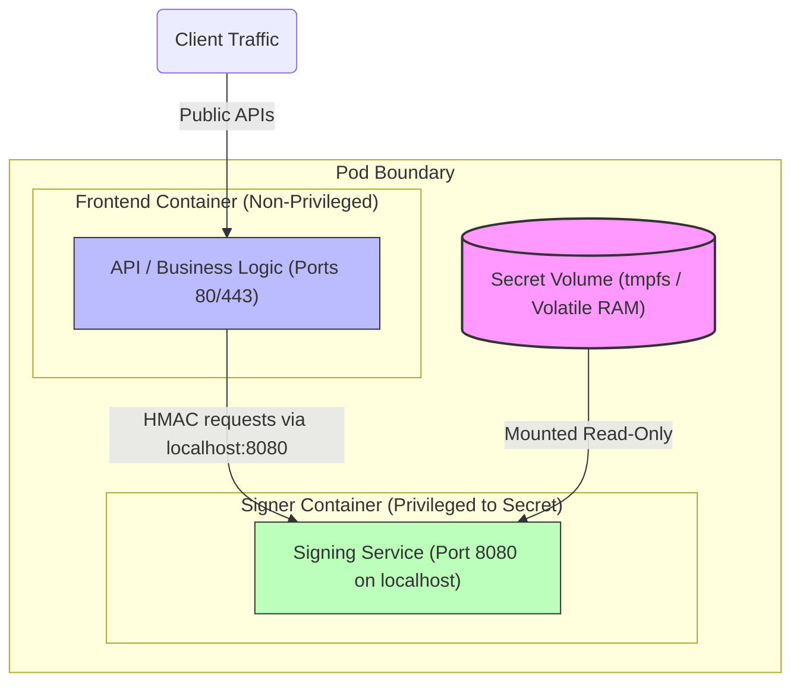

# Pattern: Cryptographic Secret Partitioning and Volatile Memory Mounts

**Breadcrumbs:** [[Digital Garden/0-Index|🏠 Index]] > Patterns > **Cryptographic Secret Partitioning and Volatile Memory Mounts**

---

## 🏛️ Architectural Context

In cloud-native application deployments, private keys, database passwords, and API tokens are prime targets for attacks. If a public-facing application container is compromised via a Remote Code Execution (RCE) vulnerability, an attacker who gains shell access can read all mounted secrets.

To prevent this, this pattern combines two key security controls:
1. **Inter-Container Privilege Separation (Signer Partitioning):** Decoupling application logic from secret key access.
2. **Volatile Memory Mounts (`tmpfs`):** Ensuring that secrets only exist in RAM and are never written to physical disk blocks.

* **Secret Isolation:** The Frontend Container processes user requests and does not have access to the Secret volume.
* **Symmetric Localhost Communication:** The Signer Container runs on the loopback interface (`127.0.0.1:8080`), accepting payload signing requests from the Frontend and returning computed HMAC signatures. If the Frontend is compromised, the attacker can only trigger signing operations but cannot steal the raw private key.
* **Anti-Forensics via `tmpfs`:** The Kubelet mounts secrets as memory-backed `tmpfs` volumes inside containers, preventing sensitive data from hitting the worker node's physical block storage where deleted files can be recovered via forensic analysis.

---

## ⚖️ Trade-offs & Alternatives

### Pros
* **Secures Raw Key Payloads:** Even a root exploit in the public application container cannot leak the private cryptographic key.
* **Zero Disk Footprint:** RAM-only mounting prevents forensic key leakage from discarded or compromised node SSDs/HDDs.
* **Token Rotation Integrity:** Ephemeral projected tokens automatically refresh without Pod restarts.

### Cons
* **Complexity:** Requires writing and maintaining multiple container definitions and inter-process endpoints (TCP sockets or Unix domain sockets) inside a single Pod.
* **Resource Cost:** Running a sidecar container consumes additional CPU and memory resources.

### Alternatives
* **KMS/Vault Direct Queries:** Applications query external systems like HashiCorp Vault directly using dynamic authentication tokens, completely removing Secret volumes.
* **Tee/Enclave Computing:** Running the cryptographic signer container inside a secure hardware enclave (e.g., Intel SGX, AMD SEV) via device plugins.

---

## 🛠️ Verification & Practical Implementation

For complete configuration playbooks, Python Flask implementations, and TLS setups, see:

* **Conceptual reference:** See the reference module [[Reference Notes/0-7_security_and_network_policies.md|0-7_security_and_network_policies.md]].
* **Hands-on project:** See the complete configuration and verification playbooks in [[Projects/kubernetes/Project - Secrets Management and Encryption.md|Project - Secrets Management and Encryption.md]].

