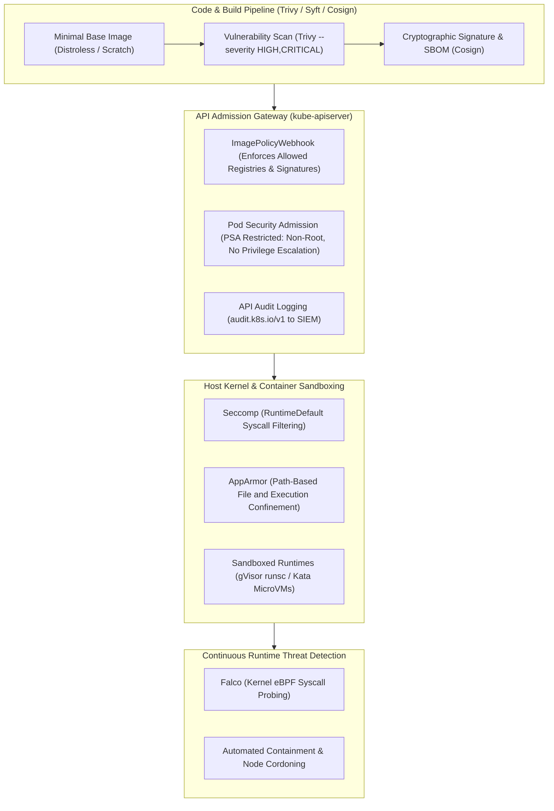

# Pattern: Defense-in-Depth Container and Kubernetes Security

**Breadcrumbs:** [[Digital Garden/0-Index|🏠 Index]] > Patterns > **Defense-in-Depth Container and Kubernetes Security**

---

## 🏛️ Architectural Context

Securing enterprise cloud-native workloads requires establishing multiple independent, complementary defensive boundaries across all layers of the stack—embodying the **4Cs of Cloud-Native Security**: **Cloud**, **Cluster**, **Container**, and **Code**. Single-point defenses (such as relying exclusively on perimeter firewalls or static CI/CD vulnerability scanning) inevitably fail when zero-day exploits, misconfigured credentials, or malicious dependencies bypass external gates.

### Defense-in-Depth Lifecycle Operations
1. **Pre-Deployment (Supply Chain):** Images are constructed with minimal attack footprints (distroless), scanned for known CVEs via [[Trivy]], and signed using cryptographic keys.
2. **Deployment (Admission Control):** The `kube-apiserver` intercepts pod scheduling via [[ImagePolicyWebhook]] to block unverified images, and applies [[pod-security-admission]] (`restricted`) to enforce non-root execution and drop Linux capabilities.
3. **Runtime Isolation (Host & Kernel):** Worker nodes confine container system calls via [[Seccomp in Kubernetes]], restrict file paths using [[AppArmor in Kubernetes]], or sandbox untrusted code in user-space kernels via [[gVisor and Sandboxed Containers]].
4. **Behavioral Monitoring (Runtime Detection):** [[Falco]] hooks into the host Linux kernel tracepoints via eBPF to detect interactive shell spawns, sensitive file reads (`/etc/shadow`), or unauthorized socket connections in real-time, dispatching alerts to security sinks.

---

## ⚖️ Trade-offs & Alternatives

| Defensive Strategy | Primary Advantage | Operational Friction / Trade-off |
| :--- | :--- | :--- |
| **Standard Containers (`runc`)** | Native performance, full hardware resource access, lowest startup overhead. | Shared host kernel exposes the node to container breakout exploits. |
| **User-Space Kernel Sandboxing ([[gVisor and Sandboxed Containers|gVisor]])** | Strong kernel virtualization; eliminates host kernel escape vectors. | Syscall translation overhead reduces throughput on I/O-intensive workloads. |
| **Hardware MicroVMs (Kata Containers)** | True virtual machine isolation per pod with dedicated guest kernels. | Higher memory footprint and requires bare-metal or nested virtualization support. |
| **Fail-Closed Admission (`defaultAllow: false`)** | Guarantees zero unverified images can run in the cluster. | Cluster deployments stall completely if the external scanner webhook experiences downtime. |
| **eBPF Syscall Interception ([[Falco]])** | Microsecond detection of active exploits without code changes. | Requires continuous rule tuning and macro filtering to minimize false positives on busy nodes. |

---

## 🛠️ Implementation References

* **Supply Chain & Image Policy:** [[Reference Notes/0-7-5_supply_chain_security_and_imagepolicywebhook.md|Module 0-7-5: Supply Chain Security & ImagePolicyWebhook]]
* **Runtime Threat Detection:** [[Reference Notes/0-7-6_runtime_security_falco_and_audit_logging.md|Module 0-7-6: Runtime Security (Falco) & API Auditing]]
* **Host Hardening & CIS Benchmarks:** [[Reference Notes/0-7-7_host_operating_system_and_node_hardening.md|Module 0-7-7: Host Operating System & Node Hardening]]
* **Workload Kernel Isolation & Sandboxing:** [[Reference Notes/0-7-9_workload_kernel_isolation_seccomp_apparmor_and_capabilities.md|Module 0-7-9: Workload Kernel Isolation, Seccomp, AppArmor & Linux Capabilities]]
* **Hands-on Security Playbook:** [[Projects/CKS/Practice Playbook - CKS Exam Hardening and Speed Hacks.md|CKS Exam Practice Playbook]]
