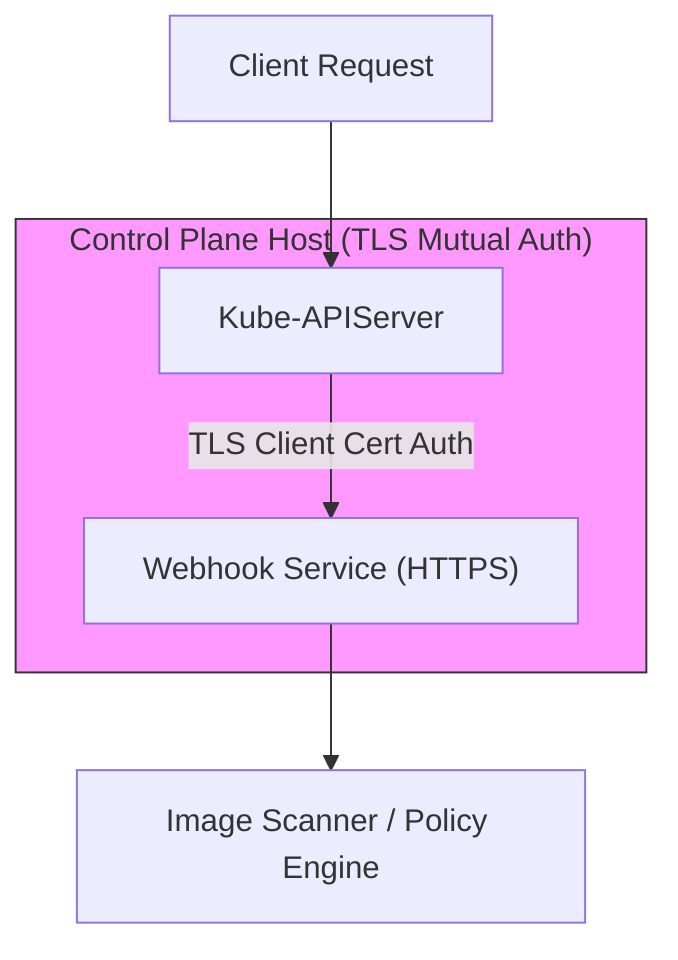

# Pattern: Dynamic Security Admission and Webhook TLS Verification

**Breadcrumbs:** [[Digital Garden/0-Index|🏠 Index]] > Patterns > **Dynamic Security Admission and Webhook TLS Verification**

---

## 🏛️ Architectural Context

In highly secure Kubernetes environments, static RBAC policies are insufficient for governing runtime constraints. The **Dynamic Security Admission** pattern introduces external HTTP Webhooks to inspect and validate request payloads against security policies (such as blocking vulnerable images, enforcing pod label inheritance, or validating network policy bounds) during the API request lifecycle.

To prevent authentication hijacking, communication between the `kube-apiserver` and the webhook endpoint must use mutual TLS (mTLS):
* **Server Verification:** The API server validates the webhook's certificate against the `caBundle` configured in the `ValidatingWebhookConfiguration` or `ImagePolicyWebhook` configuration.
* **Client Verification:** The webhook server validates the API server's identity using the client certificates provided in the API server's webhook configuration (e.g. `kubeconf.yaml`).

---

## ⚖️ Trade-offs & Alternatives

### Pros
* **Extensibility:** Enables custom, domain-specific security checks that cannot be hardcoded in Kubernetes.
* **Proactive Security:** Blocks vulnerabilities *before* they enter the cluster's persistent storage (`etcd`) or get scheduled onto nodes.

### Cons
* **Control Plane Dependency:** If `failurePolicy` is set to `Fail`, any downtime of the webhook server will completely block workload deployments in the cluster.
* **Latency Overhead:** Each API create/update call incurs an additional network round-trip to the webhook server.

### Alternatives
* **Kyverno or OPA Gatekeeper:** Instead of writing custom Webhook servers in Go/Python, deploy Kyverno or Open Policy Agent (OPA) Gatekeeper to enforce policies declaratively inside the cluster.
* **Pod Security Admission (PSA):** Use the built-in, zero-dependency `PodSecurity` admission controller if only standard security profiles (Privileged, Baseline, Restricted) are needed.

---

## 🛠️ Verification & Practical Implementation

For complete configuration playbooks, Python Flask implementations, and TLS setups, see:

* **Conceptual reference:** See the reference module [[Reference Notes/0-16_admission_controllers.md|0-16_admission_controllers.md]].
* **Hands-on project:** See the complete configuration and code playbook in [[Projects/kubernetes/Project - Admission Webhooks.md|Project - Admission Webhooks.md]].
* **Exam Prep Checklist:** See the [[Projects/CKA/Exam Checklist - Security and Storage.md|CKA Security & Storage Checklist]] for fast configuration dry-runs.
