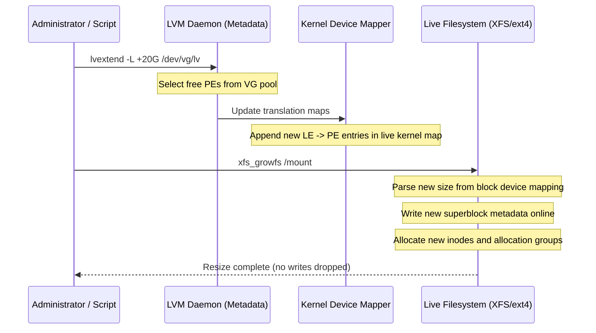

# Pattern: Dynamic Volume Pooling and Online FileSystem Expansion

**Breadcrumbs:** [[0-Index|🏠 Index]] > **Digital Garden** > **Dynamic Volume Pooling and Online FileSystem Expansion**

---

## 🏛️ Context & Problem
In traditional computing systems, storage allocation is static. Filesystems are mapped directly to physical partitions (e.g. MBR/GPT partition tables). When a partition fills up, expanding it requires:
1.  Unmounting the filesystem (causing application downtime).
2.  Adjusting boundaries in the partition table (risking sector overlap data loss).
3.  Resizing the filesystem offline.

Modern cloud-scale and database environments require **continuous uptime**. Storage space must be dynamically expanded online, without interrupting write operations or unmounting devices.

---

## 💡 The Solution Pattern: Logical Extents Abstraction
Rather than mapping the filesystem directly to physical blocks, we introduce an intermediary virtualization abstraction layer: **Logical Extents (LE) to Physical Extents (PE) Mapping**.

```
Filesystem Space (XFS / ext4 Virtual Block Address Space)
         |
         v
+-------------------------------------------------------------+
|                     Logical Volumes (LV)                    |
|       LE 0     |     LE 1     |     LE 2     |     LE 3     |
+-------------------------------------------------------------+
          |             |             |             |
          | (Indirection mapping layer managed by Kernel Device Mapper)
          v             v             v             v
+-------------------------------------------------------------+
|                     Physical Extents (PE)                   |
|       PE 0     |     PE 1     |     PE 2     |     PE 3     |
+-------------------------------------------------------------+
         |                      |
         v                      v
+------------------+   +------------------+
|   Physical PV1   |   |   Physical PV2   |
|   /dev/sdb1      |   |   /dev/sdc1      |
+------------------+   +------------------+
```

### Key Elements of the Pattern:
1.  **Block Pooling:** Raw physical block devices are converted to Physical Volumes (PVs) and pooled into a Volume Group (VG).
2.  **Extents Division:** The Volume Group segments physical storage into small, uniform, non-overlapping segments called **Physical Extents (PE)** (typically 4 MB).
3.  **Logical Extent Mapping:** Logical Volumes (LVs) are constructed of Logical Extents (LEs). The OS kernel (Device Mapper driver) maintains a dynamic lookup map translating each LE index to its current PE location.
4.  **Decoupled Spanning:** Since LEs can map to PEs anywhere in the VG pool, the logical volume can span multiple disjoint physical drives transparently.

---

## 🌉 Evolutionary Mechanics: Online Expansion Algorithms

When an administrator runs `lvextend` followed by `xfs_growfs` or `resize2fs`, the operating system executes the following steps online:



### Detailed Growth Phases:
1.  **Logical Mapping Appending:**
    *   LVM allocates unused Physical Extents (PE) from the Volume Group pool.
    *   It updates the device mapper table in the kernel. The driver appends new Logical Extents (LE) mapping references at the end of the Logical Volume logical address boundaries.
2.  **Filesystem Geometry Ingestion:**
    *   The filesystem driver queries the underlying block device (now reporting a larger sector limit).
    *   *ext4:* Appends new block groups at the end of the filesystem, initializing their block/inode bitmaps online.
    *   *XFS:* Initializes new **Allocation Groups (AG)**. In XFS, space allocation and inode creation are distributed across multiple AGs, making it highly efficient for concurrent online expansions.
3.  **Superblock Metadata Update:**
    *   The primary superblock metadata is updated to reflect the new block count.
    *   Journaling blocks are adjusted if needed. Live writes continue hitting the disk while this occurs, as the journal transactions abstract the block shifts.

---

## 🟢 Architectural Benefits
*   **Zero Downtime:** Filesystems grow under active user workload. No unmounting is required.
*   **Storage Consolidation:** Disparate drives (SSD, HDD, NVMe) can be pooled into unified pools.
*   **Logical Flexibility:** Space can be overallocated (thin-provisioning), allowing administrators to add physical disks to the pool only when utilization thresholds are breached.
