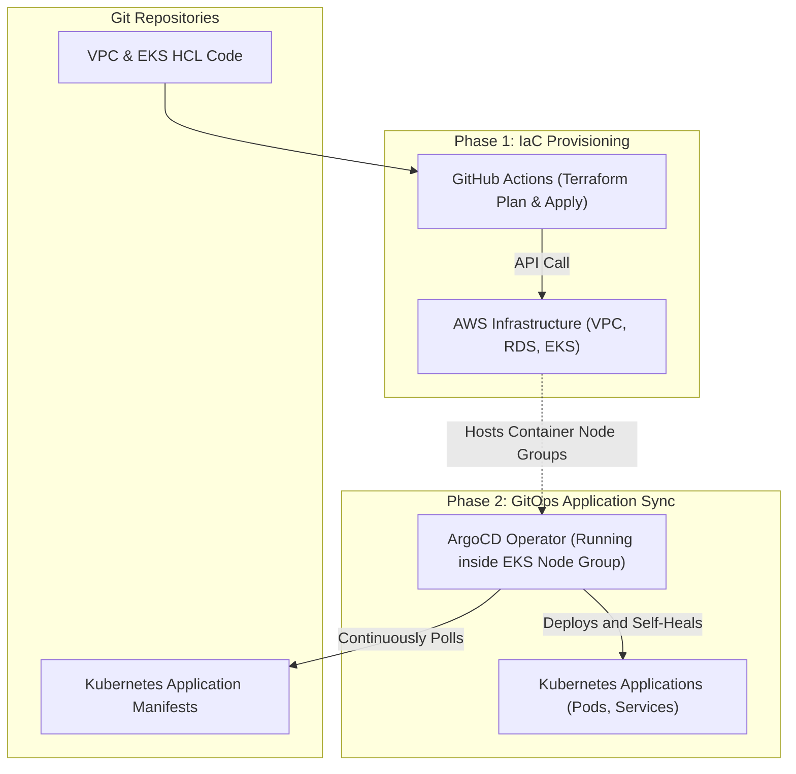

# Pattern: Immutable Infrastructure and GitOps Reconciliation

**Breadcrumbs:** [[Main Notes/0-Index|🏠 Index]] > Patterns > **Immutable Infrastructure and GitOps Reconciliation**

---

## 🏛️ Architectural Context

In modern cloud-native systems, managing infrastructure and applications requires separate tooling boundaries. **Terraform** excels at provisioning physical cloud infrastructure (VPCs, databases, networks, EKS control planes) using a push-based model. **ArgoCD** (GitOps) excels at managing application resources inside Kubernetes clusters using a pull-based, continuous reconciliation model.

This pattern combines both engines, establishing EKS provisioning as the handover boundary:

---

## ⚖️ Trade-offs & Alternatives

| Strategy | Pros | Cons |
| :--- | :--- | :--- |
| **Separate IaC & GitOps** (Recommended) | - Clear division of concerns. - If the application GitOps repository is compromised, AWS foundation network accounts are safe. - Terraform state sizes are kept small and fast. | - Requires managing two pipelines and separate credential groups. |
| **All-in-One Terraform** | - Single tool execution. - Can deploy Helm charts using the Terraform Helm provider. | - Slow execution speeds. - Any change to application pod configurations requires running a full Terraform plan, risk of network provider time-outs. |

---

## 🛠️ Verification & Practical Implementation

*   **EKS Setup:** See the deployment playbook in [[Projects/terraform/Project - EKS GitOps and ArgoCD.md]].
*   **Drift Remediation:** See automated drift recovery workflow in [[Projects/terraform/Project - Terraform Automation and Drift Remediation.md]].
