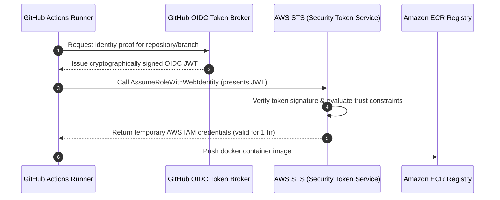

# Pattern: Secure OIDC Cloud Authentication in CI-CD

**Breadcrumbs:** [[Main Notes/0-Index|🏠 Index]] > Patterns > **Secure OIDC Cloud Authentication in CI-CD**

---

## 🏛️ Architectural Context

In modern containerized deployments, automated workflows in GitHub Actions need to authenticate to cloud providers (e.g. AWS EKS) to push container images or reload deployments. Storing long-lived credentials (like static IAM Access Keys) inside the CI/CD platform is an security anti-pattern. 

This pattern establishes a passwordless trust relationship using OpenID Connect (OIDC) federation:

---

## ⚖️ Trade-offs & Alternatives

| Strategy | Pros | Cons |
| :--- | :--- | :--- |
| **OIDC Federation** (Recommended) | - No secrets to store or rotate. - Temporary credentials automatically expire in 1 hour. - Trust is restricted down to specific repositories and branches. | - Requires setup of OIDC Identity Providers on the cloud side. |
| **Static GitHub Secrets** | - Easy to configure. | - Secrets never expire. - Compromise of secrets grants permanent access. - High maintenance overhead for rotations. |

---

## 🛠️ Verification & Practical Implementation

*   **AWS Trust Policy configuration:** Configure the OIDC issuer URL (`https://token.actions.githubusercontent.com`) and target audience (`sts.amazonaws.com`).
*   **Workflow setup:** Refer to the implementation guide in [[Projects/github-actions/Project - GitHub Actions CI-CD Pipelines.md]] and security parameters in [[Main Notes/github-actions - Security and Secrets.md]].
