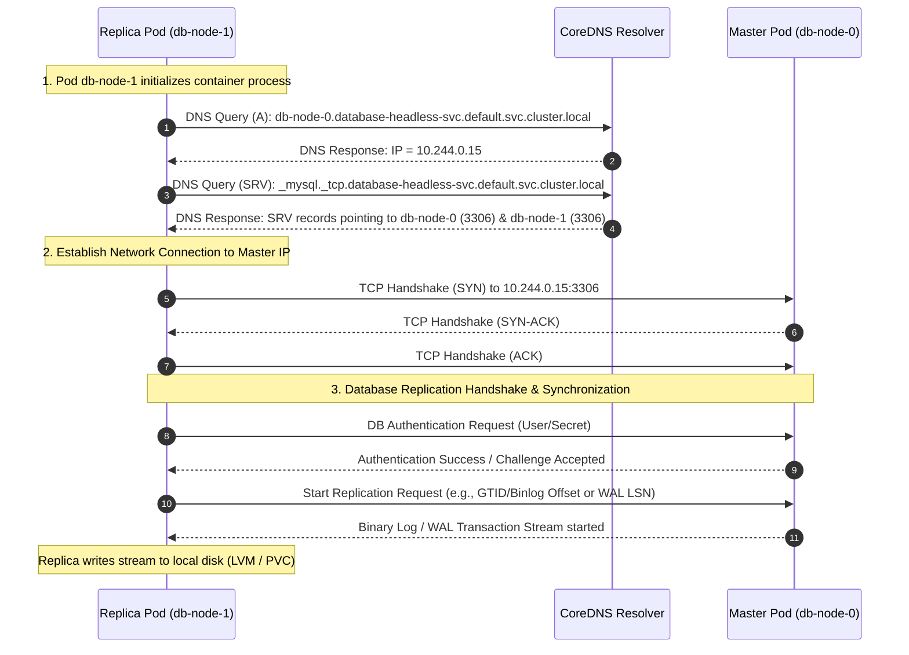

# Pattern: Stateful Database Clustering in Kubernetes

**Breadcrumbs:** [[0-Index|🏠 Index]] > Patterns > **Stateful Database Clustering in Kubernetes**

---

## 🏛️ Architectural Context

Orchestrating clustered databases (e.g., MySQL Group Replication, PostgreSQL Patroni, CockroachDB, Galera) within Kubernetes requires a tight, predictable synergy between workloads, local storage devices, and cluster-wide DNS discovery. This coordination is facilitated by the **StatefulSet** controller and associated system components:

1. **StatefulSet Ordinals and Lifecycles**:
   * Unlike stateless Deployments, which spin up Pods with randomized hash suffixes, StatefulSets assign stable, zero-indexed integer suffixes ($0, 1, \dots, N-1$) to each Pod (e.g., `db-node-0`, `db-node-1`).
   * The controller enforces **ordered startup and scaling** (from 0 to $N-1$) and **ordered teardown** (from $N-1$ down to 0) under its default `OrderedReady` policy.
   * This sequencing protects consensus quorums (Raft, Paxos) and cluster replication from split-brain scenarios by ensuring primary nodes boot and establish consensus before replicas attempt to join.

2. **The Role of the Headless Service**:
   * A companion **Headless Service** (`spec.clusterIP: None`) must be configured to group the Pods.
   * Because it lacks a virtual load-balancing IP (ClusterIP), Kubernetes does not populate iptables or IPVS routing rules for the Service. Instead, the Headless Service acts as a grouping identity that enables CoreDNS to publish direct DNS A-records and SRV records for the individual Pod endpoints.

3. **CoreDNS Record Mapping**:
   * **Individual Pod A/AAAA-Records**: Each Pod in the StatefulSet resolves to a stable FQDN:
     $$\langle\text{pod-name}\rangle.\langle\text{service-name}\rangle.\langle\text{namespace}\rangle.\text{svc.cluster.local}$$
     *Example*: `db-node-0.database-headless-svc.default.svc.cluster.local` maps directly to the private IP of the first ordinal pod.
   * **Headless Service A-Records**: Querying the base headless FQDN (e.g., `database-headless-svc.default.svc.cluster.local`) returns the A-records of all healthy, ready Pods in the selector pool, enabling cluster-wide discovery of all active database nodes.
   * **SRV Records**: CoreDNS publishes SRV records details like ports and hostname mappings:
     $$\text{\_}\langle\text{port-name}\rangle.\text{\_tcp.}\langle\text{service-name}\rangle.\langle\text{namespace}\rangle.\text{svc.cluster.local}$$
     *Example*: `_mysql._tcp.database-headless-svc.default.svc.cluster.local` resolves to the ports and hostnames of all active members, which cluster bootstrapping scripts use to dynamically map peers.

4. **Persistent Volume Claim (PVC) Templates**:
   * The `volumeClaimTemplates` block in the StatefulSet spec instructs the controller to dynamically provision a dedicated PVC for *each* Pod ordinal (e.g., `data-store-db-node-0`, `data-store-db-node-1`).
   * **Rescheduling Storage Bindings**: If a node fails and `db-node-1` is rescheduled to a different physical host, the volume binding controller ensures that the new Pod instance is re-attached to the *exact same* Persistent Volume (PV), preserving database transactions without requiring a full sync from the master.

5. **Local Storage (LVM/hostPath) and Node Affinity**:
   * Production-grade stateful databases require ultra-low I/O latency and high IOPS, which network-attached block storage often cannot guarantee.
   * **Linux Storage Layer (LVM/hostPath)**: Local storage can be configured on the physical nodes using Logical Volume Manager (LVM) to partition high-speed NVMe drives. In Kubernetes, this is projected using `local` Persistent Volumes or `hostPath`.
   * **Container Runtime Namespace Integration**: When the container runtime (e.g., `containerd` via `runc`) creates the container within the Pod sandbox, it calls `pivot_root` to isolate the mount (`mnt`) namespace. The local storage path on the host is bound directly into the container's isolated mount namespace (e.g., mounting host `/mnt/disks/nvme01` to container `/var/lib/mysql`).
   * **Node Affinity Enforcement**: Because local volumes are physically tied to a specific Node, the PV definition includes a hard node affinity constraint (e.g., `kubernetes.io/hostname: worker-node-01`). The scheduler reads this constraint and guarantees that any rescheduled Pod instance claiming that PV is forced onto the exact host where the physical drive resides.

---

## 🌐 Network Pathing & DNS

When a replica Pod (e.g., `db-node-1`) boots up, it must discover the primary/master Pod (e.g., `db-node-0`) to initiate master-replica synchronization. Rather than hardcoding IP addresses, the replica utilizes the CoreDNS naming hierarchy to identify the primary node, initiate a connection, and synchronize database states.

### Clustered Sync Sequence



1. **DNS Resolution**: The replica queries the local DNS server (`kube-dns` / CoreDNS, pointed to by `/etc/resolv.conf`) for the A-record of `db-node-0.database-headless-svc.default.svc.cluster.local`.
2. **Network Handshake**: The replica establishes a TCP 3-way handshake with the master on the database replication port.
3. **Synchronization Pipeline**: The replica authenticates using secrets (e.g., mounted via env or files) and requests the transaction log stream (MySQL binlogs or PostgreSQL WALs). The master streams data directly to the replica, which writes the state onto its node-local storage volume.

---

## ⚖️ Trade-offs & Alternatives

Operating clustered databases inside Kubernetes involves choosing between orchestration convenience and raw bare-metal control.

### 1. Kubernetes StatefulSets vs. Hosting on Bare-Metal VMs

| Metric / Dimension | Kubernetes StatefulSets | Bare-Metal / Virtual Machines |
| :--- | :--- | :--- |
| **Orchestration & Lifecycle** | **High**: Declarative YAML configuration, automated self-healing, native scaling, GitOps-ready. | **Low**: Manual deployment or complex configuration management scripts (Ansible, Puppet). |
| **Security Boundaries** | **Weak**: Shared Linux kernel. Container escapes can potentially compromise the physical Node and other tenants. | **Strong**: Hypervisor-enforced kernel isolation or physical hardware boundaries. |
| **Resource Contention** | **Risk of Contention**: Shares CPU/Memory via cgroups limits. High-load databases can suffer from "noisy neighbors" if QoS classes are not configured as `Guaranteed`. | **Dedicated**: Hard allocations of physical CPU, memory, and I/O channels. No shared resource pools. |
| **Eviction Mechanics** | **Dynamic Eviction**: Node pressure (disk, memory) can trigger the Kubelet to evict and reschedule the database. | **Static**: The VM remains running until explicit administrative intervention. |

---

### 2. Local Volume Mounts (LVM/hostPath) vs. Remote Block Storage (CSI/SAN)

* **Local Volumes (LVM / hostPath)**:
  * *Pros*: Near-zero latency, direct path to local NVMe, and massive IOPS. Ideal for high-transaction write-intensive databases.
  * *Cons*: **Node-Locked**. If the physical node suffers a hardware failure, the database Pod cannot be rescheduled on another node to recover, as its storage is inaccessible. Recovery relies entirely on application-level replication and active failovers to other running replicas.
* **Remote Block Storage (CSI / AWS EBS / SAN)**:
  * *Pros*: **High Availability**. If the node hosting a primary pod dies, the CSI driver automatically detaches the volume and re-attaches it to a new node, allowing the Pod to reschedule and resume operations without data loss.
  * *Cons*: Added network hop latency, IOPS caps, throughput limits, and the risk of "VolumeInUse" attachment lockups during rapid node transitions (which can stall database failovers by 5–15 minutes).

---

### 3. Readiness Probe Impact on Cluster Synchronization

Readiness probes control whether a database Pod is added to the Headless Service endpoint pool to serve client traffic. This introduces a critical operational trade-off:

* **Eager / Loose Readiness Probes** (e.g., checking only if the TCP port is open):
  * *Trade-off*: The Pod is marked `Ready` as soon as the database process starts. If the replica is still pulling gigabytes of historical transaction logs to catch up with the master, client read queries routed to it will return stale or inconsistent data.
* **Strict / Sync-Aware Readiness Probes** (e.g., running an `exec` script to verify replication lag or WAL synchronization):
  * *Trade-off*: Prevents stale reads by keeping the replica out of service endpoints until it is 100% synchronized.
  * *The Pitfall*: During a StatefulSet **Rolling Update**, the controller upgrades Pods sequentially (e.g., starting at `db-node-2`, then `db-node-1`, etc.). The controller **blocks** and will not proceed to update `db-node-0` until `db-node-1` passes its readiness probe. If a strict probe blocks a replica for hours due to synchronization time, the entire rollout is halted, potentially keeping the cluster in a partially upgraded state.

---

### 4. Linux Process Signals & cgroup Eviction Mechanics in Databases

Operating clustered databases within container environments introduces direct dependencies on worker node kernel scheduling, control groups (cgroups), and process signal propagation during routine lifecycle changes or node failures:

* **Graceful Shutdown (SIGTERM / Signal 15)**:
  During a normal deletion flow (e.g., node drain, scaling down ordinals, or rolling updates), the container runtime sends a `SIGTERM` signal to the container's root process (PID 1).
  * *Mechanism*: The database engine catches the signal, triggers connection draining, completes ongoing write-ahead log (WAL) transactions, flushes dirty pages from shared buffers to persistent storage (PV), and shuts down cleanly.
  * *Dependency*: This graceful path relies on the `spec.terminationGracePeriodSeconds` window (default: 30 seconds). If the database sync time exceeds this window, the Kubelet escalates to `SIGKILL`.
* **Immediate Force Deletion (SIGKILL / Signal 9)**:
  When operators execute a force deletion (`kubectl delete pod --grace-period=0 --force` or during `kubectl replace --force` recovery workflows), the grace period is bypassed. The API server instantly purges the Pod from etcd, and the runtime sends a `SIGKILL` directly to PID 1.
  * *Data Integrity Risk*: `SIGKILL` cannot be caught or blocked by the database. The process is terminated mid-write, bypassing clean checkpointing. This risks WAL index corruption, transactional inconsistencies, and replication split-brains upon recovery.
  * *cgroup Cleanup*: The container runtime immediately destroys the cgroups (control groups) allocated to the database container, revoking CPU and memory resources and instantly unmounting the private namespaces (`mnt`, `net`, `pid`).
* **cgroup Resource Constraints & QoS Alignment**:
  High-load databases are highly sensitive to cgroup resource configurations. The worker node kernel uses cgroup constraints to restrict CPU usage via Completely Fair Scheduler (CFS) bandwidth quotas and memory allocations.
  * *OOM Killer Scoring*: When a host node experiences memory pressure, the Linux kernel Out-of-Memory (OOM) killer selects which processes to kill. It bases this choice on the process's OOM score, which is controlled by Kubernetes setting the `/proc/sys/vm/oom_score_adj` dynamically based on the Pod's Quality of Service (QoS) class:
    * **Guaranteed QoS** (CPU & memory requests equal limits): `oom_score_adj` is set to `0`. These pods are heavily protected and are the last to be targeted by the host OOM killer.
    * **Burstable QoS** (Requests and limits do not match): `oom_score_adj` ranges from `2` to `999`. They are highly vulnerable to OOM kills if the node runs low on physical memory.
    * **BestEffort QoS** (No requests or limits): `oom_score_adj` is set to `1000`. They are instantly killed under any memory pressure.
  * *Best Practice*: Clustered database Pods **must** run with `Guaranteed` QoS class configuration to prevent cgroup-level resource reclamation and unexpected Linux kernel OOM kills.

---

## 🛠️ Verification & Practical Implementation

To verify that CoreDNS is correctly resolving ordinal DNS mappings and that the headless service returns the endpoints of active database members, you can execute the automated workloads audit script.

### 1. Running the Automated Verification PoC
The verification script deploy a temporary headless service and StatefulSet, then uses a debugging container to query and assert record mapping:

```bash
# 1. Start your local cluster environment
kind create cluster --name k8s-poc

# 2. Grant execution permissions to the PoC script
chmod +x "Reference Notes/scripts/verify_workloads_poc.sh"

# 3. Execute the workloads verification audit
./"Reference Notes/scripts/verify_workloads_poc.sh" --namespace default
```

*Expected Verification Output*:
```text
[INFO] Validation 4: StatefulSet Headless DNS Audit
[INFO] Deploying Headless Service and StatefulSet...
[INFO] Waiting for StatefulSet pods to roll out...
statefulset rolling update complete
[INFO] Deploying temporary netshoot container for DNS queries...
[INFO] Auditing A records for Headless Domain: headless-dns-audit-svc.default.svc.cluster.local
[OK] StatefulSet Headless DNS architecture validated successfully!
```

### 2. Manual Verification Run Sheet
If diagnosing a cluster manually, you can execute these troubleshooting command formulas:

```bash
# Launch a netshoot debugging Pod in the namespace
kubectl run dns-diagnostic --image=nicolaka/netshoot --restart=Never -- sleep 3600

# 1. Audit A-records returned by the Headless Service (returns all Pod IPs)
kubectl exec dns-diagnostic -- dig +short headless-dns-audit-svc.default.svc.cluster.local

# 2. Audit SRV records for port and ordinal member membership discovery
kubectl exec dns-diagnostic -- dig SRV _http._tcp.headless-dns-audit-svc.default.svc.cluster.local

# 3. Resolve individual Pod ordinal A-records directly
kubectl exec dns-diagnostic -- dig +short statefulset-dns-audit-0.headless-dns-audit-svc.default.svc.cluster.local
```

For detailed troubleshooting on Pod lifecycle states, cgroups memory limits, or native gRPC health probes, refer to the full reference guide:
* [[Reference Notes/07_kubernetes_workloads_and_controllers.md]]
* [[Reference Notes/scripts/verify_workloads_poc.sh]]
