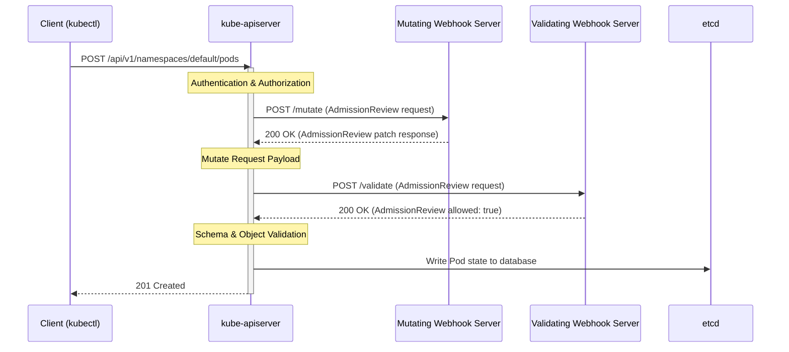

# Admission Webhooks - Mutating and Validating

**Breadcrumbs:** [[Main Notes/0-Index|🏠 Index]] > [[admission-controller|Admission Controllers]] > **Admission Webhooks - Mutating and Validating**

---

## 📑 Mutating vs. Validating Admission Controllers

Admission controllers fall into two categories, executed sequentially:

1. **Mutating Admission Controllers:**
   * Can modify the incoming request object before it is created or updated (e.g., the built-in `DefaultStorageClass` plugin automatically injects the default storage class name if a PVC does not define one).
   * Executed **first** in the admission pipeline.
2. **Validating Admission Controllers:**
   * Validate the final state of the request object and either approve or reject it (e.g., `NamespaceLifecycle` blocks requests to non-existent namespaces).
   * Executed **second** so they can inspect any modifications made during the mutating phase.

If any controller rejects the request, the API server returns an error message to the client, and the operation fails.

---

## ⚙️ How Admission Webhooks Work

To implement custom logic without modifying the Kubernetes source code, you can register external HTTP callback servers called **Admission Webhooks**:



---

## ✉️ The API Handshake (AdmissionReview JSON)

Communication between the `kube-apiserver` and the webhook server uses JSON-encoded `AdmissionReview` objects:

### 1. The Request from kube-apiserver
```json
{
  "apiVersion": "admission.k8s.io/v1",
  "kind: AdmissionReview",
  "request": {
    "uid": "705ab4f5-6393-11e8-b7cc-42010a800002",
    "kind": {"group": "", "version": "v1", "kind": "Pod"},
    "resource": {"group": "", "version": "v1", "resource": "pods"},
    "namespace": "default",
    "operation": "CREATE",
    "userInfo": {"username": "admin", "groups": ["system:masters"]},
    "object": {
      "apiVersion": "v1",
      "kind": "Pod",
      "metadata": {"name": "secure-pod"}
      // Pod spec details...
    }
  }
}
```

### 2. The Response from the Webhook Server
* **Validation Response (Allowed):**
  ```json
  {
    "apiVersion": "admission.k8s.io/v1",
    "kind": "AdmissionReview",
    "response": {
      "uid": "705ab4f5-6393-11e8-b7cc-42010a800002",
      "allowed": true
    }
  }
  ```
* **Mutation Response (With JSON Patch):**
  Mutations use the JSON Patch standard (RFC 6902) containing an array of operations (`add`, `remove`, `replace`) base64-encoded:
  ```json
  {
    "apiVersion": "admission.k8s.io/v1",
    "kind": "AdmissionReview",
    "response": {
      "uid": "705ab4f5-6393-11e8-b7cc-42010a800002",
      "allowed": true,
      "patchType": "JSONPatch",
      "patch": "W3sib3AiOiAiYWRkIiwgInBhdGgiOiAiL21ldGFkYXRhL2xhYmVscy91c2VyIiwgInZhbHVlIjogImFkbWluIn1d"
    }
  }
  ```
  *(The base64 string decodes to: `[{"op": "add", "path": "/metadata/labels/user", "value": "admin"}]`)*

---

## 🛠️ Registering Webhooks with Kubernetes

Webhooks are configured as first-class Kubernetes objects:

### MutatingWebhookConfiguration / ValidatingWebhookConfiguration
Below is an example of a `ValidatingWebhookConfiguration` registering an external validation service over TLS:

```yaml
apiVersion: admissionregistration.k8s.io/v1
kind: ValidatingWebhookConfiguration
metadata:
  name: validation-webhook-example
webhooks:
  - name: pod-policy.example.com
    rules:
      - apiGroups: [""]
        apiVersions: ["v1"]
        operations: ["CREATE"]
        resources: ["pods"]
        scope: "Namespaced"
    clientConfig:
      # If deployed as a service within the cluster
      service:
        namespace: "security-system"
        name: "webhook-service"
        path: "/validate"
      # If hosted outside the cluster, use a URL instead:
      # url: "https://external-webhook.example.com/validate"
      caBundle: "LS0tLS1CRUdJTiBDRVJUSUZJQ0FURS0tLS0tCg==" # Base64 PEM CA certificate
    admissionReviewVersions: ["v1"]
    sideEffects: None
    timeoutSeconds: 5
```

---

*Read more in [0-16_admission_controllers.md](../Reference%20Notes/0-16_admission_controllers.md), [a_guide_to_kubernetes_admission_controllers.md](../Reference%20Notes/a_guide_to_kubernetes_admission_controllers.md) and [admission_controllers_reference.md](../Reference%20Notes/admission_controllers_reference.md)*
