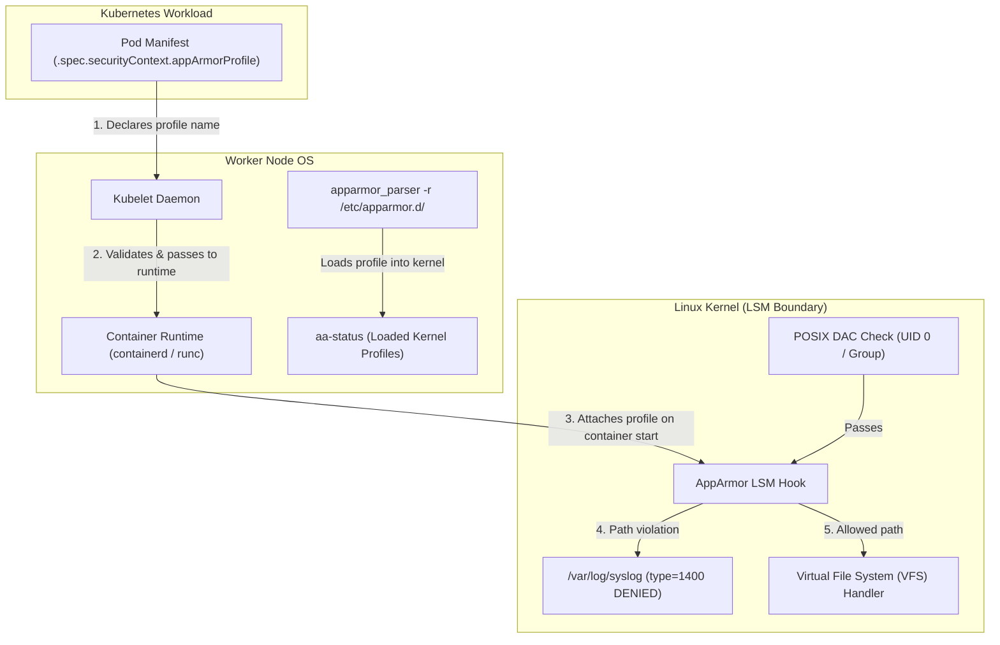

# AppArmor

**Breadcrumbs:** [[Main Notes/0-Index|🏠 Index]] > Linux & Kubernetes Security > **AppArmor**

---

## 🎯 Purpose (Why it is used)

**AppArmor (Application Armor)** is an effective Linux Security Module (LSM) that enforces path-based **Mandatory Access Control (MAC)** on Linux host systems and container workloads. While traditional POSIX Discretionary Access Control (DAC) bases access rights purely on file mode bits (`rwxrwxrwx`) and user/group identities (`UID/GID`), AppArmor confines individual programs by defining an explicit whitelist of resources, files, directories, network sockets, and capabilities they are permitted to access.

In Kubernetes clusters, AppArmor provides an essential defense-in-depth security boundary: even if a malicious process or compromised container attains `root` (`UID 0`) privileges, AppArmor prevents it from reading sensitive host files (e.g., `/etc/shadow`, `/etc/kubernetes/pki`), modifying application binaries, or executing unauthorized sub-processes.

---

## ⚙️ Functionality (What it is doing)

AppArmor operates via kernel LSM hooks interposed directly in the Virtual File System (VFS) and networking system call execution paths:

1. **Path-Based Mandatory Enforcement:** Evaluates full filesystem pathnames using globbing syntax (`*`, `**`) rather than filesystem labels or inodes.
2. **Execution Modes:**
   - **Enforce Mode (`enforce`):** Intercepts and denies unauthorized actions with `-EACCES` (Permission denied) and logs the event (`type=1400` / `apparmor="DENIED"`).
   - **Complain Mode (`complain`):** Logs policy violations without blocking execution, facilitating safe behavioral profiling via `aa-genprof` and `aa-logprof`.
   - **Unconfined:** Disables AppArmor restrictions for the target binary or container.
3. **Execution Control Qualifiers:** Governs process transitions upon `execve()`:
   - `ix`: Inherits the current profile in-place.
   - `px` / `Px`: Transitions into a discrete profile, with `Px` scrubbing unsafe environment variables (`LD_PRELOAD`, `LD_LIBRARY_PATH`).
   - `cx`: Transitions into a defined sub-profile.
   - `ux`: Spawns unconfined (strictly restricted in secure environments).
4. **Kubernetes Workload Binding:**
   - **Modern (v1.30+ GA):** Direct declarative configuration in `securityContext.appArmorProfile` (`type: RuntimeDefault`, `type: Localhost`, or `type: Unconfined`).
   - **Legacy (v1.29 and earlier):** Pod annotations formatted as `container.apparmor.security.beta.kubernetes.io/<container-name>: "localhost/<profile-name>"`.

---

## 🏛️ Architectural Context (How it fits in the architecture)



- **Node Requirement:** Profiles must be pre-loaded into the host Linux kernel on **every worker node** where the workload might be scheduled.
- **Container Runtime Handshake:** When the container runtime spawns a container, it queries the kernel for the profile name provided by Kubelet. If the profile is missing, container creation fails immediately with `CreateContainerError`.

---

## 🧩 Problem Solver (What problem it solves)

- **The "Root in Container is Root on Host" Danger:** If a container running as root executes a remote exploit, DAC allows it to read any mounted host files or write to sensitive paths. AppArmor overrides root authority, enforcing read-only or deny-all rules on critical system trees.
- **Zero-Tolerance File Modification:** By loading write-denial profiles (`deny /** w`), critical production microservices cannot be infected with file-based malware, shellscripts, or cryptominers.
- **Environment Scrubbing:** Prevents privilege escalation and process hijacking across binary invocations via `Px` scrubbed transitions.

---

## 🟢 Operational Impact (What will happen with it operating)

- Hardened containers cannot modify protected directories, execute unapproved binaries, or access unlisted hardware devices.
- High visibility: all attempted file read, write, or execution violations generate actionable audit logs with target filenames and process PIDs.
- Meets high-compliance benchmarks (CIS Kubernetes Benchmark Section 5, NIST SP 800-190).

---

## 🔴 Failure Impact (What will happen without it)

- **Unrestricted Filesystem Access:** Compromised containers can overwrite application binaries, write cronjobs, or tamper with system logs.
- **Scheduling Failures:** If a pod requests a custom AppArmor profile that has not been parsed and loaded into the node kernel via `apparmor_parser`, the pod transitions into `CreateContainerError` and refuses to launch.
- **PSA Non-Compliance:** Workloads fail against stricter organizational policies that mandate `RuntimeDefault` or vetted `Localhost` AppArmor profiles.

---

## 🔍 Deeper Dive Notes
This table automatically displays all deeper notes, use cases, and pitfalls associated with **AppArmor**.

```dataview
TABLE sub_type AS "Type", tags AS "Tags", source_type AS "Source"
FROM "Main Notes"
WHERE class = "deeper-dive" AND icontains(string(parent_concept), this.file.name)
SORT file.name ASC
```
