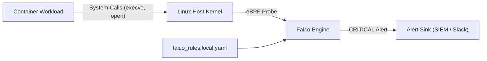

# Falco

**Breadcrumbs:** [[Main Notes/0-Index|🏠 Index]] > Security > **Falco**

---

## 🎯 Purpose (Why it is used)
**Falco** is an open-source, cloud-native runtime security tool originally designed by Sysdig and hosted by the Cloud Native Computing Foundation (CNCF). Its purpose is to provide real-time behavioral monitoring and anomaly detection across containers, Kubernetes clusters, and underlying Linux hosts by analyzing system calls at runtime.

---

## ⚙️ Functionality (What it is doing)
* **Kernel Syscall Interception:** Taps into the Linux kernel using either an eBPF driver probe or a loadable kernel module (`falco.ko`) to capture system calls (`execve`, `openat`, `socket`, `connect`, `setuid`).
* **Rule-Based Evaluation:** Evaluates kernel events and Kubernetes audit streams in real-time against customizable behavioral rules defined in YAML.
* **Alert Dispatching:** Dispatches immediate security alerts across multiple sinks, including syslog, standard output, file loggers, HTTP/HTTPS webhooks, and gRPC endpoints.
* **Context Enrichment:** Automatically enriches raw kernel events with container metadata (container ID, container name, image repository, Kubernetes pod name, namespace).

---

## 🏛️ Architectural Context (How it fits in the architecture)
Falco runs on each cluster node (typically as a DaemonSet or systemd service). It sits between the user-space container processes and the host Linux kernel, non-intrusively monitoring all containerized executions without modifying application source code or injecting sidecar proxies.



---

## 🧩 Problem Solver (What problem it solves)
Traditional security controls (such as image vulnerability scanning and static admission webhooks) only validate workloads *before* deployment. If an attacker leverages a zero-day exploit, stolen credentials, or remote code execution (RCE) at runtime, static scanners are blind to the breach. Falco solves this by providing continuous, zero-latency detection of unauthorized runtime behavior (such as spawning a reverse shell, reading `/etc/shadow`, or launching network reconnaissance tools).

---

## 🟢 Operational Impact (What will happen with it operating)
Security teams gain immediate visibility into malicious actions taking place inside running containers. Security operations centers (SOC) receive structured alerts detailing the exact PID, executable name, command-line arguments, parent process, container name, and Kubernetes namespace responsible for the anomalous behavior.

---

## 🔴 Failure Impact (What will happen without it)
Without Falco, post-exploitation lateral movement inside containerized workloads remains undetected until downstream services or databases are visibly damaged. Intruders can maintain persistence, dump in-memory secrets, and scan internal cluster networks without triggering alerts.

---

## 🔍 Deeper Dive Notes
This table automatically displays all deeper notes, use cases, and pitfalls associated with **Falco**.

```dataview
TABLE sub_type AS "Type", tags AS "Tags", source_type AS "Source"
WHERE class = "deeper-dive" AND icontains(string(parent_concept), this.file.name)
SORT file.name ASC
```
