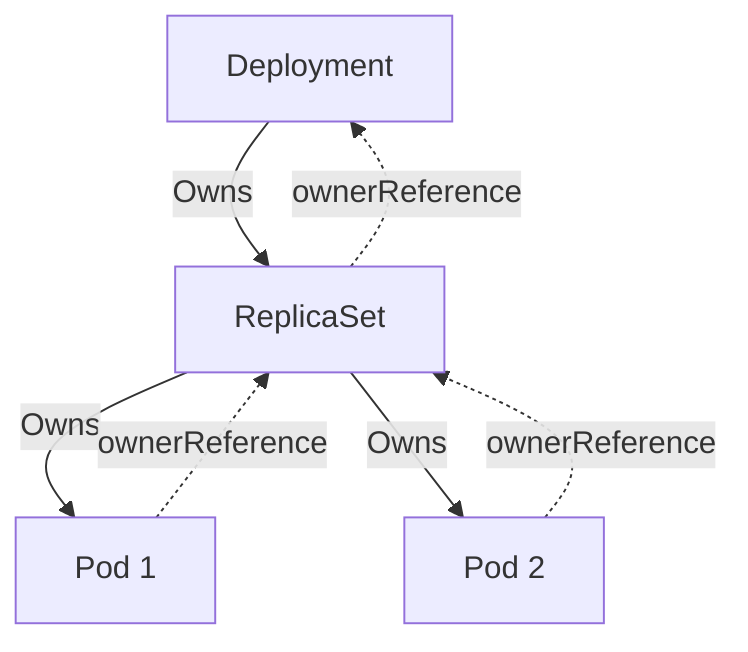

# kube-controller-manager - Garbage Collection Owner References

**Breadcrumbs:** [[Main Notes/0-Index|🏠 Index]] > [[kube-controller-manager]] > [[kube-controller-manager-deeper]] > **Owner References**

---

## 📑 1. Owner References Linkage
Kubernetes tracks relationships between objects using `metadata.ownerReferences`. Dependent objects point to their owning parent so that garbage collection can trace what to delete.



---

## ⚙️ 2. Viewing Owner References
Describe or print the JSON/YAML of a Pod managed by a ReplicaSet to inspect its owner references:
```bash
kubectl get pod nginx-78f5d69f4c-abcde -o jsonpath='{.metadata.ownerReferences}'
```
Output:
```json
[
  {
    "apiVersion": "apps/v1",
    "blockOwnerDeletion": true,
    "controller": true,
    "kind": "ReplicaSet",
    "name": "nginx-78f5d69f4c",
    "uid": "12345678-abcd-1234-abcd-1234567890ab"
  }
]
```

---

## 🔬 3. blockOwnerDeletion Flag
The `blockOwnerDeletion: true` flag in the ownerReference ensures that standard garbage collection will block deletion of the owner until the dependents are deleted if foreground cascading deletion is selected.

*Read more in [[Reference Notes/0-2_cluster_architecture_and_components.md#6-the-kubernetes-object-model]]*\n