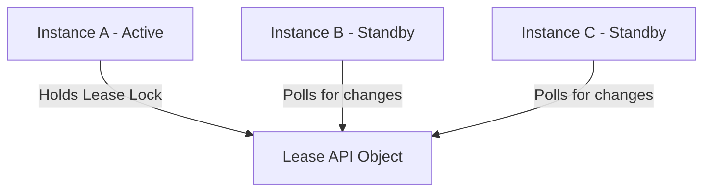

# kube-controller-manager - HA Leader Election Leases

**Breadcrumbs:** [[Main Notes/0-Index|🏠 Index]] > [[kube-controller-manager]] > [[kube-controller-manager-deeper]] > **HA Leader Election Leases**

---

## 📑 1. Leader Election Concept
For high availability, you can run multiple instances of `kube-scheduler` or `kube-controller-manager`. However, to prevent conflicts, only one instance must actively write changes to the API server at any given time.



---

## ⚙️ 2. Lease Lock Verification
The active leader holds a **Lease** object inside the `kube-system` namespace. Check active leases using:
```bash
kubectl get leases -n kube-system
```
Output:
```text
NAME                      HOLDER                    AGE
kube-controller-manager   master-node-1_uuid        12d
kube-scheduler            master-node-1_uuid        12d
```

Describe a lease lock to view parameters:
```bash
kubectl describe lease kube-controller-manager -n kube-system
```
Key fields include:
* `Holder Identity`: The hostname/ID of the active component instance.
* `Lease Duration`: The lock lease window (usually `15s`).
* `Renew Time`: The timestamp when the leader last refreshed its lease.

---

## 🔬 3. Active-Passive Failover
* **Keep-alive:** The active leader renews its lease every 2 seconds.
* **Failover:** If the active leader dies, the `Renew Time` stops updating. After the lease duration expires (e.g., 15 seconds), standby nodes compete to acquire the lease. The first to successfully update `Holder Identity` becomes the new active leader.

*Read more in [[Reference Notes/0-13_scheduling_logging_and_lifecycle.md#5-leader-election-leases-mechanics]]*\n