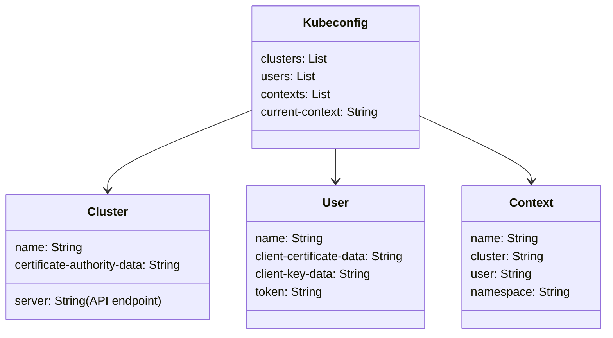

# kubectl - Kubeconfig Anatomy

**Breadcrumbs:** [[Main Notes/0-Index|🏠 Index]] > [[kubectl]] > [[kubectl-deeper]] > **Kubeconfig Anatomy**

---

## 📑 1. Core Structure of Kubeconfig
A `kubeconfig` file organizes access information for multiple clusters, users, and contexts. The default location is `~/.kube/config`.



---

## ⚙️ 2. CLI Configuration Reference (CKA Commands)
Use imperative commands to view, merge, and switch contexts in CKA:

### A. View Active Kubeconfig
```bash
# View configuration (with sensitive data hidden)
kubectl config view

# View raw configuration (including certificate data)
kubectl config view --raw
```

### B. Create and Switch Contexts
```bash
# 1. Add cluster definition
kubectl config set-cluster dev-cluster --server=https://10.10.0.10:6443 --certificate-authority=/etc/kubernetes/pki/ca.crt

# 2. Add user credentials
kubectl config set-credentials dev-user --client-certificate=/tmp/client.crt --client-key=/tmp/client.key

# 3. Create context mapping user to cluster
kubectl config set-context dev-context --cluster=dev-cluster --user=dev-user --namespace=development

# 4. Switch current-context
kubectl config use-context dev-context
```

*Read more in [[Reference Notes/0-1_kube_api_and_kubectl.md#3-kubeconfig-anatomy-and-context-management]]*\n