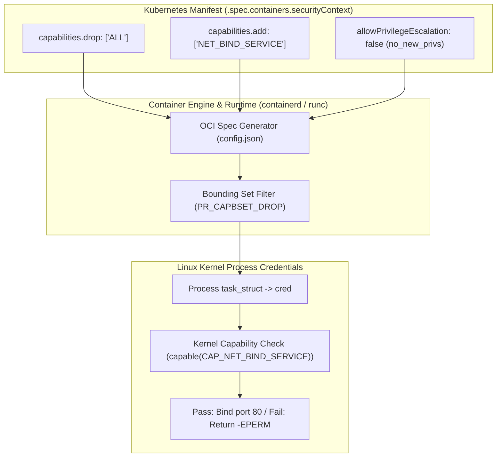

# Linux Capabilities

**Breadcrumbs:** [[Main Notes/0-Index|🏠 Index]] > Linux & Kubernetes Security > **Linux Capabilities**

---

## 🎯 Purpose (Why it is used)

**Linux Capabilities** decompose the monolithic, all-or-nothing power of the traditional UNIX superuser (`UID 0` / `root`) into approximately 41 distinct, independently grantable units of privilege. In classical systems, an executable needing to perform a minor privileged operation (such as binding to port 80 or pinging an ICMP address) required full SetUID root permissions, exposing the entire operating system if the binary had a buffer overflow or logic flaw.

In Kubernetes and cloud-native computing, Linux capabilities enforce the **Principle of Least Privilege**: containerized workloads can drop all default root privileges and retain only the specific granular capabilities necessary for their runtime function, preventing attackers from escalating privileges or manipulating the underlying host.

---

## ⚙️ Functionality (What it is doing)

Linux capabilities are integrated directly into the kernel's process credential model (`task_struct->cred`):

1. **Kernel Privilege Sets:**
   - **Permitted (`P`):** The absolute ceiling of capabilities a process may execute or enable.
   - **Effective (`E`):** The capability bitmask currently evaluated by the kernel during system call authorization.
   - **Inheritable (`I`):** Capabilities passed across `execve()` calls to unprivileged child binaries.
   - **Bounding (`B`):** A restrictive mask that defines the maximum capabilities a process and its children can ever inherit.
   - **Ambient (`A`):** Capabilities inherited across `execve()` for unprivileged non-SUID binaries.
2. **Container Runtime Stripping:**
   - Container runtimes (`runc`, `containerd`, `CRI-O`) configure the bounding set, dropping approximately 27 dangerous capabilities by default (e.g. `CAP_SYS_ADMIN`, `CAP_SYS_BOOT`, `CAP_SYS_MODULE`).
3. **Declarative Pod Hardening:**
   - Pods configure `.spec.containers[*].securityContext.capabilities`:
     - `drop: ["ALL"]`: Clears all default capabilities from the bounding and effective sets.
     - `add: ["NET_BIND_SERVICE"]`: Adds back only essential microservice privileges.
4. **Binary & Process Auditing:**
   - Evaluated using CLI tools: `getpcaps <PID>` (inspect running process capabilities), `capsh --decode=<mask_hex>` (decode kernel bitmasks), and `getcap` / `setcap` (file system capabilities).

---

## 🏛️ Architectural Context (How it fits in the architecture)



- **Pod Security Admission (PSA):** In the `restricted` PSS policy tier, workloads are mandated to drop `ALL` capabilities and are restricted to adding only `NET_BIND_SERVICE`.
- **Relationship to `no_new_privs`:** Combining capability restrictions with `allowPrivilegeEscalation: false` locks the capability bounding set, preventing any SUID binaries inside the container from re-acquiring dropped privileges.

---

## 🧩 Problem Solver (What problem it solves)

- **Eliminates Overprivileged Root:** Microservices running as root inside a container do not inherit raw socket creation (`CAP_NET_RAW`), kernel tracing (`CAP_SYS_PTRACE`), or device manipulation (`CAP_MKNOD`).
- **Prevents Host Clock & Network Hijacking:** Dropping `CAP_SYS_TIME` prevents containers from corrupting the physical node's real-time clock. Dropping `CAP_NET_ADMIN` prevents malicious pods from altering host routing or ARP tables.
- **Enables Unprivileged Execution:** Replaces legacy SUID binaries with discrete file capabilities (`setcap cap_net_bind_service=+ep /app/binary`), allowing services to listen on privileged ports without running as root.

---

## 🟢 Operational Impact (What will happen with it operating)

- Microservices operate with minimal privilege surfaces; operations outside their declared capability set immediately fail with `Operation not permitted` (`-EPERM`).
- Eliminates lateral exploit chains: even if an attacker spawns an interactive root shell inside the container, they cannot execute host takeover primitives without `CAP_SYS_ADMIN` or `CAP_NET_ADMIN`.

---

## 🔴 Failure Impact (What will happen without it)

- **Root Equivalence & Container Escapes:** Running containers with default capability sets or `--privileged` (`CAP_SYS_ADMIN`) allows attackers to mount the host root filesystem, load kernel modules, or bypass container namespaces.
- **Network Spoofing:** Retaining `CAP_NET_RAW` allows compromised containers in the same network namespace to perform ARP poisoning or spoof cluster internal traffic.
- **Failure in Restricted Namespaces:** Pods attempting to run in namespaces labeled with `pod-security.kubernetes.io/enforce: restricted` will be rejected by the API server if `capabilities.drop: ["ALL"]` is omitted.

---

## 🔍 Deeper Dive Notes
This table automatically displays all deeper notes, use cases, and pitfalls associated with **Linux Capabilities**.

```dataview
TABLE sub_type AS "Type", tags AS "Tags", source_type AS "Source"
FROM "Main Notes"
WHERE class = "deeper-dive" AND icontains(string(parent_concept), this.file.name)
SORT file.name ASC
```
