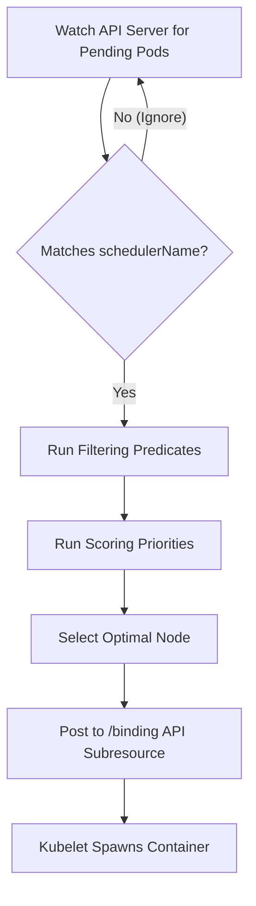

# kube-scheduler - Multiple Custom Schedulers

**Breadcrumbs:** [[Main Notes/0-Index|🏠 Index]] > [[kube-scheduler]] > **Multiple Custom Schedulers**

---

## 🎯 Purpose & Use Cases
While the default Kubernetes scheduler (`default-scheduler`) handles most workloads by evaluating taints, tolerations, and affinity, you can deploy and run **multiple schedulers simultaneously**. Workloads specify which scheduler they require, allowing you to:
- **Implement Custom Scheduling Algorithms:** Run specialized bin-packing, topological co-locations, or domain-specific node rankings.
- **Isolate Scheduling Pipelines:** Prevent scheduling latency of batch workloads from impacting critical microservices.
- **Control Plane Isolation:** Run a dedicated scheduler for a specific tenant or namespace in a multi-tenant cluster.

---

## ⚙️ Architecture & Mechanics

### 1. The Filtering Loop
A custom scheduler runs as a control loop watching the API server. Unlike the default scheduler, it ignores pods unless:
1. The Pod's `spec.nodeName` field is empty (indicating it is unscheduled/pending).
2. The Pod's `spec.schedulerName` matches the custom scheduler's configured name.



### 2. High Availability (HA) & Lease Separation
When running multiple replicas of a custom scheduler for high availability, only one replica should actively schedule pods to prevent conflicts:
- Schedulers use a **Lease** object (distributed lock in `kube-system`) to elect a leader.
- **CRITICAL:** Each custom scheduler profile must have a unique Lease lock name (`leaderElection.resourceName`). If a custom scheduler shares `kube-scheduler` with the default control plane, they will collide, continuously evicting each other's leadership.

---

## 🛠️ RBAC & Authorization (CKA Exam Requirement)
A custom scheduler is a control-plane client that reads and writes API objects. To deploy it as a Deployment in the cluster, you **must** configure its `ServiceAccount` with the following RBAC bindings:

1. **`system:kube-scheduler` (ClusterRoleBinding):** Grants standard permissions required for scheduling (watching pods, reading nodes, modifying bindings).
2. **`system:volume-scheduler` (ClusterRoleBinding):** Grants permissions to evaluate volume constraints and bind PV/PVC storage topology.
3. **`extension-apiserver-authentication-reader` (RoleBinding in `kube-system`):** Allows the scheduler to access the API server's client certification configurations.

---

## 🟢 Operational Validation & Troubleshooting

### 1. Assigning the Scheduler to a Pod
Specify the custom scheduler name under `spec.schedulerName` (if omitted, it defaults to `default-scheduler`):
```yaml
apiVersion: v1
kind: Pod
metadata:
  name: my-special-workload
spec:
  schedulerName: my-custom-scheduler
  containers:
  - name: nginx
    image: nginx:alpine
```

### 2. Diagnostics for Pending Pods
If a Pod is stuck in `Pending` without scheduling attempts (no events listed):
1. **Check the Scheduler Status:** Ensure the custom scheduler Pod/Deployment is running in the `kube-system` namespace.
2. **Inspect describe events:** Run `kubectl describe pod <pod-name>` or check events:
   ```bash
   kubectl get events -n default --sort-by='.metadata.creationTimestamp' -o wide
   ```
   Look at the `Source` column. If scheduled successfully, it should show:
   `Successfully assigned default/my-special-workload to worker-1 by my-custom-scheduler`
3. **Inspect Scheduler Logs:** Check the logs of the custom scheduler pod to diagnose predicate/priority failures:
   ```bash
   kubectl logs -n kube-system -l app=my-custom-scheduler
   ```

---

*Read more in [0-13_scheduling_logging_and_lifecycle.md](../Reference%20Notes/0-13_scheduling_logging_and_lifecycle.md#g-multiple-custom-schedulers)*
