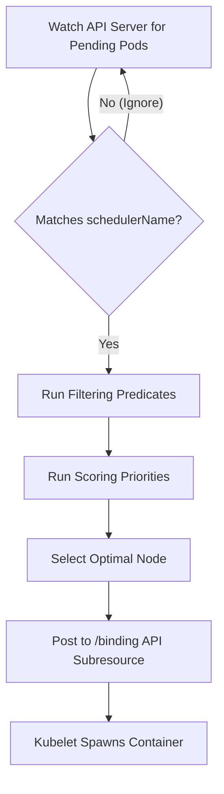

# kube-scheduler - Multiple Custom Schedulers

**Breadcrumbs:** [[Main Notes/0-Index|🏠 Index]] > [[kube-scheduler]] > [[kube-scheduler-deeper]] > **Multiple Custom Schedulers**

---

## 🎯 Purpose & Use Cases
While the default Kubernetes scheduler (`default-scheduler`) handles most workloads by evaluating taints, tolerations, and affinity, you can deploy and run **multiple schedulers simultaneously**. Workloads specify which scheduler they require, allowing you to:
- **Implement Custom Scheduling Algorithms:** Run specialized bin-packing, topological co-locations, or domain-specific node rankings.
- **Isolate Scheduling Pipelines:** Prevent scheduling latency of batch workloads from impacting critical microservices.
- **Control Plane Isolation:** Run a dedicated scheduler for a specific tenant or namespace in a multi-tenant cluster.

---

## ⚙️ Architecture & Mechanics

### 1. The Filtering Loop
A custom scheduler runs as a control loop watching the API server. Unlike the default scheduler, it ignores pods unless:
1. The Pod's `spec.nodeName` field is empty (indicating it is unscheduled/pending).
2. The Pod's `spec.schedulerName` matches the custom scheduler's configured name.



### 2. High Availability (HA) & Lease Separation
When running multiple replicas of a custom scheduler for high availability, only one replica should actively schedule pods to prevent conflicts:
- Schedulers use a **Lease** object (distributed lock in `kube-system`) to elect a leader.
- **CRITICAL:** Each custom scheduler profile must have a unique Lease lock name (`leaderElection.resourceName`). If a custom scheduler shares `kube-scheduler` with the default control plane, they will collide, continuously evicting each other's leadership.

## 🛠️ RBAC, Zero Trust Authorization & Deployment Configurations
The `kube-apiserver` operates on a strict **Zero Trust** security model. If a custom scheduler pod boots up and attempts to update the `nodeName` of a pending Pod (which is done by sending an HTTP POST request to the pod's `/binding` sub-resource), the API server will reject it with a `403 Forbidden` error.

To authorize your scheduler, you must configure a verified identity (`ServiceAccount`) and map the explicit permissions needed by the control plane client.

### 1. Step-by-Step Security Chain
*   **Step 1: The Identity (`ServiceAccount`):** Create a ServiceAccount (e.g. `my-scheduler` in the `kube-system` namespace). This acts as the official "passport" for the custom scheduler application.
*   **Step 2: Token Injection:** When your scheduler Pod is created with `spec.serviceAccountName: my-scheduler`, the admission controller automatically mounts a verified JSON Web Token (JWT) into the container filesystem at `/var/run/secrets/kubernetes.io/serviceaccount/token`.
*   **Step 3: Permission Roles:** The scheduler needs to watch Pods across all namespaces, read Node states, and update bindings. These are defined globally via ClusterRoles. You can bind built-in Kubernetes roles:
    *   `system:kube-scheduler`: Grants permissions to watch Pods, read Nodes, and modify Pod bindings.
    *   `system:volume-scheduler`: Grants permissions to evaluate volume constraints and bind PV/PVC storage topology.
    *   `extension-apiserver-authentication-reader` (RoleBinding in `kube-system`): Allows the scheduler to access the API server's client certification configurations.
*   **Step 4: The Glue (`ClusterRoleBinding`):** Bind the `my-scheduler` ServiceAccount to the ClusterRoles above. When the scheduler sends requests with its JWT, the RBAC gatekeeper validates the token and maps it to the bound roles, authorizing the binding operations.

### 2. Custom Scheduler Pod Manifest Example
The Pod manifest attaches the identity to the process. The process itself is configured to act both as an API client (scheduling pods) and an API server (serving its own health `/healthz` and metrics `/metrics` on port `10259`).

```yaml
apiVersion: v1
kind: Pod
metadata:
  name: my-custom-scheduler
  namespace: kube-system
  labels:
    component: my-custom-scheduler
spec:
  # ---------------------------------------------------------
  # ATTACHES SERVICE ACCOUNT IDENTITY TO THE POD
  serviceAccountName: my-scheduler
  # ---------------------------------------------------------
  containers:
  - name: my-custom-scheduler
    image: registry.k8s.io/kube-scheduler:v1.29.0
    command:
    - kube-scheduler
    # Delegated Auth flags: use kube-apiserver to authenticate and authorize requests to metrics port 10259
    - --authentication-kubeconfig=/etc/kubernetes/scheduler.conf
    - --authorization-kubeconfig=/etc/kubernetes/scheduler.conf
    # Brain configuration file (ComponentConfig API)
    - --config=/etc/kubernetes/my-scheduler-config.yaml
    - --secure-port=10259
```

### 3. ComponentConfig API (`my-scheduler-config.yaml`)
Modern versions of Kubernetes use ComponentConfig API files instead of long command-line flags. The config file maps directly to a `KubeSchedulerConfiguration` object:

```yaml
apiVersion: kubescheduler.config.k8s.io/v1
kind: KubeSchedulerConfiguration
profiles:
  - schedulerName: my-custom-scheduler # <-- Declares scheduler name to the cluster
leaderElection:
  leaderElect: false
```


## 🟢 Operational Validation & Troubleshooting

### 1. Assigning the Scheduler to a Pod
Specify the custom scheduler name under `spec.schedulerName` (if omitted, it defaults to `default-scheduler`):
```yaml
apiVersion: v1
kind: Pod
metadata:
  name: my-special-workload
spec:
  schedulerName: my-custom-scheduler
  containers:
  - name: nginx
    image: nginx:alpine
```

### 2. Diagnostics for Pending Pods
If a Pod is stuck in `Pending` without scheduling attempts (no events listed):
1. **Check the Scheduler Status:** Ensure the custom scheduler Pod/Deployment is running in the `kube-system` namespace.
2. **Inspect describe events:** Run `kubectl describe pod <pod-name>` or check events:
   ```bash
   kubectl get events -n default --sort-by='.metadata.creationTimestamp' -o wide
   ```
   Look at the `Source` column. If scheduled successfully, it should show:
   `Successfully assigned default/my-special-workload to worker-1 by my-custom-scheduler`
3. **Inspect Scheduler Logs:** Check the logs of the custom scheduler pod to diagnose predicate/priority failures:
   ```bash
   kubectl logs -n kube-system -l app=my-custom-scheduler
   ```

---

*Read more in [0-13_scheduling_logging_and_lifecycle.md](../Reference%20Notes/0-13_scheduling_logging_and_lifecycle.md#g-multiple-custom-schedulers)*
