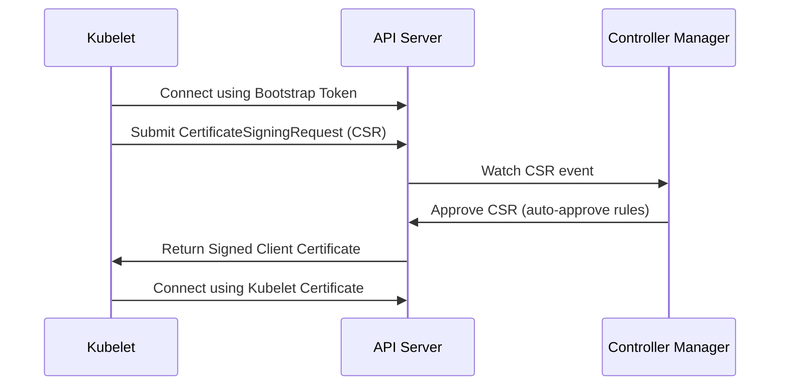

# kubelet - Node Bootstrap and TLS Bootstrapping

**Breadcrumbs:** [[Main Notes/0-Index|🏠 Index]] > [[kubelet]] > **TLS Bootstrapping**

---

## 📑 1. Why TLS Bootstrapping Exists
To secure communication, each Kubelet must authenticate with the API Server using client certificates. In a large cluster, generating and distributing these certificates manually to every node is a massive operational burden.

**TLS Bootstrapping** automates the generation, distribution, and signing of these Kubelet certificates.

---

## ⚙️ 2. Step-by-Step TLS Bootstrapping Flow

1. **Bootstrap Config:** Kubelet starts up with a bootstrap-kubeconfig file containing a short-lived **Bootstrap Token**.
2. **Submit CSR:** Kubelet contacts the API server using this token and submits a CertificateSigningRequest (CSR).
3. **Approval:** The CSR is approved (either manually by an administrator using `kubectl certificate approve` or automatically by the Certificate Controller).
4. **Certificate Rotation:** Kubelet saves the signed certificate in `/var/lib/kubelet/pki/kubelet-current.pem` and switches to using it for all future API communication.

*Read more in [[Reference Notes/0-3_node_mechanics_and_resource_limits.md#1-node-bootstrapping-and-kubelet-self-registration]]*\n