# kube-controller-manager - Node Eviction Grace Periods

**Breadcrumbs:** [[Main Notes/0-Index|🏠 Index]] > [[kube-controller-manager]] > **Node Eviction Grace Periods**

---

## 📑 1. Node Health Eviction Flow
When a worker node stops sending heartbeats, the Control Plane initiates a timeline to taint the node and evict its running Pods.

```mermaid
gantt
    title Node Offline Timeline
    dateFormat  X
    axisFormat %s
    section Health Check
    Kubelet fails heartbeats :active, 0, 40
    Node marked NotReady/Unknown :crit, 40, 300
    Eviction Grace Period expires :active, 300, 310
    Pods Evicted & Rescheduled :done, 310, 320
```



---

## ⚙️ 2. Configuration Parameters
These settings reside in the `kube-controller-manager` configurations:
* **`--node-monitor-grace-period` (Default: `40s`):** The amount of time the controller waits before marking a node as `NotReady` or `Unknown` if it does not receive a heartbeat.
* **`pod-eviction-timeout` (Default: `5m` / `300s`):** The timeout before the Control Plane schedules replacement Pods on healthy nodes, evicting the existing ones.

---

## 🔬 3. Pod Tolerations for Taints
When a node becomes unreachable, the controller automatically adds a taint:
* `node.kubernetes.io/unreachable:NoExecute`
* `node.kubernetes.io/not-ready:NoExecute`

Pods running on the node will be evicted immediately unless they have a matching toleration with a `tolerationSeconds` grace period:
```yaml
spec:
  tolerations:
  - key: "node.kubernetes.io/unreachable"
    operator: "Exists"
    effect: "NoExecute"
    tolerationSeconds: 6000 # <-- Delay eviction for 100 minutes
```

*Read more in [[Reference Notes/0-10_maintenance_upgrades_and_etcd.md#15-node-eviction-tolerations-and-patching-concurrency]]*\n