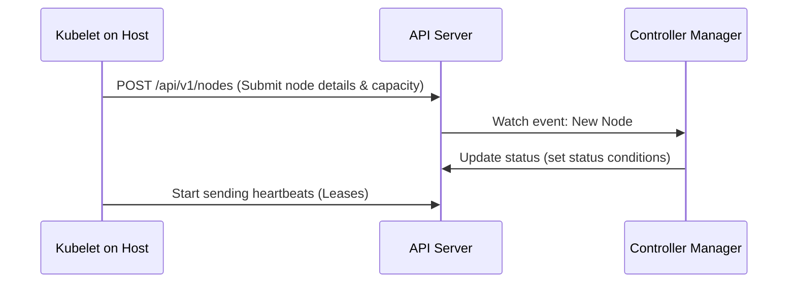

# node - Node Registration Pathway

**Breadcrumbs:** [[Main Notes/0-Index|🏠 Index]] > [[node]] > **Node Registration Pathway**

---

## 📑 1. Kubelet Self-Registration Process
When the Kubelet starts up on a host machine, it automatically registers itself with the cluster API Server if `--register-node` is set to `true` (default).



---

## ⚙️ 2. Detailed Steps in the Pathway
1. **Host Inspection:** Kubelet inspects the host to determine CPU capacity, memory size, host IP, hostname, and OS runtime.
2. **Node Object Creation:** Kubelet contacts the API server using its bootstrap credentials and creates a Node API object.
3. **Control Loop Monitoring:** The Node Controller in the `kube-controller-manager` detects the new Node, checks CIDR allocation, and assigns the node internal conditions.
4. **Heartbeat Lifecycle:** Kubelet starts updating its Lease status inside the `kube-node-lease` namespace every 10 seconds.

---

## 🔬 3. Manual Node Creation Alternative
If self-registration is disabled (`--register-node=false`), the administrator must manually pre-create the Node object:
```bash
cat <<EOF | kubectl apply -f -
apiVersion: v1
kind: Node
metadata:
  name: host-node-1
EOF
```
The Kubelet on `host-node-1` will then link to this object and populate its status.

*Read more in [[Reference Notes/0-3_node_mechanics_and_resource_limits.md#1-node-bootstrapping-and-kubelet-self-registration]]*\n