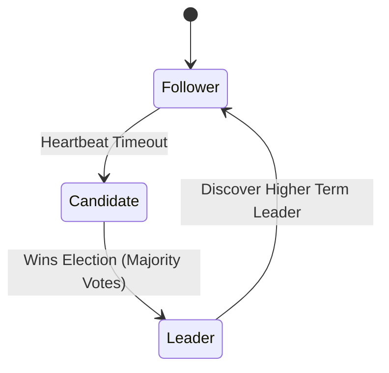

# etcd - Raft Consensus

**Breadcrumbs:** [[Main Notes/0-Index|🏠 Index]] > [[etcd]] > **Raft Consensus**

---

## 📑 1. Raft Algorithm in etcd
ETCD uses the **Raft Consensus** protocol to manage replication of the database state across a cluster. Raft ensures that a write is committed and available only if a majority of nodes agree to it.

---

## ⚙️ 2. Raft Roles and States
Every ETCD node operates in one of three states:
* **Leader:** Handles all client requests, coordinates log replication, and dictates heartbeat timeouts.
* **Follower:** Passive receiver. Replicates logs from the leader and responds to votes request.
* **Candidate:** Temporary state during a leader election, campaigning for votes.

---

## 🔬 3. Data Replication Flow
1. Client sends a write request to the Leader.
2. Leader writes to its local log and sends an `AppendEntries` RPC to all Followers.
3. Once a majority of nodes acknowledge writing the entry, the Leader commits the write and notifies the client.

*Read more in [[Reference Notes/0-10_maintenance_upgrades_and_etcd.md#4-etcd-database-administration-and-restoration]]*\n