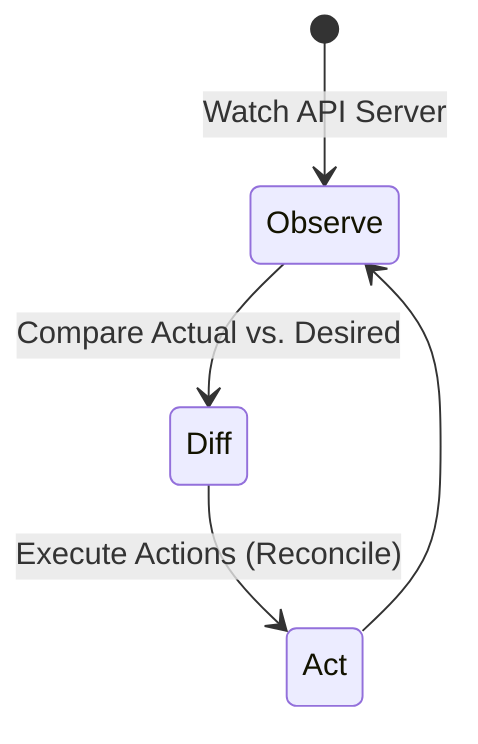

# kube-controller-manager - Reconciliation Loop Mechanics

**Breadcrumbs:** [[Main Notes/0-Index|🏠 Index]] > [[kube-controller-manager]] > **Reconciliation Loop Mechanics**

---

## 📑 1. What is the Reconciliation Loop?
Kubernetes controllers use a continuous control loop (the **Reconciliation Loop**) to monitor the state of the cluster and make changes to bring the actual state closer to the desired state.



---

## ⚙️ 2. Steps in the Loop
The loop runs continuously:
1. **Observe:** The controller watches the API Server (via informers/listers) for changes in resources.
2. **Diff:** The controller compares the actual state (e.g. 2 Pods running) with the desired state declared in the object spec (e.g. 3 replicas).
3. **Act:** If a difference exists, the controller acts to correct it (e.g. makes an API call to create 1 more Pod).

---

## 🔬 3. Example: ReplicaSet Controller Loop
* **Desired State:** `spec.replicas = 3`.
* **Loop Logic:**
  ```python
  while True:
      actual_pods = get_pods_with_selector(replicaset.selector)
      diff = replicaset.replicas - len(actual_pods)
      if diff > 0:
          create_pods(diff)
      elif diff < 0:
          delete_pods(abs(diff))
      sleep(reconciliation_interval)
  ```

*Read more in [[Reference Notes/0-2_cluster_architecture_and_components.md#d-kube-controller-manager-the-reconciler]]*\n