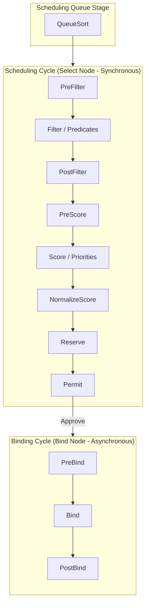
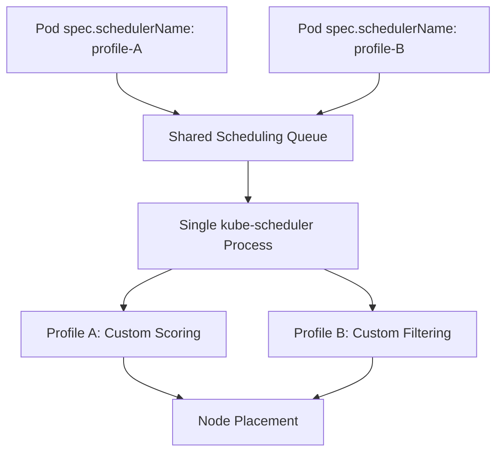

# kube-scheduler - Scheduler Profiles & Extension Points

**Breadcrumbs:** [[Main Notes/0-Index|🏠 Index]] > [[kube-scheduler]] > [[kube-scheduler-deeper]] > **Scheduler Profiles**

---

## 📑 1. The Scheduling Framework & Extension Points
The Kubernetes **Scheduling Framework** is a pluggable architecture that executes scheduling algorithms across multiple stages. Each stage exposes an **Extension Point** where custom or default plugins can hook in to filter nodes, rank them, or bind Pods.



---

## 🔌 2. Core Extension Points & Default Plugins
A single plugin can register at multiple extension points to participate in different lifecycle stages. Here is how key default plugins map to these stages:

| Stage / Extension Point | Default Plugin | Functionality / Action |
| :--- | :--- | :--- |
| **QueueSort** | `PrioritySort` | Sorts pending Pods in the scheduling queue based on their PriorityClass. Only one QueueSort plugin can be active at a time. |
| **Filter** (Predicates) | `NodeUnschedulable` <br> `NodeResourcesFit` <br> `NodeName` | Filters out nodes that are cordoned (`Unschedulable: true`), lack requested CPU/Memory, or do not match the Pod's static `nodeName`. |
| **Score** (Priorities) | `NodeResourcesFit` <br> `ImageLocality` <br> `NodeAffinity` | Scores eligible nodes (0 to 10). `ImageLocality` prioritizes nodes that already have the container images cached to reduce pull latency. |
| **Bind** | `DefaultBinder` | Issues the final HTTP `Binding` POST request to the API server to write the node selection to the Pod's `spec.nodeName` field. |

> [!NOTE]
> Unlike the **Filter** phase (which rejects ineligible nodes immediately), plugins in the **Score** phase do not reject placement. For example, if no nodes have cached images, `ImageLocality` will assign low scores but the Pod will still be scheduled on a node without the cached image.

---

## ⚙️ 3. Scheduler Profiles (Multiple Profiles in One Process)
Before Kubernetes **v1.18**, supporting different scheduling behaviors required running multiple scheduler binaries (processes) with separate configurations. This approach had two key drawbacks:
1. **Process Overhead:** Managing and monitoring multiple system processes.
2. **Race Conditions:** Schedulers worked independently, leading to conflicts where multiple schedulers placed different Pods on the same node simultaneously, unaware of each other's decisions.

### The Solution: Multi-Profile Scheduling (v1.18+)
A single scheduler binary can now execute **multiple scheduling profiles**. Each profile acts as a separate virtual scheduler, sharing a single scheduling queue and state. This eliminates process conflicts and race conditions.



---

## 🛠️ 4. Configuring Profiles (`KubeSchedulerConfiguration`)
To run multiple profiles, use the ComponentConfig API in a scheduler configuration file and pass it to the scheduler via `--config`.

Here is an example `/etc/kubernetes/my-scheduler-config.yaml` specifying multiple profiles and custom plugin enable/disable behavior:

```yaml
apiVersion: kubescheduler.config.k8s.io/v1
kind: KubeSchedulerConfiguration
leaderElection:
  leaderElect: false
profiles:
  # Profile 1: Default Scheduler
  - schedulerName: default-scheduler

  # Profile 2: Custom Scheduler with Taints Ignored
  - schedulerName: scheduler-ignore-taints
    plugins:
      filter:
        disabled:
          - name: NodeTaints # Disables taints check

  # Profile 3: No-Scoring Scheduler (Faster decisions, ignores node rank)
  - schedulerName: scheduler-fast-bind
    plugins:
      preScore:
        disabled:
          - name: "*" # Disables all pre-scoring plugins
      score:
        disabled:
          - name: "*" # Disables all scoring plugins
```

---

## 🔍 References & Further Reading
* [Kubernetes Scheduling Framework](https://kubernetes.io/docs/concepts/scheduling-eviction/scheduling-framework/)
* [Configure Multiple Schedulers](https://kubernetes.io/docs/tasks/extend-kubernetes/configure-multiple-schedulers/)
* KEP-1451: Multiple Scheduling Profiles
