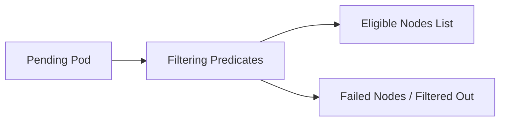

# kube-scheduler - Scheduling Filtering Predicates

**Breadcrumbs:** [[Main Notes/0-Index|🏠 Index]] > [[kube-scheduler]] > [[kube-scheduler-deeper]] > **Filtering Predicates**

---

## 📑 1. Overview of the Filtering Phase
In the **Filtering** (or *Predicates*) phase of the scheduling cycle, the `kube-scheduler` filters out nodes that do not meet the resource or constraints requirements of a pending Pod.



---

## ⚙️ 2. Core Filtering Predicates
The scheduler executes several standard predicate plugins in order:

### A. PodFitsResources
Checks if a node has enough unallocated CPU, memory, and ephemeral storage capacity to satisfy the Pod's resource requests.
* **Calculation:** $\text{Available} = \text{Allocatable} - \sum(\text{Existing Pod Requests})$. If $\text{Requested} > \text{Available}$, the node is excluded.

### B. PodFitsHostPorts
Ensures that the ports requested via the Pod's `spec.containers[*].ports[*].hostPort` are not already occupied on the node.
* **CKA Trap:** Using `hostPort` limits the Pod to running at most one replica per node.

### C. PodMatchNodeSelector
Checks if the node's labels match the Pod's `spec.nodeSelector` or `spec.affinity.nodeAffinity` requirements.

### D. PodToleratesNodeTaints
Verifies that the Pod contains matching tolerations for all taints present on the node.
* **Taint Mechanics:** Nodes with taints will reject any Pod that does not explicitly tolerate them.

### E. NodeUnschedulable
Excludes nodes that are marked as unschedulable (`spec.unschedulable: true`), which happens during a cordon operation.

---

## 🔍 3. Troubleshooting Filter Failures
If a Pod remains `Pending` due to filtering failures, inspect it using:
```bash
kubectl describe pod <pod-name>
```
Look for events matching:
* `0/3 nodes are available: 1 node(s) had untolerated taint, 2 Insufficient memory.`

*Read more in [[Reference Notes/0-13_scheduling_logging_and_lifecycle.md#3-labels-selectors-and-affinity-evaluation]]*\n