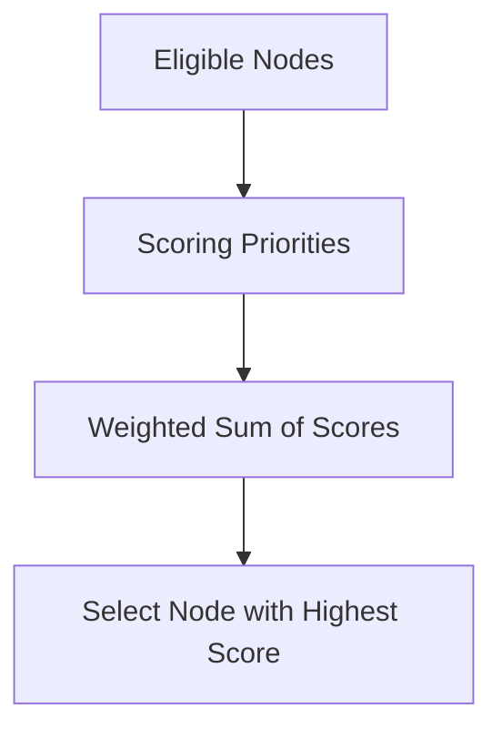

# kube-scheduler - Scheduling Scoring Priorities

**Breadcrumbs:** [[Main Notes/0-Index|🏠 Index]] > [[kube-scheduler]] > **Scoring Priorities**

---

## 📑 1. Overview of the Scoring Phase
In the **Scoring** (or *Priorities*) phase, the `kube-scheduler` ranks all eligible nodes that survived the filtering phase. It assigns a score from `0` to `10` to each node based on various ranking algorithms.



---

## ⚙️ 2. Core Scoring Priority Plugins

### A. ImageLocalityPriorityMap
Prioritizes nodes that already have the requested container images cached locally.
* **Benefit:** Reduces container startup time and network bandwidth usage during Pod bootstrapping.

### B. NodeResourcesLeastAllocated vs. MostAllocated
Configures how the scheduler distributes workloads:
* **LeastAllocated (Default):** Spreads Pods evenly across the cluster to balance CPU and memory usage.
* **MostAllocated (Bin-packing):** Tightly packs workloads onto as few nodes as possible, allowing other nodes to scale down or go idle.

### C. NodeAffinityPriority
Assigns points for satisfying soft scheduling preferences specified in `preferredDuringSchedulingIgnoredDuringExecution`.

### D. TaintTolerationPriorityMap
Scores nodes based on the count of matching taints/tolerations, preferring nodes where the Pod tolerates fewer taints to preserve tolerations for critical nodes.

---

## 🔍 3. Customizing Scores via Configuration
Cluster administrators can configure plugin weights in the scheduler's configuration profile:
```yaml
apiVersion: kubescheduler.config.k8s.io/v1
kind: KubeSchedulerConfiguration
profiles:
  - schedulerName: default-scheduler
    plugins:
      score:
        disabled:
          - name: NodeResourcesLeastAllocated
        enabled:
          - name: NodeResourcesMostAllocated
            weight: 100
```

*Read more in [[Reference Notes/0-13_scheduling_logging_and_lifecycle.md#1-the-scheduling-framework-pipeline]]*\n