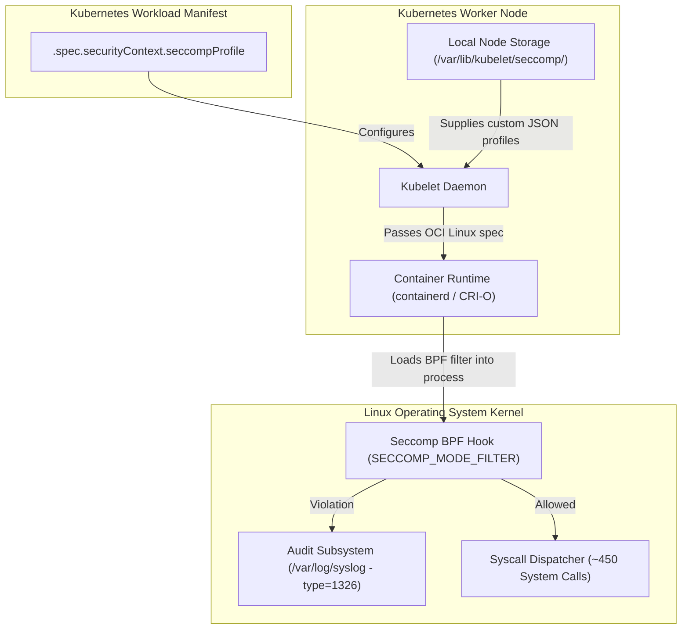

# Seccomp

**Breadcrumbs:** [[Main Notes/0-Index|🏠 Index]] > Linux & Kubernetes Security > **Seccomp**

---

## 🎯 Purpose (Why it is used)

**Seccomp (Secure Computing Mode)** is a Linux kernel security facility designed to restrict the system calls (syscalls) an arbitrary userspace process can make into the kernel. In containerized and Kubernetes environments, all containers share the underlying host operating system kernel. Even if a container is restricted by Linux namespaces and cgroups, an unconstrained container process can invoke any of the ~450 available Linux syscalls. 

Seccomp acts as a syscall firewall at the kernel boundary: it drops dangerous, obsolete, or privileged system calls (such as `reboot`, `sys_chroot`, `kexec_load`, `mount`, `swapon`, or raw packet operations) so that even if an attacker achieves Remote Code Execution (RCE) inside a container, they cannot exploit kernel vulnerabilities or break out to the host.

---

## ⚙️ Functionality (What it is doing)

Seccomp operates by executing Berkeley Packet Filter (BPF) bytecode hooks inside the Linux kernel on every system call invocation:

1. **System Call Interception:** When a process issues an interrupt or `syscall` instruction, the kernel checks whether a seccomp filter is active for the thread (`SECCOMP_MODE_FILTER`).
2. **Rule Evaluation:** The BPF program evaluates the numeric syscall number, processor architecture (`SCMP_ARCH_X86_64`), and call arguments.
3. **Action Enforcement:**
   - **`SCMP_ACT_ALLOW`:** The system call proceeds to the kernel dispatcher without impediment.
   - **`SCMP_ACT_LOG`:** The syscall is permitted, but an audit log entry (`type=1326`) is generated in `/var/log/syslog` or `/var/log/audit/audit.log` for discovery and profiling.
   - **`SCMP_ACT_ERRNO`:** The syscall is blocked, and an error code (`EPERM` by default) is returned to the process without terminating it.
   - **`SCMP_ACT_KILL_PROCESS` / `SCMP_ACT_KILL`:** The process or thread is immediately terminated with `SIGSYS`.
4. **Kubernetes Integration:**
   - Evaluates `.spec.securityContext.seccompProfile` (`RuntimeDefault`, `Localhost`, or `Unconfined`).
   - Supports node-wide automatic defaulting (`seccompDefault: true` in Kubelet configuration), ensuring unconfigured pods run securely under `RuntimeDefault`.

---

## 🏛️ Architectural Context (How it fits in the architecture)



- **Kubelet:** Reads `.spec.securityContext.seccompProfile`. If `type: Localhost`, it resolves the relative profile path from `/var/lib/kubelet/seccomp/`.
- **Container Runtime Interface (CRI):** Compiles the profile into the Open Container Initiative (OCI) runtime specification and passes it to the low-level runtime (`runc` / `crun`).
- **Container Process:** Runs with `no_new_privs` bit enabled (`allowPrivilegeEscalation: false`) so child processes cannot bypass the seccomp boundary.

---

## 🧩 Problem Solver (What problem it solves)

- **Shared Kernel Attack Surface:** In standard container runtimes, all containers share the host kernel. Unfiltered syscall access exposes the host to zero-day kernel vulnerabilities (e.g. `Dirty COW`, `Dirty Pipe`, namespace escape bugs). Seccomp reduces this attack surface by up to 90% by disabling unneeded syscalls.
- **Privilege Escalation Containment:** Prevents processes from calling system administration functions, loading unverified kernel modules, changing system clocks, or modifying routing tables.
- **Compliance with Pod Security Standards (PSS):** Applying `seccompProfile.type: RuntimeDefault` fulfills the **Restricted** tier of Kubernetes Pod Security Standards without requiring custom JSON files on worker nodes.

---

## 🟢 Operational Impact (What will happen with it operating)

- Applications run with a strictly enforced syscall boundary.
- With `RuntimeDefault`, standard web servers, microservices, and databases function completely normally because container runtimes whitelist all standard POSIX application calls.
- Unused dangerous syscalls return `EPERM` or trigger process termination if an adversary attempts to execute exploit payloads.
- With `seccompDefault: true` on worker nodes, any developer who forgets to configure `seccompProfile` is protected by default without breaking manifest portability.

---

## 🔴 Failure Impact (What will happen without it)

- **Container Breakouts:** Any remote code execution vulnerability in a containerized app gives an attacker direct access to the full host kernel API, facilitating privilege escalation and complete host compromise.
- **Audit Blind Spots:** Without profiling via `SCMP_ACT_LOG`, security teams cannot determine what syscalls an application requires or whether suspicious calls are occurring.
- **PSS Failures:** Clusters enforcing Pod Security Admission (PSA) at the `restricted` level will reject pod creation if seccomp is missing or set to `Unconfined`.

---

## 🔍 Deeper Dive Notes
This table automatically displays all deeper notes, use cases, and pitfalls associated with **Seccomp**.

```dataview
TABLE sub_type AS "Type", tags AS "Tags", source_type AS "Source"
WHERE class = "deeper-dive" AND icontains(string(parent_concept), this.file.name)
SORT file.name ASC
```
