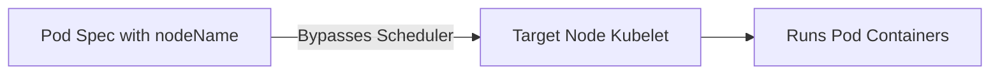

# kube-scheduler - Static nodeName Scheduling Bypass

**Breadcrumbs:** [[Main Notes/0-Index|🏠 Index]] > [[kube-scheduler]] > [[kube-scheduler-deeper]] > **Static nodeName Scheduling Bypass**

---

## 📑 1. Bypassing the Scheduler at Creation Time
If you know exactly which node should run your Pod, you can specify its name directly in the Pod specification using the `spec.nodeName` field. This bypasses the scheduler completely.



---

## ⚙️ 2. Configuration Example
Create a Pod manifest specifying the destination node directly:
```yaml
apiVersion: v1
kind: Pod
metadata:
  name: scheduler-bypass-pod
spec:
  nodeName: k8s-worker-2 # <-- Direct assignment
  containers:
  - name: nginx
    image: nginx:alpine
```

---

## ⚠️ 3. Operational Mechanics and Risks
* **No Validation:** Because it bypasses the scheduler, the host's capacity is not checked. If the node runs out of memory, it may OOM-kill other containers or crash.
* **Taints Ignored:** The Pod will execute on the targeted node even if the node has an active `NoSchedule` taint and the Pod has no matching tolerations.
* **No Failover:** If the targeted node goes offline, the Pod is marked as failed and will not reschedule to any other node.

*Read more in [[Reference Notes/0-13_scheduling_logging_and_lifecycle.md#2-manual-node-binding-bypass-mechanisms]]*\n