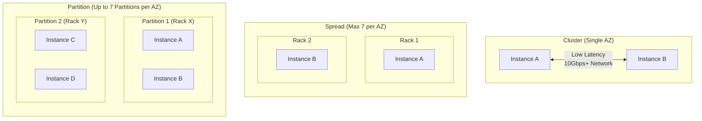

# aws - Placement Group

**Breadcrumbs:** [[Main Notes/0-Index|🏠 Index]] > [[aws]] > [[aws - EC2 and Elastic Load Balancing]] > **Placement Group**

---

## 📑 EC2 Placement Group Topologies

An **EC2 Placement Group** is a logical configuration container that allows customers to influence how EC2 instances are placed on physical hypervisor racks to meet specific application latency or resilience requirements.

### 🏛️ Placement Strategies

#### 1. Cluster Placement Group
*   **Topology:** Packs instances closely together within a single Availability Zone (AZ).
*   **Benefits:** Enables low network latency and high throughput (10 Gbps+ using enhanced networking) for inter-instance communication.
*   **Risks:** High risk of concurrent failure if the underlying AZ encounters a physical hardware or power fault.
*   **Use Cases:** High-Performance Computing (HPC), high-speed big data analytics, low-latency node networks.

#### 2. Spread Placement Group
*   **Topology:** Distributes instances so that each is placed on a completely separate physical rack (separate power and network feeds).
*   **Constraints:** Strictly limited to a maximum of **7 instances per AZ** per placement group.
*   **Benefits:** Maximizes isolation between instances to prevent concurrent failure from a single rack fault.
*   **Use Cases:** Small fleets of critical workloads (e.g., control plane nodes, main database instances, security proxies).

#### 3. Partition Placement Group
*   **Topology:** Divides instance placement across logical partitions (up to 7 partitions per AZ). Each partition maps to an isolated set of physical hardware racks.
*   **Scale:** Can support hundreds of EC2 instances per group (unlike Spread).
*   **Benefits:** Ensures instances in Partition A do not share hardware with instances in Partition B. If Partition B fails, Partition A remains active.
*   **Use Cases:** Partition-aware distributed data stores (e.g., Apache Kafka, Cassandra, Hadoop HDFS, HBase).

*Read more in [[Reference Notes/3-4_aws_ec2_compute.md#5. EC2 Placement Groups]]*
