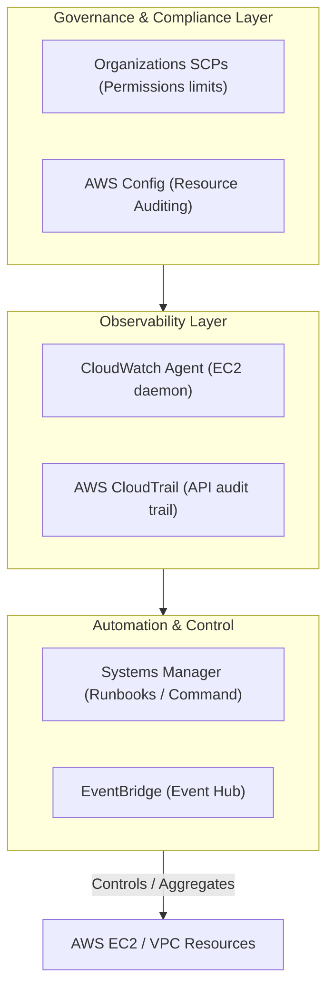

# AWS CloudOps

**Breadcrumbs:** [[Main Notes/0-Index|🏠 Index]] > AWS > **AWS CloudOps**

---

## 🎯 Purpose (Why it is used)

AWS CloudOps (formerly SysOps Administration) comprises the operational frameworks, observability architectures, and automation systems used to deploy, manage, monitor, and remediate resources within AWS. It ensures systems are secure, resilient, high-performing, and compliant with standard governance boundaries.

---

## ⚙️ Functionality (What it is doing)

AWS CloudOps manages several critical capabilities across the cloud lifecycle:
*   **Observability:** Collecting kernel-level and virtualization-layer metrics and routing logs dynamically via the unified CloudWatch Agent.
*   **Auto-Remediation:** Capturing resource failure events through Amazon EventBridge and triggering automated diagnostic runbooks in Systems Manager.
*   **Infrastructure Tuning:** Optimizing block storage (EBS gp3), object storage (S3 lifecycles), and database routing (RDS Proxy).
*   **Disaster Recovery:** Automating backups, snapshot scheduling via DLM, and configuring active-passive DNS failovers with Route 53.
*   **Compliance Governance:** Setting regional restrictions via Service Control Policies (SCPs) and verifying resource rules continuously using AWS Config.

---

## 🏛️ Architectural Context (How it fits in the architecture)

AWS CloudOps acts as the operations management layer wrapping all AWS compute, storage, database, and network resources:



---

## 🧩 Problem Solver (What problem it solves)

AWS CloudOps eliminates the need for manual, error-prone human intervention to maintain system health:
*   **Without it:** Ops teams must manually SSH into crashed nodes, review static text files, size disks reactively when they hit 100% capacity, and manually configure regional network restrictions in every AWS member account.
*   **With it:** Systems utilize auto-healing workflows that reboot failed daemons within seconds, move cold database logs to cheap archival S3 tiers automatically, and enforce global IAM permission guardrails automatically across the entire organizational unit.

---

## 🟢 Operational Impact (What will happen with it operating)

With a fully functioning CloudOps architecture:
*   Resource health metrics (RAM, Swap, Disk I/O) are captured in real-time, providing early warnings for capacity expansion.
*   Application errors (e.g. Nginx 5xx server drops) trigger immediate event-driven alerts or script execution.
*   Security baselines are enforced automatically via Service Control Policies and auto-remediating AWS Config rules.
*   Multi-region deployments are managed from a single stack controller with controlled concurrency and rollback guardrails.

---

## 🔴 Failure Impact (What will happen without it)

If CloudOps monitoring or automation components fail:
*   System administrators remain blind to OS-level resource exhaustion (OOM crashes) until users report outages.
*   Malicious API activity (unauthorized role assumptions or configuration changes) goes unnoticed without CloudTrail log integrity checks.
*   VPC configuration drift or unauthorized security group additions bypass security controls, leaving the network vulnerable.
*   Incident resolution times (MTTR) increase significantly as responders must manually trace logs, identify faulty systems, and execute fixes.

---

## 🔍 Deeper Dive Notes

This table displays all deeper dive notes, use cases, and operational pitfalls for **AWS CloudOps**:

```dataview
TABLE sub_type AS "Type", tags AS "Tags", source_type AS "Source"
WHERE class = "deeper-dive" AND icontains(string(parent_concept), this.file.name)
SORT file.name ASC
```
