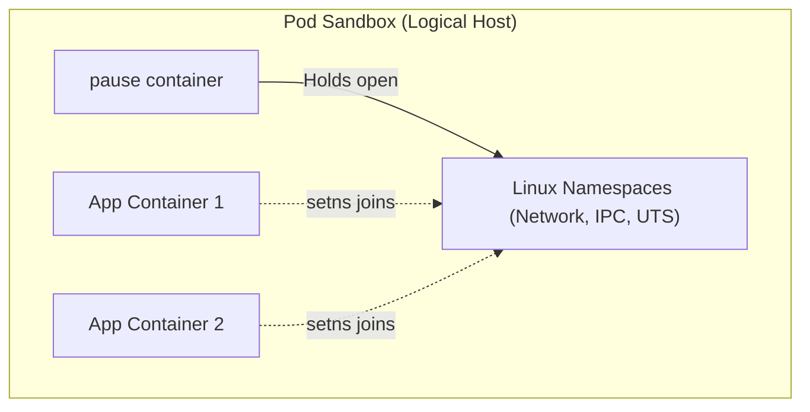

# container-runtime deeper

**Breadcrumbs:** [[Main Notes/0-Index|🏠 Index]] > [[container-runtime]] > **deeper dive**

---

This note covers the Container Runtime Interface (CRI) services, OCI specifications, shim mechanics, the pause container, Cgroup drivers, and runtime command-line tools.

---

## 🔌 1. The CRI Dual Services (gRPC)
The Container Runtime Interface (CRI) consists of two gRPC services running over a local Unix domain socket:
1. **`RuntimeService`:** Manages the lifecycle of Pod Sandboxes and active containers (create, start, stop, remove, exec).
2. **`ImageService`:** Manages images (pull, list, inspect, remove).

---

## 🏛️ 2. High-Level vs. Low-Level Runtimes (OCI & runc)
Kubernetes decouples container execution into two tiers:
* **High-Level Runtime (CRI-compliant):** e.g., `containerd` or `CRI-O`. Handles the gRPC API, pulls images, unpacks them, and manages container networking and storage.
* **Low-Level Runtime (OCI-compliant):** e.g., `runc`. A lightweight CLI tool that talks directly to the Linux kernel to configure cgroups, namespaces, and execute the container process, then exits immediately.

---

## 🪓 3. containerd-shim
Because the low-level runtime (`runc`) exits after creating the container, something must stay active to monitor the container process:
* **containerd-shim:** A tiny process spawned for each container.
* **Responsibilities:**
  * Keeps the container's standard I/O (stdin, stdout, stderr) file descriptors open even if containerd restarts.
  * Reports the container exit status code back to containerd.
  * Prevents "zombie processes" if the container's main process crashes.

---

## ⏸️ 4. The Pause Container
Every Pod in Kubernetes runs a hidden helper container called the **pause container** (or infra container):
* **Namespace Holder:** It is the first container started in the Pod sandbox. It does not run any application code; it simply runs a sleep loop.
* **Resource Sharing:** It holds open the Network and IPC namespaces. All other application containers inside the same Pod join these namespaces, allowing them to communicate over `localhost` and share storage volumes.



---

## 🧬 5. Cgroup Drivers: systemd vs. cgroupfs
Linux uses control groups (`cgroups`) to limit container resources. Kubernetes and the container runtime must use the same driver to manage these cgroups:
* **`cgroupfs` (Legacy):** The runtime writes resource files directly to `/sys/fs/cgroup`.
* **`systemd` (Modern & Recommended):** The OS uses systemd as its init process, which manages cgroup mappings.
* **Critical Rule:** If the container runtime uses `systemd` but the kubelet uses `cgroupfs` (or vice versa), the node will experience duplicate control hierarchies and eventually crash under heavy memory load. Both must be aligned.

---

## 🛠️ 6. Debug CLI Tools Comparison (CKA Essential)
When debugging a broken node, you cannot use `kubectl` or `docker`. You must use node-level tools to inspect container configurations and logs:

| CLI Tool | Target Level | Developer / Community | Namespace Aware? | Purpose & Features |
| :--- | :--- | :--- | :--- | :--- |
| **`ctr`** | containerd daemon | containerd Community | Yes (`ctr -n k8s.io ...`) | Native containerd debugging. Minimal feature set, not user-friendly. Used strictly for raw container tasks and image pulls on containerd directly. |
| **`nerdctl`** | containerd daemon | containerd Community | Yes (`nerdctl -n k8s.io ...`) | User-friendly, Docker-compatible CLI. Supports Docker CLI commands (`run`, `ps`, `build`, etc.) plus advanced containerd features (encrypted images, eStargz lazy image pulling, P2P image distribution, image signing, and Kubernetes namespace isolation). |
| **`crictl`** | CRI endpoint socket | Kubernetes Community | Yes (CRI connection aware) | **Kubernetes-native CLI** for inspecting and debugging runtime issues across *any* CRI-compliant runtime (containerd, CRI-O, etc.). Matches Docker syntax (`ps`, `logs`, `exec`) but interfaces at the CRI socket level. |

### crictl Commands Example
To list Pods, Containers, and Images on a node using the CRI socket:
```bash
# Configure socket environment variable
export CRI_CONFIG_FILE=/etc/crictl.yaml
crictl pods
crictl ps
crictl images
crictl logs <container-id>
crictl exec -it <container-id> sh
```

#### ⚠️ Production Warning: Bypassing Kubelet
While `crictl` supports creating containers, **never run `crictl` container creation commands on production nodes**. The `kubelet` is the sole manager of node state. If it discovers a running container that it did not spin up itself, it will flag it as an untracked resource and automatically delete or garbage collect it. Use `crictl` purely for debugging.

#### 🎛️ Port Awareness
Unlike Docker, `crictl` is designed to inspect CRI-mapped ports. Use the command:
```bash
crictl ports
```
to list active port mappings mapped under the Pod sandbox namespaces.

*Read more in [0-5_containers_runtimes_and_lifecycle.md](../Reference%20Notes/0-5_containers_runtimes_and_lifecycle.md#2-container-runtime-interface-cri--namespaces).*

---

## 🚫 7. Dockershim Deprecation & Socket Requirements

Originally, Docker was the sole runtime supported by Kubernetes, bridged via **Dockershim**. 

### The Decoupling Logic:
Docker is a full developer suite (encompassing API, CLI, image building tools, authentication layers, volumes, and networking helper systems). Because Kubernetes natively manages networking, scheduling, secrets, and volumes, it did not need these high-level Docker features. Therefore, to minimize overhead and cluster vulnerability surface, support for Docker Engine was deprecated and **completely removed** in Kubernetes **v1.24**.
*   **OCI Compliance:** Since Docker builds images matching the Open Container Initiative (OCI) image specification, old Docker images continue to work seamlessly with standalone containerd or CRI-O.
*   **Standalone containerd:** Clusters can run containerd alone without any Docker package installed.

### Default crictl Socket Polling Order:
When `crictl` runs without an explicit endpoint configuration, it polls local sockets in the following priority sequence:
1.  `unix:///var/run/dockershim.sock` (Dockershim)
2.  `unix:///run/containerd/containerd.sock` (containerd)
3.  `unix:///run/crio/crio.sock` (CRI-O)
4.  `unix:///var/run/cri-dockerd.sock` (cri-dockerd)

### Modern Socket Requirements:
Modern clusters require explicit configurations for socket endpoints:
1.  **Kubelet Startup Flags:** Configure `--container-runtime=remote` and `--container-runtime-endpoint=unix:///run/containerd/containerd.sock` (or appropriate runtime path).
2.  **`crictl` Configuration:** Explicitly declare the endpoint either in `/etc/crictl.yaml` or as environment variables:
    ```bash
    export CONTAINER_RUNTIME_ENDPOINT=unix:///run/containerd/containerd.sock
    export IMAGE_SERVICE_ENDPOINT=unix:///run/containerd/containerd.sock
    ```

> [!TIP]
> **The Runtime Upgrade Trap:** Upgrading containerd on a live node using package managers can cause socket interruptions. If Kubelet fails its gRPC reconnection attempts, perform a hard service restart:
> `sudo systemctl restart kubelet`

*Read more in [0-5_containers_runtimes_and_lifecycle.md](../Reference%20Notes/0-5_containers_runtimes_and_lifecycle.md#2-container-runtime-interface-cri--namespaces)*

## 🔍 Sub-Concepts & Use Cases
This table automatically displays all deeper notes, use cases, and configurations associated with **container-runtime-deeper**.

```dataview
TABLE sub_type AS "Type", tags AS "Tags", source_type AS "Source"
WHERE class = "deeper-dive" AND icontains(string(parent_concept), this.file.name)
SORT file.name ASC
```
