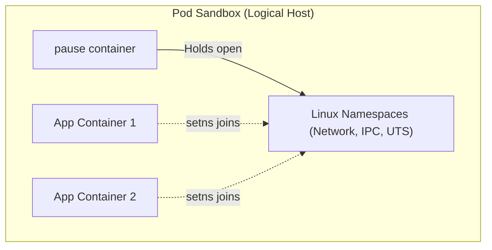

# container-runtime

**Breadcrumbs:** [[Main Notes/0-Index|🏠 Index]] > Worker Node Mechanics > **container-runtime**

---

## 🎯 Purpose (Why it is used)
The `container-runtime` is the execution engine on each node. It is responsible for pulling container images from remote registries, managing local cached images, and running the actual containerized applications inside isolated OS sandboxes, enforcing resource constraints.

---

## ⚙️ Functionality (What it is doing)
1. **gRPC Interface Hosting:** Exposes a Unix socket implementing the Container Runtime Interface (CRI) for communication with the `kubelet`.
2. **Image Management:** Pulls, caches, lists, and purges container images (`ImageService`).
3. **Sandbox Provisioning:** Establishes the Pod Sandbox (including the `pause` container) to lock down sharing namespaces (Network, IPC) for containers in the same Pod.
4. **Lifecycle Execution:** Launches, monitors, and stops containers (`RuntimeService`) by invoking low-level OCI executors.
5. **Cgroup Enforcement:** Maps and enforces CPU, memory, and PID limits onto OS control groups (`cgroups`).

---

## 🏛️ Architectural Context (How it fits in the architecture)
The `container-runtime` resides on the host OS of every cluster node:
* **The Kubelet's Engine:** The `kubelet` communicates with it using gRPC over a local Unix domain socket.
* **Kernel Link:** It acts as the direct supervisor of host container processes, configuring namespaces and cgroups in the Linux kernel to run container runtimes.

---

## 🧩 Problem Solver (What problem it solves)
* **Runtime Pluggability:** Separates the core Kubernetes codebase from container engine details. The Container Runtime Interface (CRI) allows any runtime (e.g., `containerd`, `CRI-O`) to be plugged in seamlessly.
* **Process Isolation:** Solves the security and stability problem of running multiple applications on the same physical host by applying kernel namespaces (walls) and cgroups (limits) to prevent interference.

---

## 🟢 Operational Impact (What will happen with it operating)
* **Workload Execution:** Pods are successfully launched on worker nodes.
* **Image Delivery:** Images are pulled from container registries and saved locally.
* **QoS Enforcement:** Resource limits configured in Pod specs are applied, protecting the host system from resource exhaustion.

---

## 🔴 Failure Impact (What will happen without it)
* **CRI Errors:** The `kubelet` logs connection errors and cannot execute commands. The node may transition to `NotReady` or report runtime status errors.
* **Orphaned workloads:** Existing containers might continue running on the host OS, but they cannot be deleted, scaled, or upgraded by Kubernetes.
* **Scheduling Freeze:** Any pods assigned to the node fail to create, hanging in `ContainerCreating` or displaying `CRIInitializationError` status.
---

---

This note covers the Container Runtime Interface (CRI) services, OCI specifications, shim mechanics, the pause container, Cgroup drivers, and runtime command-line tools.

---

## 🔌 1. The CRI Dual Services (gRPC)
The Container Runtime Interface (CRI) consists of two gRPC services running over a local Unix domain socket:
1. **`RuntimeService`:** Manages the lifecycle of Pod Sandboxes and active containers (create, start, stop, remove, exec).
2. **`ImageService`:** Manages images (pull, list, inspect, remove).

---

## 🏛️ 2. High-Level vs. Low-Level Runtimes (OCI & runc)
Kubernetes decouples container execution into two tiers:
* **High-Level Runtime (CRI-compliant):** e.g., `containerd` or `CRI-O`. Handles the gRPC API, pulls images, unpacks them, and manages container networking and storage.
* **Low-Level Runtime (OCI-compliant):** e.g., `runc`. A lightweight CLI tool that talks directly to the Linux kernel to configure cgroups, namespaces, and execute the container process, then exits immediately.

---

## 🪓 3. containerd-shim
Because the low-level runtime (`runc`) exits after creating the container, something must stay active to monitor the container process:
* **containerd-shim:** A tiny process spawned for each container.
* **Responsibilities:**
  * Keeps the container's standard I/O (stdin, stdout, stderr) file descriptors open even if containerd restarts.
  * Reports the container exit status code back to containerd.
  * Prevents "zombie processes" if the container's main process crashes.

---

## ⏸️ 4. The Pause Container
Every Pod in Kubernetes runs a hidden helper container called the **pause container** (or infra container):
* **Namespace Holder:** It is the first container started in the Pod sandbox. It does not run any application code; it simply runs a sleep loop.
* **Resource Sharing:** It holds open the Network and IPC namespaces. All other application containers inside the same Pod join these namespaces, allowing them to communicate over `localhost` and share storage volumes.



---

## 🧬 5. Cgroup Drivers: systemd vs. cgroupfs
Linux uses control groups (`cgroups`) to limit container resources. Kubernetes and the container runtime must use the same driver to manage these cgroups:
* **`cgroupfs` (Legacy):** The runtime writes resource files directly to `/sys/fs/cgroup`.
* **`systemd` (Modern & Recommended):** The OS uses systemd as its init process, which manages cgroup mappings.
* **Critical Rule:** If the container runtime uses `systemd` but the kubelet uses `cgroupfs` (or vice versa), the node will experience duplicate control hierarchies and eventually crash under heavy memory load. Both must be aligned.

---

## 🛠️ 6. Debug CLI Tools Comparison (CKA Essential)
When debugging a broken node, you cannot use `kubectl` or `docker`. You must use node-level tools:

| CLI Tool | Target Level | Namespace Aware? | Purpose |
| :--- | :--- | :--- | :--- |
| **`ctr`** | containerd daemon | Yes (`ctr -n k8s.io ...`) | Native containerd debugging. |
| **`nerdctl`** | containerd daemon | Yes (`nerdctl -n k8s.io ...`) | Docker-compatible syntax for containerd. |
| **`crictl`** | CRI endpoint socket | Yes (Automatically connects to CRI) | **Kubernetes-native CLI** for troubleshooting runtime issues. |

### crictl Commands Example
To list Pods, Containers, and Images on a node using the CRI socket:
```bash
# Configure socket environment variable
export CRI_CONFIG_FILE=/etc/crictl.yaml
crictl pods
crictl ps
crictl images
crictl logs <container-id>
```

*Read more in [0-5_containers_runtimes_and_lifecycle.md](../Reference%20Notes/0-5_containers_runtimes_and_lifecycle.md#2-the-kubelet-to-cri-architecture).*

---

## 🚫 7. Dockershim Deprecation & Socket Requirements

Originally, Docker was the sole runtime supported by Kubernetes, bridged via **Dockershim**.

### Key Milestones:
*   **Removal in v1.24:** Dockershim was deprecated and completely removed from the core Kubernetes codebase. The Kubelet now interacts directly with native CRI runtimes like `containerd` or `CRI-O`.
*   **Legacy Adapter (`cri-dockerd`):** If you still need to run Docker container engines in v1.24+, you must install `cri-dockerd`. It acts as an adapter, exposing a CRI-compliant socket (`unix:///var/run/cri-dockerd.sock`) and forwarding gRPC calls to the Docker Daemon socket (`unix:///var/run/docker.sock`).

### Modern Socket Requirements:
Modern clusters require explicit configurations for socket endpoints:
1.  **Kubelet Startup Flags:** Configure `--container-runtime=remote` and `--container-runtime-endpoint=unix:///run/containerd/containerd.sock` (or appropriate runtime path).
2.  **`crictl` Configuration:** Explicitly declare the endpoint either in `/etc/crictl.yaml` or as an environment variable:
    ```bash
    export CONTAINER_RUNTIME_ENDPOINT=unix:///run/containerd/containerd.sock
    ```

> [!TIP]
> **The Runtime Upgrade Trap:** Upgrading containerd on a live node using package managers can cause socket interruptions. If Kubelet fails its gRPC reconnection attempts, perform a hard service restart:
> `sudo systemctl restart kubelet`

*Read more in [0-5_containers_runtimes_and_lifecycle.md](../Reference%20Notes/0-5_containers_runtimes_and_lifecycle.md#2-the-kubelet-to-cri-architecture)*

---

## 🔍 Deeper Dive Notes
This table automatically displays all deeper notes, use cases, and pitfalls associated with the **container-runtime**.

```dataview
TABLE sub_type AS "Type", tags AS "Tags", sources AS "Sources"
WHERE class = "deeper-dive" AND icontains(string(parent_concept), this.file.name)
SORT file.name ASC
```
