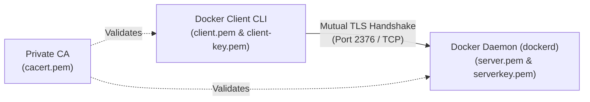
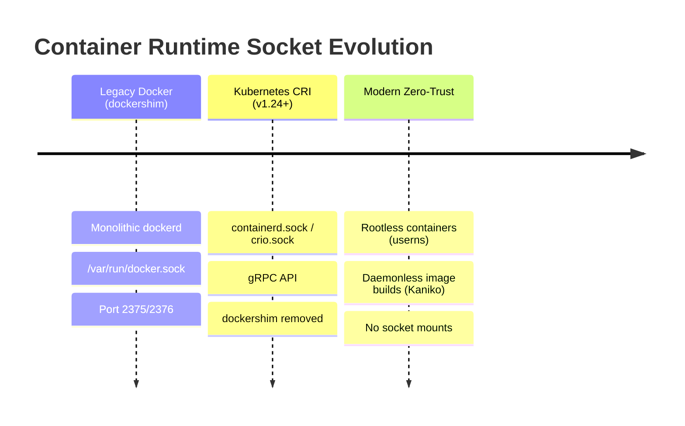

# docker - Daemon and Socket Security

**Breadcrumbs:** [[Main Notes/0-Index|🏠 Index]] > [[docker]] > **Daemon and Socket Security**

---

## 🎯 Purpose & Threat Model

The Docker daemon (`dockerd`) runs as `root` (UID 0) on the host operating system, possessing unrestricted access to the Linux kernel, storage subsystems, and networking devices. Access to the Docker API constitutes effective root access on the physical host machine. 

Securing the communication channels to the daemon—both local Unix sockets and remote TCP listeners—is a fundamental pillar of node and cluster security in the **Certified Kubernetes Security Specialist (CKS)** curriculum.

---

## ⚙️ Communication Channels & Vulnerabilities

### 1. Local Unix Domain Socket (`/var/run/docker.sock`)
* **Mechanism:** Docker uses a local POSIX IPC socket (`unix:///var/run/docker.sock`) for communication between the CLI client and the daemon.
* **Permissions:** Default permissions are `root:docker` with mode `0660`.
* **Privilege Escalation Risk:** Adding non-root users to the `docker` group (`usermod -aG docker $USER`) is architecturally identical to granting passwordless `sudo`. Any user with write permissions to `/var/run/docker.sock` can spawn a container mounting the host's root directory (`docker run -v /:/host-root --privileged alpine chroot /host-root`), taking full control of the operating system.

### 2. The Insecure TCP Port 2375 Exposure
* **The Vulnerability:** Binding the daemon to an unencrypted, unauthenticated TCP port (`tcp://0.0.0.0:2375`) allows anyone with network reachability to issue arbitrary Docker commands.
* **Blast Radius:** Automated worms and attackers continuously scan networks for port 2375 to hijack compute resources for cryptocurrency mining, deploy ransomware, or exfiltrate private credentials.

### 3. Container Breakout via Socket Mounts (`-v /var/run/docker.sock`)
* **The Vector:** Workloads (such as CI/CD build agents or monitoring tools) that mount the host's `/var/run/docker.sock` inside the container can break out of container isolation.
* **The Exploit:** Compromised container code uses the socket to launch sibling containers on the host with elevated privileges, bypassing Kubernetes NetworkPolicies, Seccomp profiles, and AppArmor profiles applied to the original container.
* **Remediation:** Enforce Kubernetes Pod Security Standards (`restricted` profile) to prohibit `hostPath` volume mounts, and adopt unprivileged, daemonless build engines like **Kaniko**, **Buildah**, or **Podman**.

---

## 🔒 Hardening the Docker API with TLS & Mutual Authentication (mTLS)

When remote management of the Docker daemon is required, it must be hardened using mutual TLS on port `2376`:



### 1. PKI Components
* **CA Certificate (`cacert.pem`):** Signs both server and client certificates, establishing trust.
* **Server Certificate & Key (`server.pem`, `serverkey.pem`):** Authenticates the server to the client and encrypts the communication channel.
* **Client Certificate & Key (`client.pem`, `client-key.pem`):** Authenticates authorized users or external orchestrators.
* **Enforcing `tlsverify: true`:** Without `tlsverify`, TLS encrypts traffic over the wire but allows unauthenticated clients to connect without presenting a signed certificate.

### 2. Declarative Configuration (`/etc/docker/daemon.json`)
```json
{
  "hosts": [
    "unix:///var/run/docker.sock",
    "tcp://192.168.1.10:2376"
  ],
  "tls": true,
  "tlscert": "/var/docker/server.pem",
  "tlskey": "/var/docker/serverkey.pem",
  "tlsverify": true,
  "tlscacert": "/var/docker/cacert.pem"
}
```

### 3. Systemd Conflict Trap
> [!WARNING]
> If command-line flags (such as `-H fd://` or `-H tcp://...`) are defined in the systemd service unit (`/lib/systemd/system/docker.service`) while `"hosts"` is also declared in `/etc/docker/daemon.json`, the daemon will fail to start with a configuration conflict error.
> **Fix:** Remove `-H` from `docker.service` (via `systemctl edit docker`) or remove `"hosts"` from `daemon.json`.

---

## 🌉 Evolutionary Bridge: From Docker Daemon to CRI Sockets



* **The CRI Transition:** Kubernetes removed `dockershim` in v1.24 to communicate directly with Container Runtime Interface (CRI) runtimes (`containerd` or `CRI-O`) via gRPC over UNIX domain sockets (`unix:///run/containerd/containerd.sock`).
* **Universal Threat Model:** The security risks of container runtime sockets did not disappear with the removal of Docker. Mounting `/run/containerd/containerd.sock` into an untrusted pod presents the identical container-breakout vulnerability: an attacker can run `crictl` or issue direct gRPC calls to create privileged pods, access host filesystems, and compromise the cluster.

---

## 🔍 Related References & Study Guides

* **Core Reference Module:** [[Reference Notes/0-7-7_system_hardening_seccomp_apparmor_and_syscalls.md#34-docker-daemon--container-runtime-socket-security-cks-core|Module 0-7-7: Host System Hardening, CIS Benchmarks, AppArmor & Seccomp]]
* **CKS Hands-On Scenario:** [[Projects/CKS/Practice Playbook - CKS Exam Hardening and Speed Hacks.md#scenario-15-docker-daemon-hardening--unix-socket-isolation|CKS Exam Practice Playbook: Scenario 15]]
* **Parent Concept:** [[Main Notes/docker|docker]]
