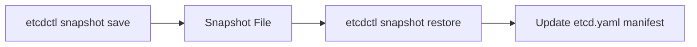

# etcd - etcd Backup and Restore

**Breadcrumbs:** [[Main Notes/0-Index|🏠 Index]] > [[etcd]] > **etcd Backup and Restore**

---

## 📑 1. CKA etcd Administration
Backup and restore of the ETCD database is a core CKA testing domain. You must perform these tasks strictly using `etcdctl` with security certs.



---

## ⚙️ 2. Step-by-Step CLI Walkthrough

### Step 1: Discover TLS Certificates & Endpoints
Inspect the static pod manifest on the control plane node: `/etc/kubernetes/manifests/etcd.yaml`. Note these parameters:
* `--endpoints` (usually `https://127.0.0.1:2379`)
* `--cacert` (usually `/etc/kubernetes/pki/etcd/ca.crt`)
* `--cert` (usually `/etc/kubernetes/pki/etcd/server.crt`)
* `--key` (usually `/etc/kubernetes/pki/etcd/server.key`)

### Step 2: Create a Snapshot Backup
Execute the save command using the cert paths discovered above:
```bash
ETCDCTL_API=3 etcdctl   --endpoints=https://127.0.0.1:2379   --cacert=/etc/kubernetes/pki/etcd/ca.crt   --cert=/etc/kubernetes/pki/etcd/server.crt   --key=/etc/kubernetes/pki/etcd/server.key   snapshot save /tmp/etcd-backup.db
```

### Step 3: Restore the Snapshot
Restore the snapshot data to a new database directory (e.g. `/var/lib/etcd-restored`):
```bash
ETCDCTL_API=3 etcdctl   --data-dir=/var/lib/etcd-restored   snapshot restore /tmp/etcd-backup.db
```

### Step 4: Update ETCD Manifest
Modify the `/etc/kubernetes/manifests/etcd.yaml` static pod spec to use the restored directory.
Find the volume config and change the hostPath:
```yaml
# In /etc/kubernetes/manifests/etcd.yaml
  volumes:
  - name: etcd-data
    hostPath:
      path: /var/lib/etcd-restored # <-- Change here
      type: DirectoryOrCreate
```
Wait for Kubelet to automatically restart the static Pod (check status using `crictl ps | grep etcd` or `kubectl get pods -n kube-system`).

*Read more in [[Reference Notes/0-10_maintenance_upgrades_and_etcd.md#4-etcd-database-administration-and-restoration]]*\n