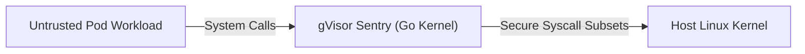

# gVisor and Sandboxed Containers

**Breadcrumbs:** [[Main Notes/0-Index|🏠 Index]] > Container Runtimes > **gVisor and Sandboxed Containers**

---

## 🎯 Purpose (Why it is used)
**gVisor** is an open-source application kernel written in Go that provides secure container virtualization and strong workload isolation. It is designed to run untrusted or multi-tenant code securely on shared infrastructure by intercepting application system calls and handling them in user-space rather than passing them directly to the host Linux kernel.

---

## ⚙️ Functionality (What it is doing)
* **Application Kernel Emulation (Sentry):** Emulates Linux kernel primitives and implements over 300 system calls in memory-safe Go.
* **File System Proxying (Gofer):** Mediates file access between the container and the host filesystem, preventing unauthorized host modifications.
* **Kubernetes RuntimeClass Integration:** Exposes an OCI-compliant runtime (`runsc`) that binds seamlessly into Kubernetes worker nodes via the `RuntimeClass` API object.

---

## 🏛️ Architectural Context (How it fits in the architecture)
gVisor plugs into the Container Runtime Interface (CRI)—such as containerd or CRI-O—as an alternative OCI runtime handler (`runsc`). When a Pod specifies `runtimeClassName: gvisor`, the container is instantiated inside gVisor's sandbox rather than the default `runc` runtime.



---

## 🧩 Problem Solver (What problem it solves)
Standard Linux containers share the underlying host kernel directly. If an attacker discovers a zero-day vulnerability in the host Linux kernel, they can escape the container and compromise the entire node. gVisor eliminates shared-kernel vulnerabilities by creating a distinct virtualization barrier around untrusted workloads.

---

## 🟢 Operational Impact (What will happen with it operating)
Untrusted multi-tenant workloads execute securely alongside internal applications on the same physical nodes without risking kernel-level host takeovers.

---

## 🔴 Failure Impact (What will happen without it)
A zero-day kernel exploit (e.g., Dirty COW, CVE-2022-0847) inside any untrusted container provides the attacker with immediate root privilege escalation on the underlying physical node.

---

## 🔍 Deeper Dive Notes
This table automatically displays all deeper notes, use cases, and pitfalls associated with **gVisor and Sandboxed Containers**.

```dataview
TABLE sub_type AS "Type", tags AS "Tags", source_type AS "Source"
WHERE class = "deeper-dive" AND icontains(string(parent_concept), this.file.name)
SORT file.name ASC
```
