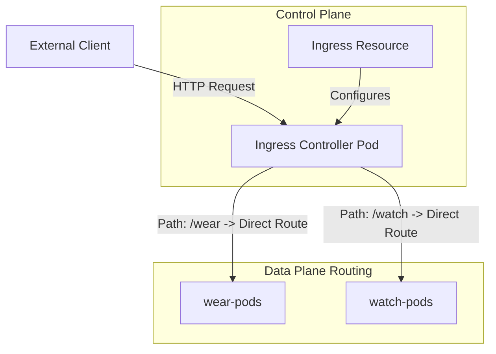

# ingress

**Breadcrumbs:** [[Main Notes/0-Index|🏠 Index]] > Workloads & Infrastructure > **ingress**

---

## 🎯 Purpose (Why it is used)
An `Ingress` exposes HTTP and HTTPS routes from outside the cluster to services within the cluster. It provides L7 routing, SSL/TLS termination, and path-based or host-based virtual hosting.

---

## ⚙️ Functionality (What it is doing)
* **L7 Application Routing:** Inspects incoming HTTP requests, routing them to target services based on:
  - **Path-Based Routing:** `domain.com/api` -> `api-service`, `domain.com/static` -> `static-service`.
  - **Host-Based Routing:** `api.domain.com` -> `api-service`, `web.domain.com` -> `web-service`.
* **SSL/TLS Termination:** Manages SSL certificates to encrypt client traffic before it enters the pod network.
* **Header and Path Rewriting:** Uses annotations (e.g. `nginx.ingress.kubernetes.io/rewrite-target`) to alter request paths dynamically.

---

## 🏛️ Architectural Context (How it fits in the architecture)
* **Ingress Controller:** Ingress resources are descriptions only. They require an active **Ingress Controller** (e.g., NGINX Ingress, Traefik, HAProxy) running as a workload inside the cluster.



* **Data Plane:** The Ingress Controller parses the Ingress manifests, updates its internal config (e.g., `nginx.conf`), and directly routes incoming traffic to backing pod IPs (bypassing ClusterIP NAT routing for better performance).

---

## 🧩 Problem Solver (What problem it solves)
* **Cloud Cost Consolidation:** Solves expensive cloud resource consumption. Instead of creating a separate Cloud LoadBalancer (L4) for every single service (which costs money), a single Ingress Controller manages traffic for hundreds of services using a single entry IP.
* **SSL Certificate Centralization:** Centralizes SSL key management, removing the need to configure certificates inside individual application pods.

---

## 🟢 Operational Impact (What will happen with it operating)
* Web traffic routes smoothly to multiple backend microservices based on hostnames and URL paths.
* Inbound connections benefit from unified traffic rate limits, TLS encryption, and rewrite rules.

---

## 🔴 Failure Impact (What will happen without it)
* Exposing multiple web applications requires provisioning individual cloud load balancers or exposing complex NodePorts.
* Path-based rewrites and hostname routing must be configured manually on external proxy servers.

---

## 🧱 Core Controller Components
Exposing Ingress to external traffic relies on deploying four core objects in the cluster:
1.  **Deployment:** Runs the controller proxy workload (e.g. `ingress-nginx/controller`).
2.  **ConfigMap:** Decouples NGINX configuration settings (keepalive, session timeouts, buffering) from the Pod image.
3.  **Service (NodePort/LoadBalancer):** Exposes HTTP/HTTPS ports 80/443 to external clients.
4.  **ServiceAccount & ClusterRole Binding:** Grants the controller API permissions to `watch` and `list` Services, Endpoints, and Secrets.

---

## 🔀 Path-Based vs. Host-Based Routing YAML

### Path-Based (Single Domain, Multiple Sub-Paths)
```yaml
spec:
  rules:
  - host: my-store.com
    http:
      paths:
      - path: /wear
        pathType: Prefix
        backend:
          service:
            name: wear-service
            port:
              number: 80
```

### Host-Based (Multiple Domains / Subdomains)
```yaml
spec:
  rules:
  - host: wear.my-store.com
    http:
      paths:
      - pathType: Prefix
        path: /
        backend:
          service:
            name: wear-service
            port:
              number: 80
```

---

## 🔍 Deeper Dive Notes
*   **Detailed Architecture Walkthrough:** See [[Reference Notes/0-9_networking_dns_and_ingress|Module 0-9: Networking, DNS, and Ingress]] for a complete architectural analysis of NodePort limitations, NGINX components, and TLS termination.

This table automatically displays all deeper notes, use cases, and pitfalls associated with **ingress**.

```dataview
TABLE sub_type AS "Type", tags AS "Tags", source_type AS "Source"
WHERE class = "deeper-dive" AND icontains(string(parent_concept), this.file.name)
SORT file.name ASC
```
