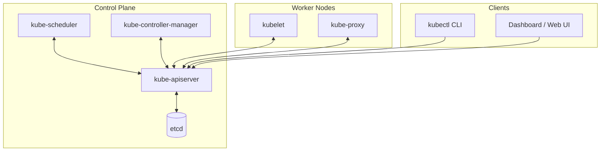

# kube-apiserver

**Breadcrumbs:** [[Main Notes/0-Index|🏠 Index]] > Control Plane > **kube-apiserver**

---

## 🎯 Purpose (Why it is used)
The `kube-apiserver` acts as the central hub and single entrance gate for the Kubernetes control plane. It is the only component in the cluster allowed to read from or write to the primary state store (`etcd`). It exposes the Kubernetes API over HTTP/HTTPS, serving as the front-end interface for cluster administrators (`kubectl`), system components, and third-party integrations.

> [!TIP] Conceptual Analogy (Mumshad's CKA)
> In a shipping port analogy, the `kube-apiserver` represents the **Port Authority / Coordinator** on the Control Ship. It is the primary orchestrator of all operations, exposing the API that external users (dock authorities) and port offices (controllers) use to query cluster state and direct operations.

---

## ⚙️ Functionality (What it is doing)
1. **Request Reception & Lifecycle Management:** Receives all HTTP REST calls to create, update, delete, or fetch API resources.
2. **Security Gateway:**
   - **Authentication:** Validates the identity of clients (users, service accounts, nodes) using TLS certificates, Bearer tokens, or OIDC.
   - **Authorization:** Verifies user permissions against RBAC policies (`RoleBinding`, `ClusterRoleBinding`) and NodeRestriction policies.
   - **Admission Control:** Runs request payloads through a series of plugins (e.g., `LimitRanger`, `NamespaceLifecycle`) to mutate or reject requests.
3. **OpenAPI Validation:** Validates request payloads against the Kubernetes OpenAPI schema to ensure formatting correctness before persistence.
4. **State Commit:** Writes validated state updates directly to the `etcd` backend database.
5. **Watch Broadcasting:** Coordinates the event-driven Watch mechanism, streaming chunked state updates to components (like controllers and schedulers) that need to react to changes.

---

## 🏛️ Architectural Context (How it fits in the architecture)
The `kube-apiserver` sits in the absolute center of the Control Plane:



* **Only client to etcd:** No other component accesses `etcd` directly; they must query or update state through the API server.
* **Component coordinator:** The `kube-scheduler` and `kube-controller-manager` run loops that watch the API server for changes and write resolved states back to it.
* **Node controller:** The `kubelet` on worker nodes registers with the API server, checks for pod assignments, and periodically updates its status.
* **Client access point:** CLI users run `kubectl`, which serializes commands to HTTPS requests directed at the `kube-apiserver` endpoint.

---

## 🧩 Problem Solver (What problem it solves)
* **Concurrency and Database Guarding:** Prevents race conditions and raw data corruption in `etcd` by acting as a strict transaction controller and schema validator.
* **Security Centralization:** Eliminates the need to distribute authentication, authorization, or audit logs across separate components. Every action is audited and validated at a single checkpoint.
* **Decoupling and Abstraction:** Standardizes all API objects (Pods, Services, etc.) under an OpenAPI spec, abstracting the underlying infrastructure and database structure.

---

## 🟢 Operational Impact (What will happen with it operating)
* **Active Management:** Users can run `kubectl` commands to inspect and update resources in real time.
* **Declarative Orchestration:** The control loop operates smoothly. If a deployment is requested, the controller-manager creates pod specs, the scheduler matches them to nodes, and the kubelets spin them up.
* **Resource Leases:** Nodes are monitored continuously through Leases in the `kube-node-lease` namespace, enabling immediate detection of worker node failures.

---

## 🔴 Failure Impact (What will happen without it)
* **Administrative Freeze:** All `kubectl` commands and API requests fail immediately (returns connection refused or timeout).
* **Control Plane Stagnation:** The `kube-scheduler` and `kube-controller-manager` cannot receive updates, find pending pods, or create replacement pods. Self-healing, scaling, and rolling updates stop entirely.
* **Frozen Workers:** Worker nodes continue executing existing workloads in their current state. If a container crashes, the container runtime (e.g., `containerd`) may restart it locally if governed by a local policy, but the `kubelet` cannot report status or receive instructions to run new workloads.
* **Stateless Split Brain Safety:** Since `etcd` cannot be accessed, no state changes occur, preventing accidental replication conflicts or split-brain inconsistencies while the API server is down.

---

## 🔍 Deeper Dive Notes
This table automatically displays all deeper notes, use cases, and pitfalls associated with the **kube-apiserver**.

```dataview
TABLE sub_type AS "Type", tags AS "Tags", source_type AS "Source"
WHERE class = "deeper-dive" AND icontains(string(parent_concept), this.file.name)
SORT file.name ASC
```
