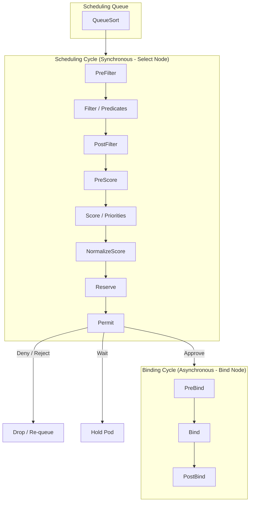

# kube-scheduler deeper

**Breadcrumbs:** [[Index|🏠 Index]] > [[kube-scheduler]] > **deeper dive**

---

This note covers the detailed scheduling pipeline algorithms, configuration of multiple custom schedulers, and bypass mechanisms.

---

## ⚙️ 1. Detailed Scheduling Pipeline
The scheduling queue processes Pods sequentially through two main phases: the **Scheduling Cycle** and the **Binding Cycle**.



### A. Filtering (Predicates)
Evaluates nodes against boolean checks. If a node fails any check, it is removed from the candidate list:
* `PodFitsResources`: Checks if the node has enough unallocated CPU and Memory to meet the Pod's resource requests.
* `PodFitsHostPorts`: Ensures ports requested via `hostPort` are not already bound on the node.
* `PodMatchNodeSelector`: Verifies the node's labels match the Pod's `nodeSelector` or `nodeAffinity` requirements.
* `PodToleratesNodeTaints`: Verifies the Pod possesses tolerations for all taints present on the node.

### B. Scoring (Priorities)
Scores remaining candidate nodes from 0 to 10 to find the best fit:
* `ImageLocalityPriorityMap`: Gives higher scores to nodes that have already cached the requested container images, reducing network pull times.
* `NodeResourcesLeastAllocated`/`MostAllocated`: Customizes behavior to either spread workloads evenly (least allocated) or bin-pack workloads tightly to minimize node usage (most allocated).
* `NodeAffinityPriority`: Assigns points for satisfying soft scheduling preferences (`preferredDuringSchedulingIgnoredDuringExecution`).

---

## 🛠️ 2. Multiple Custom Schedulers
You can run multiple instances of the scheduler in a cluster, each using a different configuration policy (e.g., custom predicates or priorities):
* **Deployment:** Custom schedulers can be deployed as standard Pods/Deployments in the `kube-system` namespace.
* **Manifest Example:** To target a custom scheduler, specify `spec.schedulerName` in your Pod definition:
  ```yaml
  apiVersion: v1
  kind: Pod
  metadata:
    name: custom-scheduled-pod
  spec:
    schedulerName: my-custom-scheduler # <-- Target custom scheduler
    containers:
    - name: nginx
      image: nginx
  ```
If omitted, `schedulerName` defaults to `default-scheduler`.

---

## 🔓 3. Bypassing the Scheduler (Manual Binding)
If the scheduler is broken, you can bypass it entirely to schedule pods:

### Method A: Static `nodeName`
During Pod creation, specify the destination node name directly in the YAML spec. This bypasses the entire filtering/ranking pipeline, and the Kubelet on that node will start the pod:
```yaml
spec:
  nodeName: worker-node-1 # <-- Bypasses scheduler completely
```

### Method B: Binding API Object (Programmatic)
To assign a running `Pending` pod to a node, post a `Binding` resource directly to the API Server. The scheduler does this behind the scenes:
```json
{
  "apiVersion": "v1",
  "kind": "Binding",
  "metadata": {
    "name": "my-pending-pod"
  },
  "target": {
    "apiVersion": "v1",
    "kind": "Node",
    "name": "worker-node-1"
  }
}
```

*Read more in [02_cluster_architecture_and_components.md](../Reference%20Notes/02_cluster_architecture_and_components.md#c-kube-scheduler-the-matchmaker).*
