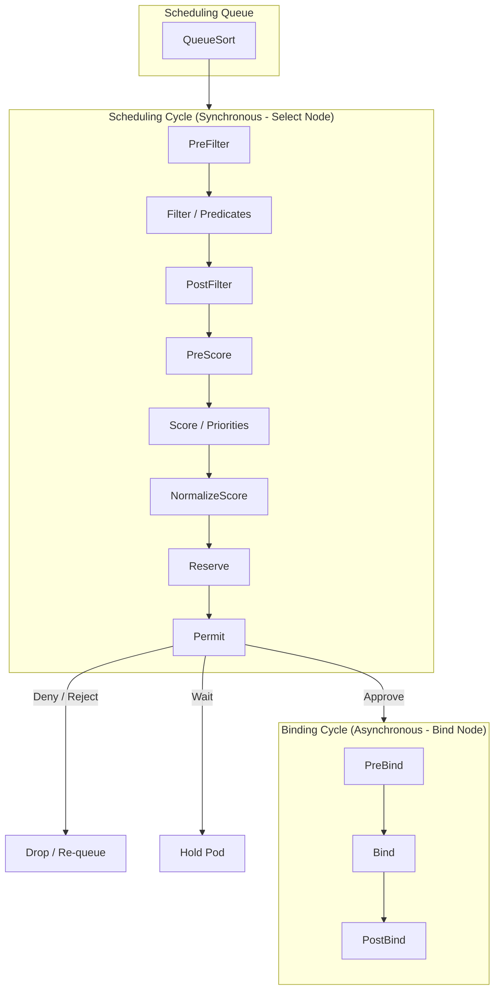

# kube-scheduler deeper

**Breadcrumbs:** [[Main Notes/0-Index|🏠 Index]] > [[kube-scheduler]] > **deeper dive**

---

This note covers the detailed scheduling pipeline algorithms, configuration of multiple custom schedulers, and bypass mechanisms.

---

## ⚙️ 1. Detailed Scheduling Pipeline
The scheduling queue processes Pods sequentially through two main phases: the **Scheduling Cycle** and the **Binding Cycle**.



### C. Scheduler Cache, Informer & Requeueing Mechanics
To achieve high throughput (scheduling tens of thousands of Pods in minutes), the scheduler does not query the API server for all cluster resources on every cycle. Instead, it relies on event-driven caching:
* **SharedInformers & Event Queue:** The scheduler registers a `SharedInformer` that watches for new Pod events. When a Pod without a `nodeName` is created, it is pushed onto an internal queue (`podQueue`).
* **The `scheduleOne` Loop:** The scheduler runs a continuous loop (`scheduleOne`) that pops the next Pod from `podQueue`, executes the scheduling cycle, and starts the binding cycle.
* **Optimistic Cache (`AssumePod`):** Once a node is chosen, the scheduler immediately updates its local cache (`AssumePod`) to mark those resources as allocated before sending the binding request to the API server. This prevents the scheduler from double-allocating resources to two different Pods in rapid succession.
* **Error Requeueing:** If a Pod fails to schedule (e.g. no nodes fit the predicates), the scheduler calls its error handler (`sched.config.Error(pod, err)`) which puts the Pod back on the `podQueue` to try again.
* **No-Resync Policy:** The scheduler sets its informer resync period to `0` (never resync). Re-syncing forces the scheduler to query and process every object again, which degrades performance. The Kubernetes maintainers enforce a no-resync policy to ensure underlying correctness bugs (e.g. lost pods) are caught and fixed rather than hidden by periodic resyncs.
* **Unreserve / Rollback:** If the asynchronous binding cycle fails (e.g. network timeout or API error), the scheduler executes an `Unreserve` operation to free the cached resources on the node and make them available for other pods.

### A. Filtering (Predicates)
Evaluates nodes against boolean checks. If a node fails any check, it is removed from the candidate list:
* `PodFitsResources`: Checks if the node has enough unallocated CPU and Memory to meet the Pod's resource requests.
* `PodFitsHostPorts`: Ensures ports requested via `hostPort` are not already bound on the node.
* `PodMatchNodeSelector`: Verifies the node's labels match the Pod's `nodeSelector` or `nodeAffinity` requirements.
* `PodToleratesNodeTaints`: Verifies the Pod possesses tolerations for all taints present on the node.

### B. Scoring (Priorities)
Scores remaining candidate nodes from 0 to 10 to find the best fit:
* `ImageLocalityPriorityMap`: Gives higher scores to nodes that have already cached the requested container images, reducing network pull times.
* `NodeResourcesLeastAllocated`/`MostAllocated`: Customizes behavior to either spread workloads evenly (least allocated) or bin-pack workloads tightly to minimize node usage (most allocated).
* `NodeAffinityPriority`: Assigns points for satisfying soft scheduling preferences (`preferredDuringSchedulingIgnoredDuringExecution`).

---

## 🛠️ 2. Multiple Custom Schedulers
You can run multiple instances of the scheduler in a cluster, each using a different configuration policy (e.g., custom predicates or priorities).
* **Running Multiple Binaries:** Custom schedulers can be deployed as standard Pods/Deployments in the `kube-system` namespace. See **[[Multiple Custom Schedulers]]** for details.
* **Running Multiple Profiles:** Since Kubernetes v1.18, you can run multiple profiles (names) inside a single scheduler binary to prevent resource race conditions. See **[[Scheduler Profiles]]** for details.
* **Manifest Example:** To target a custom scheduler, specify `spec.schedulerName` in your Pod definition:
  ```yaml
  apiVersion: v1
  kind: Pod
  metadata:
    name: custom-scheduled-pod
  spec:
    schedulerName: my-custom-scheduler # <-- Target custom scheduler
    containers:
    - name: nginx
      image: nginx
  ```
If omitted, `schedulerName` defaults to `default-scheduler`.

---

## 🔓 3. Bypassing the Scheduler (Manual Binding)
If the scheduler is broken, you can bypass it entirely to schedule pods:

### Method A: Static `nodeName`
During Pod creation, specify the destination node name directly in the YAML spec. This bypasses the entire filtering/ranking pipeline, and the Kubelet on that node will start the pod:
```yaml
spec:
  nodeName: worker-node-1 # <-- Bypasses scheduler completely
```

### Method B: Binding API Object (Programmatic)
To assign a running `Pending` pod to a node, post a `Binding` resource directly to the API Server. The scheduler does this behind the scenes:
```json
{
  "apiVersion": "v1",
  "kind": "Binding",
  "metadata": {
    "name": "my-pending-pod"
  },
  "target": {
    "apiVersion": "v1",
    "kind": "Node",
    "name": "worker-node-1"
  }
}
```

*Read more in [0-2_cluster_architecture_and_components.md](../Reference%20Notes/0-2_cluster_architecture_and_components.md#c-kube-scheduler-the-matchmaker).*

---

## 📊 4. Scheduler Logging & Profiling Metrics
To monitor scheduler behavior or debug latency issues (such as slow scheduling cycles or high memory usage):
* **Logs Inspection:** Stream logs from the default scheduler static pod or daemon:
  ```bash
  kubectl logs -n kube-system -l component=kube-scheduler
  ```
* **Component Metrics:** The scheduler exposes detailed Prometheus performance metrics (e.g., scheduling latency, queue depth) at `/metrics` (default port `10259`).
* **pprof Profiling Dumps:** With `--enable-profiling=true` (enabled by default), administrators can retrieve raw pprof profiles for CPU and memory usage debugging:
  ```bash
  kubectl get --raw /debug/pprof/profile > scheduler_cpu.pprof
  ```

---

## 🔍 Sub-Concepts & Use Cases
This table automatically displays all deeper notes, use cases, and configurations associated with **kube-scheduler-deeper**.

```dataview
TABLE sub_type AS "Type", tags AS "Tags", source_type AS "Source"
WHERE class = "deeper-dive" AND icontains(string(parent_concept), this.file.name)
SORT file.name ASC
```
