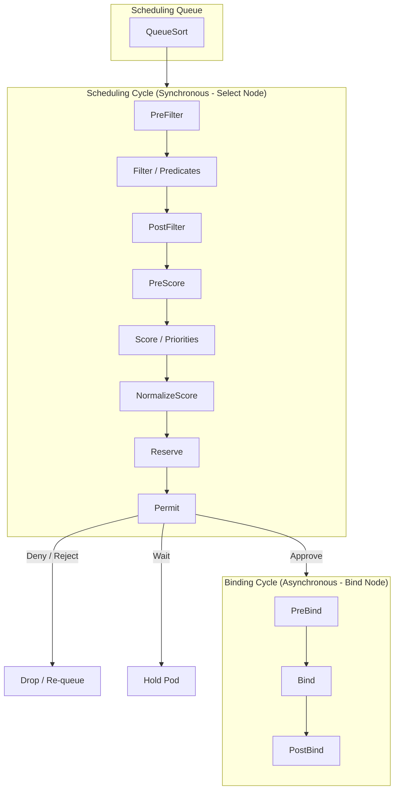

# kube-scheduler

**Breadcrumbs:** [[Main Notes/0-Index|🏠 Index]] > Control Plane > **kube-scheduler**

---

## 🎯 Purpose (Why it is used)
The `kube-scheduler` is the Control Plane's "matchmaker." It evaluates newly created, unassigned Pods and selects the optimal worker node in the cluster for them to run on, taking resource requirements, hardware constraints, affinity policies, and taints into account.

---

## ⚙️ Functionality (What it is doing)
1. **Pending Pod Watch:** Watches the API Server for any Pod that has a blank `spec.nodeName` field.
2. **Filtering (Predicates):** Evaluates all available worker nodes and filters out those that cannot host the Pod (e.g., insufficient CPU/Memory, missing node label selectors, or node taints).
3. **Ranking (Priorities):** Scores the remaining eligible nodes (on a scale of 0 to 10) using priority algorithms (e.g., balancing resource usage, preferring nodes that already have the required container image cached).
4. **Binding:** Selects the node with the highest score, and sends a "Binding" API request to the `kube-apiserver` to write the chosen node name into the Pod's `spec.nodeName` field.

---

## 🏛️ Architectural Context (How it fits in the architecture)
The `kube-scheduler` runs as an independent control loop:
* **Decoupled Placement:** It does not directly deploy container processes. It only updates the metadata in the `kube-apiserver`.
* **Kubelet Hand-off:** Once the scheduler binds a Pod to a node in `etcd`, the `kubelet` daemon on that node detects the update and coordinates with the Container Runtime (CRI) to spin up the container.

---

## 🧩 Problem Solver (What problem it solves)
* **Resource Contention:** Prevents scheduling workloads on nodes that lack the capacity, avoiding host CPU starvation or Out-Of-Memory (OOM) kills.
* **Complex Placement Rules:** Handles complex affinity, anti-affinity, and co-location rules to place workloads close to their databases or spread them apart for high availability.
* **Topology Awareness:** Places pods across separate failure domains (e.g., racks, regions, availability zones) to ensure application resilience if a zone fails.

---

## 🟢 Operational Impact (What will happen with it operating)
* **Dynamic Orchestration:** Pods transition automatically from `Pending` to `ContainerCreating` and then `Running`.
* **Constraint Compliance:** Workloads are placed strictly on nodes that match their affinity rules, tolerations, and requirements.
* **Resource Balance:** The cluster maintains a balanced load across all worker nodes.

---

## 🔴 Failure Impact (What will happen without it)
* **Scheduling Freeze:** Any newly created Pods will remain in a `Pending` state indefinitely because no component is assigning them to nodes.
* **Existing Pod Safety:** Currently running Pods are unaffected and continue executing.
* **Self-Healing Failure:** If a running Pod crashes or its host node dies, the Controller Manager will detect it and create a replacement Pod, but this replacement will stay `Pending` because there is no scheduler to place it.
* **Manual Bypass:** Administrators can bypass a failed scheduler by manually defining `spec.nodeName: <node-name>` directly inside a Pod's YAML manifest at creation time.
---

---

This note covers the detailed scheduling pipeline algorithms, configuration of multiple custom schedulers, and bypass mechanisms.

---

## ⚙️ 1. Detailed Scheduling Pipeline
The scheduling queue processes Pods sequentially through two main phases: the **Scheduling Cycle** and the **Binding Cycle**.



### A. Filtering (Predicates)
Evaluates nodes against boolean checks. If a node fails any check, it is removed from the candidate list:
* `PodFitsResources`: Checks if the node has enough unallocated CPU and Memory to meet the Pod's resource requests.
* `PodFitsHostPorts`: Ensures ports requested via `hostPort` are not already bound on the node.
* `PodMatchNodeSelector`: Verifies the node's labels match the Pod's `nodeSelector` or `nodeAffinity` requirements.
* `PodToleratesNodeTaints`: Verifies the Pod possesses tolerations for all taints present on the node.

### B. Scoring (Priorities)
Scores remaining candidate nodes from 0 to 10 to find the best fit:
* `ImageLocalityPriorityMap`: Gives higher scores to nodes that have already cached the requested container images, reducing network pull times.
* `NodeResourcesLeastAllocated`/`MostAllocated`: Customizes behavior to either spread workloads evenly (least allocated) or bin-pack workloads tightly to minimize node usage (most allocated).
* `NodeAffinityPriority`: Assigns points for satisfying soft scheduling preferences (`preferredDuringSchedulingIgnoredDuringExecution`).

---

## 🛠️ 2. Multiple Custom Schedulers
You can run multiple instances of the scheduler in a cluster, each using a different configuration policy (e.g., custom predicates or priorities):
* **Deployment:** Custom schedulers can be deployed as standard Pods/Deployments in the `kube-system` namespace.
* **Manifest Example:** To target a custom scheduler, specify `spec.schedulerName` in your Pod definition:
  ```yaml
  apiVersion: v1
  kind: Pod
  metadata:
    name: custom-scheduled-pod
  spec:
    schedulerName: my-custom-scheduler # <-- Target custom scheduler
    containers:
    - name: nginx
      image: nginx
  ```
If omitted, `schedulerName` defaults to `default-scheduler`.

---

## 🔓 3. Bypassing the Scheduler (Manual Binding)
If the scheduler is broken, you can bypass it entirely to schedule pods:

### Method A: Static `nodeName`
During Pod creation, specify the destination node name directly in the YAML spec. This bypasses the entire filtering/ranking pipeline, and the Kubelet on that node will start the pod:
```yaml
spec:
  nodeName: worker-node-1 # <-- Bypasses scheduler completely
```

### Method B: Binding API Object (Programmatic)
To assign a running `Pending` pod to a node, post a `Binding` resource directly to the API Server. The scheduler does this behind the scenes:
```json
{
  "apiVersion": "v1",
  "kind": "Binding",
  "metadata": {
    "name": "my-pending-pod"
  },
  "target": {
    "apiVersion": "v1",
    "kind": "Node",
    "name": "worker-node-1"
  }
}
```

*Read more in [0-2_cluster_architecture_and_components.md](../Reference%20Notes/0-2_cluster_architecture_and_components.md#c-kube-scheduler-the-matchmaker).*

---

## 🔍 Deeper Dive Notes
This table automatically displays all deeper notes, use cases, and pitfalls associated with the **kube-scheduler**.

```dataview
TABLE sub_type AS "Type", tags AS "Tags", sources AS "Sources"
WHERE class = "deeper-dive" AND contains(parent_concept, this.file.link)
SORT file.name ASC
```
