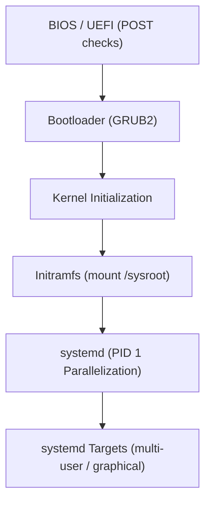

# Linux - Boot Initialization and Systemd

**Breadcrumbs:** [[Main Notes/linux|🏠 Linux Landing]] > **Boot Initialization & systemd**

---

## 🏛️ The Boot Process Flow

The startup sequence of a Linux system transitions from hardware verification to user space process initialization.



### Steps of the Sequence:
1.  **BIOS/UEFI (Hardware Init):** Performs Power-On Self-Test (POST), hardware peripheral inspection, and selects primary boot device sequence.
2.  **Bootloader (GRUB2):** Loads the kernel executable (`vmlinuz`) and initial RAM filesystem (`initramfs`) into memory.
3.  **Kernel Initialization:** Configures CPU registers, hardware architecture drivers, and mounts virtual directory trees.
4.  **Initramfs execution:** An ephemeral root filesystem that mounts physical storage devices containing actual host partitions under `/sysroot`.
5.  **systemd (PID 1):** Spawns system services in parallel, replacing sequential boot engines.

---

## ⚙️ systemd Unit Management

systemd manages system state using various **Unit** types, configured in `/lib/systemd/system/` (distributions) and `/etc/systemd/system/` (local customization overrides).

### Key Unit Types:
*   **`.service`:** Represents active daemons or scripts (e.g. `httpd.service`).
*   **`.target`:** Groups services together to represent operating execution states (equivalent to legacy SysV runlevels).
*   **`.socket`:** Listens on IPC sockets or network ports, starting the corresponding service only when a connection request arrives.
*   **`.mount` / `.automount`:** Configures directory mount points.

---

## 🌉 Evolutionary Comparison: SysV Init vs. systemd

| Feature | Legacy SysV Init | Modern systemd |
| :--- | :--- | :--- |
| **PID 1 Process** | `/sbin/init` | `/usr/lib/systemd/systemd` |
| **Startup Type** | **Sequential** (Init scripts run one after another, slow boot). | **Parallelized** (Uses socket/D-Bus activation to start services concurrently). |
| **Process Tracking**| Tracks process IDs (PIDs). Fails to track orphaned daemon child processes. | Tracks processes via **Control Groups (cgroups)**. No orphan escape. |
| **State Grouping** | Runlevels (`0` to `6`). | **Targets** (`multi-user.target`, `graphical.target`). |
| **Dependency Mgmt** | Configured via runlevel script numbering (e.g. `S80apache`). | Explicit dependency directives (`Requires=`, `After=`). |

---

## 🛠️ Boot Failure Rescue Flow (`rd.break`)

If a system fails to boot due to an invalid mount configuration or lost root credentials, interrupt the boot pipeline to resolve it:

1.  **Interrupt GRUB:** Reboot the host, highlight the kernel menu item, and press `e` to edit parameters.
2.  **Kernel Break Argument:** Locate the `linux` or `linux16` line and append `rd.break` to the end.
3.  **Console Access:** Press `Ctrl + x` to boot into a minimal RAM disk root shell.
4.  **Re-mount Host Root:**
    ```bash
    # Mount the target host filesystem (initially mounted as read-only on /sysroot) as read-write:
    mount -o remount,rw /sysroot
    
    # Enter chroot context to access root executables:
    chroot /sysroot
    
    # Reset root password:
    passwd root
    
    # Force SELinux filesystem context relabeling on next reboot:
    touch /.autorelabel
    
    # Exit chroot redirection:
    exit
    
    # Resume normal system startup:
    exit
    ```
