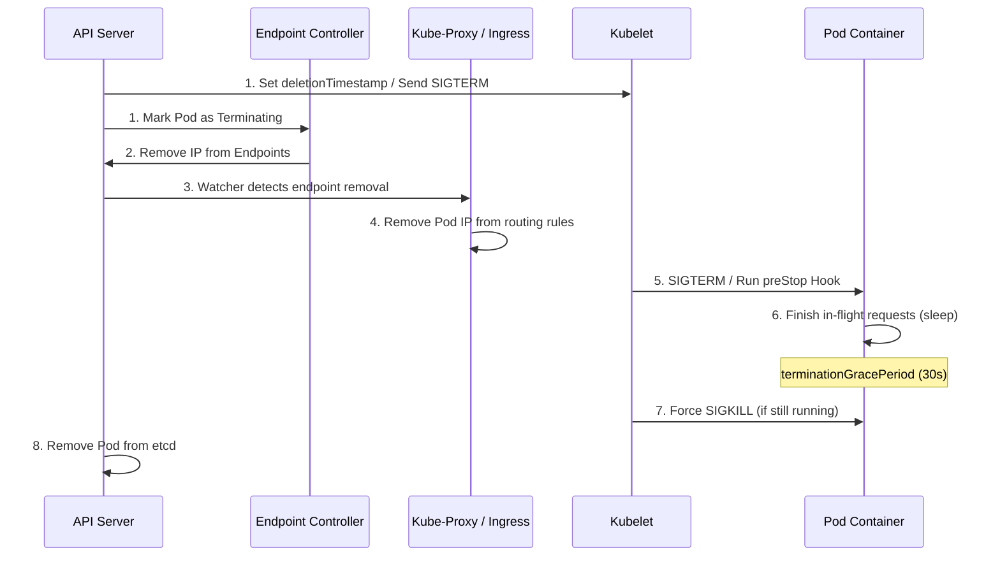

# service - Source IP and Pod Termination Lifecycle

**Breadcrumbs:** [[0-Index|🏠 Index]] > [[service]] > **Source IP and Pod Termination Lifecycle**

---

## 📑 Source IP Preservation (`externalTrafficPolicy`)

When external traffic (from clients outside the cluster) hits a Service (e.g. NodePort or LoadBalancer), Kubernetes handles client source IP mapping in two ways:

### 1. `externalTrafficPolicy: Cluster` (Default)
* **Mechanics:** Traffic hitting any cluster node is routed by Kube-Proxy across all pods in the cluster. If the targeted pod resides on a different node, the packet is forwarded across the overlay network. This requires **Source NAT (SNAT)**, which overwrites the client's source IP with the forwarding node's IP.
* **Pros:** Even load distribution across all pods in the cluster.
* **Cons:** Loss of the original client source IP (the backend application sees node IPs).

### 2. `externalTrafficPolicy: Local`
* **Mechanics:** Traffic is only routed to pods running on the exact node that receives the traffic. No cross-node hop is performed, and **SNAT is bypassed**. The client's original source IP is fully preserved.
* **Pros:** Client source IP visibility is maintained.
* **Cons:**
  * If a node has no active pods for the service, traffic is dropped.
  * Risk of unequal traffic distribution if pods are not distributed evenly across nodes.

---

## 📑 Pod & Endpoint Termination Lifecycle

Gracefully decommissioning pods during rollouts or scale-downs is critical to prevent connection errors:



### The Race Condition and preStop Hook Mitigation
Because endpoint removal and SIGTERM signaling run asynchronously in parallel, there is a race condition where a container starts shutting down before Kube-proxy removes its IP from node routing rules. To prevent clients hitting terminating containers:
* **Mitigation:** Define a `preStop` hook to introduce a sleep delay (e.g., `sleep 5`). This holds container shutdown until Kube-proxy has completely updated local routing rules.
  ```yaml
  lifecycle:
    preStop:
      exec:
        command: ["/bin/sh", "-c", "sleep 5 && nginx -s quit"]
  ```

*Read more in [0-9_networking_dns_and_ingress.md](../Reference%20Notes/0-9_networking_dns_and_ingress.md#44-source-ip-preservation-externaltrafficpolicy)*
