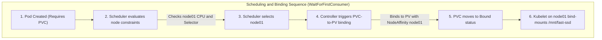

# Project: Local Storage Models and Scheduling Traps

**Breadcrumbs:** [[Main Notes/0-Index|🏠 Index]] > Projects > **Local Storage Models and Scheduling Traps**

---

## 🎯 Project Overview
This hands-on project demonstrates how the Kubernetes Scheduler interacts with local node storage. You will configure and deploy three local storage scenarios: static `local` volumes using `kubernetes.io/no-provisioner` (safeguarded by `WaitForFirstConsumer` binding), the dynamic Rancher `local-path` provisioner, and a manual `hostPath` mount. The core objective is to experience the "Scheduling Deadlock" failure loop first-hand and verify how deferred volume binding resolves it.

---

## 🏛️ Target Architecture



---

## 🛠️ Step-by-Step Implementation & Configuration

### Scenario A: Static Local Volume with Delayed Binding

#### 1. Define the StorageClass
This StorageClass sets the provisioner to `no-provisioner` (meaning humans must create PVs) and delays binding.

```yaml
# 01-storageclass.yaml
apiVersion: storage.k8s.io/v1
kind: StorageClass
metadata:
  name: local-storage
provisioner: kubernetes.io/no-provisioner
volumeBindingMode: WaitForFirstConsumer
```

#### 2. Define the Node-Affinity-Locked PersistentVolume
This PV locks itself to `node01` using a hard node affinity selector.

```yaml
# 02-pv.yaml
apiVersion: v1
kind: PersistentVolume
metadata:
  name: local-pv-data
spec:
  capacity:
    storage: 10Gi
  accessModes:
    - ReadWriteOnce
  persistentVolumeReclaimPolicy: Retain
  storageClassName: local-storage
  local:
    path: /mnt/fast-ssd # Path must exist on host node01
  nodeAffinity:
    required:
      nodeSelectorTerms:
        - matchExpressions:
            - key: kubernetes.io/hostname
              operator: In
              values:
                - node01
```

#### 3. Define the PersistentVolumeClaim
This PVC requests the `local-storage` class.

```yaml
# 03-pvc.yaml
apiVersion: v1
kind: PersistentVolumeClaim
metadata:
  name: local-pvc
spec:
  accessModes:
    - ReadWriteOnce
  storageClassName: local-storage
  resources:
    requests:
      storage: 10Gi
```

#### 4. Define the Consumer Pod
A Pod that requests the local-pvc.

```yaml
# 04-pod.yaml
apiVersion: v1
kind: Pod
metadata:
  name: storage-consumer-pod
spec:
  containers:
    - name: nginx
      image: nginx:alpine
      volumeMounts:
        - name: local-volume
          mountPath: /usr/share/nginx/html
  volumes:
    - name: local-volume
      persistentVolumeClaim:
        claimName: local-pvc
```

---

## 🔍 Verification & Diagnostics

### Step 1: Pre-provision Host Directory
Before creating resources, simulate the administrator formatting/mounting a drive on `node01` (or your local node):
```bash
# Executed on node01 host terminal
sudo mkdir -p /mnt/fast-ssd
echo "Hello from physical disk on Node01" | sudo tee /mnt/fast-ssd/index.html
```

### Step 2: Apply Manifests and Verify Pending State
Apply the StorageClass, PV, and PVC:
```bash
kubectl apply -f 01-storageclass.yaml
kubectl apply -f 02-pv.yaml
kubectl apply -f 03-pvc.yaml
```
Query the PVC status:
```bash
kubectl get pvc local-pvc
```
*Expected Output:*
```plaintext
NAME        STATUS    VOLUME   CAPACITY   ACCESS MODES   STORAGECLASS    AGE
local-pvc   Pending                                      local-storage   10s
```
*(The PVC remains `Pending` because `WaitForFirstConsumer` prevents binding until a Pod is scheduled).*

### Step 3: Deploy Pod and Verify Binding
Apply the Pod manifest:
```bash
kubectl apply -f 04-pod.yaml
```
Verify the PVC and Pod status:
```bash
kubectl get pvc local-pvc
kubectl get pod storage-consumer-pod
```
*Expected Output:*
```plaintext
NAME        STATUS   VOLUME          CAPACITY   ACCESS MODES   STORAGECLASS    AGE
local-pvc   Bound    local-pv-data   10Gi       RWO            local-storage   45s

NAME                   READY   STATUS    RESTARTS   AGE
storage-consumer-pod   1/1     Running   0          10s
```

### Step 4: Simulate the "Volume Node Affinity Conflict" Deadlock
To simulate the failure loop, we will create an immediate binding StorageClass and associate it with a new local PV and PVC.

```yaml
# 05-immediate-sc.yaml
apiVersion: storage.k8s.io/v1
kind: StorageClass
metadata:
  name: immediate-local-sc
provisioner: kubernetes.io/no-provisioner
volumeBindingMode: Immediate

---
# 06-immediate-pv.yaml
apiVersion: v1
kind: PersistentVolume
metadata:
  name: immediate-pv
spec:
  capacity:
    storage: 5Gi
  accessModes:
    - ReadWriteOnce
  storageClassName: immediate-local-sc
  local:
    path: /mnt/fast-ssd
  nodeAffinity:
    required:
      nodeSelectorTerms:
        - matchExpressions:
            - key: kubernetes.io/hostname
              operator: In
              values:
                - node01 # Locked to node01

---
# 07-immediate-pvc.yaml
apiVersion: v1
kind: PersistentVolumeClaim
metadata:
  name: immediate-pvc
spec:
  accessModes:
    - ReadWriteOnce
  storageClassName: immediate-local-sc
  resources:
    requests:
      storage: 5Gi
```

Apply these files:
```bash
kubectl apply -f 05-immediate-sc.yaml -f 06-immediate-pv.yaml -f 07-immediate-pvc.yaml
```
Verify binding status:
```bash
kubectl get pvc immediate-pvc
```
*Expected Output:*
```plaintext
NAME            STATUS   VOLUME         CAPACITY   ACCESS MODES   STORAGECLASS         AGE
immediate-pvc   Bound    immediate-pv   5Gi        RWO            immediate-local-sc   5s
```
*(The PVC bound immediately to the PV on `node01` without waiting for a Pod).*

Now, deploy a Pod that requests this PVC, but force the Pod to run on `node02` (simulating scheduler constraints like node selectors or resource exhaustion on `node01`):

```yaml
# 08-deadlocked-pod.yaml
apiVersion: v1
kind: Pod
metadata:
  name: deadlocked-pod
spec:
  nodeSelector:
    kubernetes.io/hostname: node02 # Forced to node02
  containers:
    - name: nginx
      image: nginx:alpine
      volumeMounts:
        - name: local-vol
          mountPath: /usr/share/nginx/html
  volumes:
    - name: local-vol
      persistentVolumeClaim:
        claimName: immediate-pvc
```

Apply the pod:
```bash
kubectl apply -f 08-deadlocked-pod.yaml
```
Query the Pod status:
```bash
kubectl get pod deadlocked-pod
```
*Expected Output:*
```plaintext
NAME             READY   STATUS    RESTARTS   AGE
deadlocked-pod   0/1     Pending   0          10s
```
Inspect the scheduling events:
```bash
kubectl describe pod deadlocked-pod
```
*Expected Output (Events Section):*
```plaintext
Events:
  Type     Reason            Age   From               Message
  ----     ------            ----  ----               -------
  Warning  FailedScheduling  12s   default-scheduler  0/2 nodes are available: 1 node(s) had volume node affinity conflict, 1 node(s) had untolerated taint.
```
*(The Pod is deadlocked. The PVC is bound to a PV on `node01`, but the Pod can only run on `node02`. They can never reconcile).*

---

## 💡 Key Architectural Takeaways

- **Volume Binding Safety:** Local volumes MUST utilize `volumeBindingMode: WaitForFirstConsumer` to allow the scheduler to coordinate scheduling constraints with the physical location of node storage.
- **Data Segregation Risks:** Unlike network volumes, local storage is node-locked. Bypassing node affinity via raw `hostPath` mounts creates dynamic data splits if the Pod is rescheduled to another host, leading to silent data loss or state mismatch.
- **Control Plane Integrity:** Setting `storageClassName: ""` is a critical mechanism to ensure a static volume binds directly to a manually defined PV, bypassing any default dynamic storage classes.
