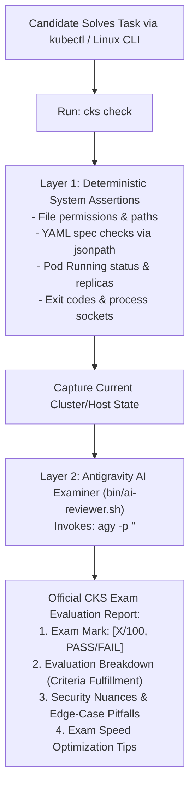

# 🛡️ CKS Real Exam 2026: Interactive Simulation Lab & Implementation Guide

**Breadcrumbs:** [[0-Index - Kubernetes|🏠 Kubernetes Reference MOC]] > [[0-Index - CKS|🛡️ CKS Reference MOC]] > [[Projects/CKS/Real Exam 2026 - 16 Question Simulation Lab Guide.md|🎯 Real Exam 2026 Lab Guide]] > **Lab Implementation README**

Welcome to the **Certified Kubernetes Security Specialist (CKS) Real Exam Simulation Lab**. This environment runs on Ubuntu 22.04 with a live `kubeadm` v1.32.13 cluster, engineered specifically to replicate the actual CKS exam environment with automated setup, deterministic validation, AI-powered examiner grading, and complete reset capabilities.

---

## 🔍 Inflow Sources Comparison: Are the Sources the Same or Different?

You provided two core exam files in the knowledge base:
1. `inflow/CKS_EXAM.md`
2. `inflow/cks_exam_notes.md`
*(Plus `inflow/CKS Notes.md` and the DevOps Tales "CKS 2026" YouTube Playlist: `https://www.youtube.com/playlist?list=PLyKswBedEWujChLpKK6zFj0S4MOUaxqR3`)*

### 1. Conceptual Alignment: 100% Identical Topic Scope
Both files cover the **exact same 16 real-world exam questions**. Every single question in `CKS_EXAM.md` has a direct corresponding entry in `cks_exam_notes.md`. They describe the identical set of exam tasks you faced.

### 2. Perspectives & Formatting Differences
Although the technical problems are identical, their **perspective, format, and content depth differ substantially**:

| Aspect | `inflow/CKS_EXAM.md` | `inflow/cks_exam_notes.md` |
| :--- | :--- | :--- |
| **Perspective** | **The Exam Problem Sheet / Specification** | **The Candidate's Terminal Scratchpad / Fix Playbook** |
| **Content Type** | Problem statements, high-level requirements, and constraints. | Raw terminal commands, exact CLI flags, and YAML snippets. |
| **Context & Sources** | Contains the DevOps Tales 2026 playlist link, scenario notes, and version numbers (e.g. Node upgrade 1.35/1.32 skew). | Contains raw interactive keystrokes (`vi /var/lib/...`, `gpasswd -d developer docker`). |
| **Troubleshooting & Diagnostics** | Describes high-level symptom (e.g. "Pods become compliant", "Fix insecure kubelet"). | Contains hard-won runtime diagnostics: `crictl ps -a \| grep kube-apiserver` and `k describe rs -n <ns> -> Ready: 0, error: 109`. |
| **Numbering Sequence** | 1 to 16 in exam task presentation order. | Numbered 1 to 16, but in a shuffled execution order. |

### 3. Detailed Cross-Source Mapping Matrix

| Lab Scenario | `inflow/CKS_EXAM.md` | `inflow/cks_exam_notes.md` | Key Differences & How They Were Synthesized |
| :---: | :---: | :---: | :--- |
| **Q01: Insecure Kubelet & etcd** | Item 1 | Item 3 | `CKS_EXAM.md` specifies the requirements (`anonymous-auth=false`, `--authorization-mode=Webhook`, `--client-cert-auth`). `cks_exam_notes.md` provides the exact file paths (`/var/lib/kubelet/config.yaml`), the daemon-reload commands, and the node verification step. |
| **Q02: TLS Secret Creation** | Item 2 | Item 8 | `CKS_EXAM.md` notes the secret is already referenced by a deployment. `cks_exam_notes.md` adds the exam trick of scaling the deployment to 0 replicas to avoid crash-loop thrashing while generating the secret. |
| **Q03: Dockerfile & Pod Security** | Item 3 | Item 9 | `CKS_EXAM.md` notes the couchdb image and exact UID 65535. `cks_exam_notes.md` provides the YAML securityContext keys (`readOnlyRootFilesystem: true`, `privileged: false`). |
| **Q04: Falco `/dev/mem` Detection** | Item 4 | Item 7 | `CKS_EXAM.md` writes the full Falco rule with `priority: WARNING` and tags. `cks_exam_notes.md` details how to test it with `sudo falco -r /etc/falco/falco_rules.local.yaml` or checking Falco service pods. |
| **Q05: Container Immutability** | Item 5 | Item 10 | `CKS_EXAM.md` defines UID 30000 and immutability. `cks_exam_notes.md` notes that this must be enforced across **2 containers** in the same pod specification. |
| **Q06: API Server Audit Logging** | Item 6 | Item 15 | `CKS_EXAM.md` specifies the multi-level audit policy (Metadata vs Request for prod deployments). `cks_exam_notes.md` emphasizes the critical volumeMounts in `kube-apiserver.yaml` and the `crictl logs` recovery command if the API server crashes. |
| **Q07: NetworkPolicy Ingress** | Item 7 | Item 14 | `CKS_EXAM.md` defines the policy rules. `cks_exam_notes.md` provides the complete declarative NetworkPolicy manifests for default-deny and namespaceSelector. |
| **Q08: Ingress HTTPS (Cilium/Nginx)** | Item 8 | Item 2 | `CKS_EXAM.md` contrasts Cilium (`ingress.cilium.io/force-https: "enabled"`) with Nginx (`ssl-redirect: "true"`). `cks_exam_notes.md` provides the exact curl verification command (`curl -k https://web.k8s.local:32001`). |
| **Q09: Projected SA Tokens** | Item 9 | Item 13 | `CKS_EXAM.md` provides the official documentation link for projected volumes. `cks_exam_notes.md` details setting `automountServiceAccountToken: false` on both the ServiceAccount and the Deployment. |
| **Q10: Node Drain & Upgrade** | Item 10 | Item 12 | `CKS_EXAM.md` specifies the exact drain flags (`--ignore-daemonsets --delete-emptydir-data --force`) and `apt-cache madison`. `cks_exam_notes.md` emphasizes version parity between `kubelet` and `kubectl`. |
| **Q11: SBOM Generation (`bom`)** | Item 11 | Item 11 | `CKS_EXAM.md` identifies `libcrypto3 3-15-0` in an Alpine image. `cks_exam_notes.md` gives the inspection command: `kubectl exec -n <ns> <pod> -c <container> -- apk list libcrypto` across all 3 containers. |
| **Q12: Restricted PSS & ReplicaSet** | Item 12 | Item 6 | `CKS_EXAM.md` outlines fixing the deployment under restricted PSS. `cks_exam_notes.md` reveals the diagnostic trap: `k describe rs -n <ns>` shows `Ready: 0, error: 109`, and details the 5 required fields (allowPrivilegeEscalation, drop ALL, runAsNonRoot, RuntimeDefault seccomp). |
| **Q13: Securing Docker Daemon** | Item 13 | Item 1 | `CKS_EXAM.md` specifies removing user from docker group and root socket ownership. `cks_exam_notes.md` details editing `/usr/lib/systemd/system/docker.socket` (SocketGroup=root) and removing `-H tcp://0.0.0.0:2375` from `docker.service`. |
| **Q14: Istio mTLS / Microsegmentation** | Item 14 | Item 4 | `CKS_EXAM.md` details mutual authentication requirements. `cks_exam_notes.md` provides the exact steps: label namespace `istio-injection=enabled --overwrite`, apply `PeerAuthentication` STRICT, and run `kubectl rollout restart`. |
| **Q15: ImagePolicyWebhook** | Item 15 | Item 5 | `CKS_EXAM.md` notes fail-closed admission. `cks_exam_notes.md` gives exact paths (`/etc/kubernetes/webhook/image-policy.yaml`), setting `defaultAllow: false`, and adding API server admission flags. |
| **Q16: API Server Auth & RBAC** | Item 16 | Item 16 | `CKS_EXAM.md` specifies `--anonymous-auth=false`, `Node,RBAC`, and `NodeRestriction`. `cks_exam_notes.md` specifies the exact edits to `/etc/kubernetes/manifests/kube-apiserver.yaml`. |

---

## 🏗️ Detailed Implementation Architecture

The simulation lab was implemented from the ground up on your VM to provide an authentic, isolated, and repeatable testing ground.

```
/home/karim/cks-exam-lab/
├── README.md               # Complete implementation and reference guide
├── bin/
│   ├── cks                 # Master CLI tool (symlinked to /usr/local/bin/cks)
│   └── ai-reviewer.sh      # AI evaluation engine powered by Antigravity CLI (agy -p)
├── q01-kubelet-etcd/       # Scenario 01
│   ├── question.md         # Formal exam problem statement & constraints
│   ├── setup.sh            # Injects broken/insecure state & creates backups
│   ├── validate.sh         # Runs deterministic checks + invokes AI reviewer
│   ├── solution.md         # Architecture explanation, commands & manifests
│   └── undo.sh             # Idempotent cleanup script
├── q02-tls-secret/         # Scenario 02
├── ...
└── q16-apiserver-auth/     # Scenario 16
```

---

### 1. Infrastructure Resuscitation & Node Preparation
Before questions could run, the underlying host and Kubernetes cluster required repair:
1. **Network Skew Resolution:**
   - The cluster was bootstrapped with IP `10.0.0.133`. When DHCP reassigned the VM to `10.0.0.134`, etcd failed to bind `10.0.0.133:2380` (`bind: cannot assign requested address`).
   - Added persistent IP alias `10.0.0.133/24` to NetworkManager connection `Wired connection 1`.
2. **API Server Certificate Regeneration:**
   - Regenerated `/etc/kubernetes/pki/apiserver.crt` using `kubeadm init phase certs apiserver --apiserver-cert-extra-sans 10.0.0.134,10.0.0.133` so both IPs validate cleanly under TLS.
3. **Kubeadm 1.29+ RBAC Binding:**
   - In modern kubeadm, `admin.conf` binds to `kubeadm:cluster-admins` rather than `system:masters`. Bound `kubeadm:cluster-admins` to the `cluster-admin` ClusterRole, restoring non-sudo `kubectl` operations for user `karim`.
4. **Networking & Essential Addons:**
   - Re-applied `CoreDNS` and `kube-proxy` via `kubeadm init phase addon all` and installed `Flannel` CNI daemonset.
5. **Security Binaries Installed:**
   - **`bom` (v0.8.0):** Downloaded official Kubernetes SIGs binary to `/usr/local/bin/bom`.
   - **`falco` (v0.45.0):** Installed via Falco APT repository with modern eBPF driver.
   - **`trivy` (v0.74.0):** Installed to `/usr/local/bin/trivy`.
   - **Ingress Classes:** Pre-created `nginx` and `cilium` IngressClasses.

---

### 2. The 5-File Scenario Standard

Each of the 16 scenarios strictly implements 5 standard files:

#### 1. `question.md`
- Formatted exactly like official Linux Foundation CKS exam prompts.
- Specifies **Context**, **Task Requirements**, **Rules & Constraints**, and **Expected State**.
- Cites the exact inflow files and video lectures where the question originated.

#### 2. `setup.sh`
- Backs up any critical system or manifest files to `/var/backups/cks/qXX/`.
- Injects the realistic broken or insecure starting state (e.g. insecure flags, misconfigured permissions, missing secrets, failing pods).
- Configures necessary namespaces, deployments, or host services.

#### 3. `validate.sh`
- **Part 1 (Deterministic Tests):** Executes rigid bash checks (JSONPath queries, grep filters, exit codes, process statuses, systemd states) and prints `[PASS]` or `[FAIL]`.
- **Part 2 (Antigravity AI Review):** Extracts the candidate's actual manifest/config/process state, packages the requirements, and pipes them into `bin/ai-reviewer.sh`.

#### 4. `undo.sh`
- Restores original backed-up configurations from `/var/backups/cks/qXX/`.
- Deletes created namespaces (`--ignore-not-found=true`), temporary files in `/opt/course/`, and test users.
- Idempotent and safe to run at any time.

#### 5. `solution.md`
- Contains deep-intuition architectural rationale ("Why this matters in production").
- Provides copy-pasteable terminal commands, dry-run formulas, and complete YAML manifests.
- Details the exact failure loops and debugging commands (`crictl`, `kubectl describe rs`).

---

### 3. The Dual-Layer Evaluation Engine (Deterministic + AI)

When you run `cks check <N>`, the script executes two validation layers:



#### Why Both Layers?
- **Deterministic Assertions** guarantee zero false positives on basic criteria (e.g., did the pod actually reach `Running`? Is the secret named correctly?).
- **Antigravity AI Examiner (`agy -p`)** provides human-examiner level feedback:
  - Detects subtle configuration omissions (e.g. omitting `defaultMode: 0400` on secret volumes, or forgetting `runAsNonRoot: true` alongside `runAsUser`).
  - Evaluates whether your solution would score full marks under Linux Foundation grading rubrics.
  - Suggests faster imperative CLI commands to save time during the real 2-hour exam.

---

### 4. The Master CLI Tool: `cks`

Installed globally at `/usr/local/bin/cks`, the master CLI provides simple commands:

| Command | Action |
| :--- | :--- |
| `cks list` | Formats a colorized overview of all 16 scenarios and their status (`READY`, `ACTIVE`, `SOLVED`). |
| `cks start <1-16>` | Runs `setup.sh` for that scenario, marks it `ACTIVE`, and prints the question prompt. |
| `cks check <1-16>` | Runs `validate.sh`, testing your solution and presenting the AI evaluation report. Marks `SOLVED` on pass. |
| `cks solve <1-16>` | Prints the complete step-by-step solution guide and architectural explanations from `solution.md`. |
| `cks undo <1-16>` | Runs `undo.sh`, returning the cluster/node to clean state and marking the scenario `READY`. |
| `cks reset-all` | Loops through all 16 questions and executes `undo.sh` on each one. |

---

## 🎯 Recommended Practice Protocol

To achieve 100% exam readiness, follow this study loop:

1. **SSH into the VM:**
   ```bash
   ssh karim@10.0.0.134
   ```
2. **Review all questions:**
   ```bash
   cks list
   ```
3. **Start a question:**
   ```bash
   cks start 12
   ```
4. **Attempt to solve it:**
   Use standard exam techniques (`kubectl`, `vi`, `systemctl`).
5. **Validate and receive AI feedback:**
   ```bash
   cks check 12
   ```
6. **Review the solution guide:**
   ```bash
   cks solve 12
   ```
7. **Clean up and reset:**
   ```bash
   cks undo 12
   ```
8. **Repeat until you can solve all 16 scenarios from memory in under 6 minutes each!**
