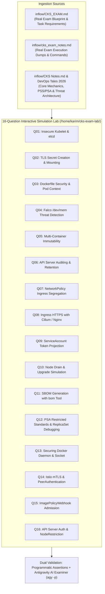

# 🛡️ CKS Real Exam 2026: 16-Question Interactive Simulation Lab Guide

**Breadcrumbs:** [[0-Index - Kubernetes|🏠 Kubernetes Reference MOC]] > [[0-Index - CKS|🛡️ CKS Reference MOC]] > **Real Exam 2026 Simulation Lab**

> [!IMPORTANT]
> **Live VM Simulation Environment:**
> All 16 exam scenarios in this guide are pre-deployed, automated, and ready for hands-on drill on the dedicated Ubuntu node at `karim@10.0.0.134`.
> 
> The lab is driven by the master CLI tool **`cks`** installed directly on the VM:
> - `cks list`: Displays all 16 scenarios and current status (`READY`, `ACTIVE`, `SOLVED`).
> - `cks start <1-16>`: Injects the broken/insecure configuration and activates the question.
> - `cks check <1-16>`: Runs programmatic verification tests + **Antigravity AI Examiner evaluation** (`agy -p`) with score, feedback, and speed tips.
> - `cks solve <1-16>`: Displays the complete solution guide, manifests, and command formulas.
> - `cks undo <1-16>`: Completely cleans up the question and returns the system to pristine state.
> - `cks reset-all`: Resets all 16 questions.

---

## 🏛️ Exam Blueprint & Master Scenario Correlation

Every question in this lab originates directly from real exam tasks documented in the 3 inflow knowledge sources:



---

## 📋 Comprehensive Scenario Breakdown (Questions 1 to 16)

---

### 🔹 Question 01: Fix Insecure Kubelet and etcd Configuration
* **Directory:** `/home/karim/cks-exam-lab/q01-kubelet-etcd/`
* **Domain:** Cluster Hardening & CIS Benchmarks
* **Source References:** `CKS_EXAM.md` (Item 1), `cks_exam_notes.md` (Item 3), `CKS Notes.md`
* **Related Core Reference:** [[Reference Notes/0-7-8_cluster_hardening_cis_benchmarks_and_upgrades.md|Module 0-7-8: CIS Benchmarks & Kubelet Hardening]]

#### Problem Statement
A CIS Kubernetes Benchmark audit has identified critical vulnerabilities on the control plane and node components:
1. The Kubelet agent accepts unauthenticated anonymous requests and does not delegate authorization to the API Server.
2. The etcd datastore accepts unauthenticated client TLS connections.

Modify `/var/lib/kubelet/config.yaml` to disable anonymous auth (`enabled: false`), enable webhook auth (`enabled: true`), and set authorization mode to `Webhook`. Reload systemd and restart Kubelet. In `/etc/kubernetes/manifests/etcd.yaml`, enforce `--client-cert-auth=true`.

#### Deep Intuition & AARF Analysis
* **The Answer:**
  ```bash
  # 1. Edit /var/lib/kubelet/config.yaml
  sudo vi /var/lib/kubelet/config.yaml
  # authentication.anonymous.enabled: false
  # authentication.webhook.enabled: true
  # authorization.mode: Webhook

  # 2. Reload and restart
  sudo systemctl daemon-reload && sudo systemctl restart kubelet

  # 3. Edit /etc/kubernetes/manifests/etcd.yaml
  # Ensure --client-cert-auth=true
  ```
* **The Assumptions:** The cluster is bootstrapped with Kubeadm, and API server has certificates ready to handle Kubelet SubjectAccessReview requests.
* **The Rationale (Why):** Without webhook authorization, any request reaching Kubelet port `10250` can run arbitrary commands via `/run/<ns>/<pod>/<container>`. Delegating to Webhook forces RBAC authorization on node endpoints.
* **The Failure Loop (What if not):** Unauthenticated attackers on the node network can dump secrets, inject cryptominers, or execute remote code inside pods without hitting the API server audit logs.

---

### 🔹 Question 02: Create and Mount Ingress TLS Secret
* **Directory:** `/home/karim/cks-exam-lab/q02-tls-secret/`
* **Domain:** Cluster Hardening & PKI
* **Source References:** `CKS_EXAM.md` (Item 2), `cks_exam_notes.md` (Item 8), `CKS Notes.md`
* **Related Core Reference:** [[Reference Notes/0-7-1_rbac_service_accounts_and_certificates.md|Module 0-7-1: RBAC, ServiceAccounts & PKI]]

#### Problem Statement
A secure deployment named `secure-app` in namespace `staging-sec` is failing to start (`CreateContainerConfigError`) because its volume references a TLS secret named `app-tls-secret` that does not exist in that namespace. Use the certificate at `/opt/course/tls/app.crt` and key at `/opt/course/tls/app.key` to create the secret and restore pod health.

#### Deep Intuition & AARF Analysis
* **The Answer:**
  ```bash
  kubectl create secret tls app-tls-secret \
    -n staging-sec \
    --cert=/opt/course/tls/app.crt \
    --key=/opt/course/tls/app.key
  ```
* **The Assumptions:** Target namespace `staging-sec` exists; certificate and key are valid PEM-encoded RSA/ECDSA pairs.
* **The Rationale (Why):** Kubernetes secrets are namespaced. A secret in `default` cannot be mounted by workloads in `staging-sec`. `kubernetes.io/tls` secret types strictly map `tls.crt` and `tls.key`.
* **The Failure Loop (What if not):** Pods remain permanently stuck in `CreateContainerConfigError` or `ContainerCreating`.

---

### 🔹 Question 03: Dockerfile Security Best Practices & Pod Immutability
* **Directory:** `/home/karim/cks-exam-lab/q03-dockerfile-security/`
* **Domain:** Supply Chain & Workload Hardening
* **Source References:** `CKS_EXAM.md` (Item 3), `cks_exam_notes.md` (Item 9), `CKS Notes.md`
* **Related Core Reference:** [[Reference Notes/0-7-5_supply_chain_security_and_imagepolicywebhook.md|Module 0-7-5: Supply Chain Security]]

#### Problem Statement
A containerized service and its Kubernetes Deployment have failed security review. The Dockerfile builds an image running as root, and the Deployment allows privilege escalation and root filesystem modification.
1. Update `/opt/course/docker/Dockerfile` to set `USER nobody` (or UID `65534`).
2. Update `/opt/course/docker/deployment.yaml` to enforce `runAsUser: 65535`, `readOnlyRootFilesystem: true`, `privileged: false`, and `allowPrivilegeEscalation: false`.
3. Apply to namespace `production-workloads`.

#### Deep Intuition & AARF Analysis
* **The Answer:**
  ```dockerfile
  # Dockerfile
  FROM alpine:3.19
  USER nobody
  CMD ["sleep", "3600"]
  ```
  ```yaml
  # deployment.yaml
  spec:
    template:
      spec:
        containers:
        - name: couchdb
          image: alpine:latest
          securityContext:
            runAsUser: 65535
            readOnlyRootFilesystem: true
            privileged: false
            allowPrivilegeEscalation: false
  ```
* **The Rationale (Why):** `readOnlyRootFilesystem: true` blocks attackers from dropping webshells or modifying `/etc/passwd`. `allowPrivilegeEscalation: false` sets `no_new_privs` on Linux kernel level, disabling SUID binaries.

---

### 🔹 Question 04: Detect /dev/mem Access Using Falco
* **Directory:** `/home/karim/cks-exam-lab/q04-falco-dev-mem/`
* **Domain:** Runtime Security & Threat Forensics
* **Source References:** `CKS_EXAM.md` (Item 4), `cks_exam_notes.md` (Item 7), DevOps Tales Video 5
* **Related Core Reference:** [[Reference Notes/0-7-6_runtime_security_falco_and_audit_logging.md|Module 0-7-6: Runtime Security, Falco eBPF & Auditing]]

#### Problem Statement
A compromised workload in namespace `threat-zone` is attempting kernel memory inspection by accessing `/dev/mem`.
1. Append a custom Falco rule to `/etc/falco/falco_rules.local.yaml`:
   ```yaml
   - rule: Detect /dev/mem Access
     desc: Alert when any process opens /dev/mem
     condition: container and open_read and fd.name = "/dev/mem"
     output: "Suspicious /dev/mem access (pod=%k8s.pod.name ns=%k8s.ns.name user=%user.name cmd=%proc.cmdline file=%fd.name)"
     priority: WARNING
     tags: [filesystem, mitre_discovery]
   ```
2. Identify the compromised pod in namespace `threat-zone` triggering this alert.
3. Scale the offending Deployment down to 0 replicas.

#### Deep Intuition & AARF Analysis
* **The Answer:** Add rule to `/etc/falco/falco_rules.local.yaml`. Check pods in `threat-zone`: `rogue-inspector` is executing `/dev/mem` reads. Scale down:
  ```bash
  kubectl scale deploy -n threat-zone rogue-inspector --replicas=0
  ```
* **The Rationale (Why):** `/dev/mem` provides direct physical RAM access, allowing rootkit installation and private key harvesting directly from memory buffers.

---

### 🔹 Question 05: Multi-Container Immutability & Least Privilege
* **Directory:** `/home/karim/cks-exam-lab/q05-container-immutability/`
* **Domain:** Workload Hardening & Kernel Isolation
* **Source References:** `CKS_EXAM.md` (Item 5), `cks_exam_notes.md` (Item 10), `CKS Notes.md`
* **Related Core Reference:** [[Reference Notes/0-7-9_workload_kernel_isolation_seccomp_apparmor_and_capabilities.md|Module 0-7-9: Workload Kernel Isolation]]

#### Problem Statement
Harden the multi-container deployment `analytics-collector` in namespace `data-platform`. Both containers (`collector` and `aggregator`) must run with `runAsUser: 30000`, `readOnlyRootFilesystem: true`, and `allowPrivilegeEscalation: false`.

#### Deep Intuition & AARF Analysis
* **The Answer:**
  ```yaml
  securityContext:
    runAsUser: 30000
    readOnlyRootFilesystem: true
    allowPrivilegeEscalation: false
  ```
* **The Exam Pitfall:** Candidates often configure `securityContext` on only one container or place container-level fields (like `readOnlyRootFilesystem`) under `pod.spec.securityContext` where they are invalid.

---

### 🔹 Question 06: API Server Audit Logging Engine & Retention
* **Directory:** `/home/karim/cks-exam-lab/q06-audit-logging/`
* **Domain:** Cluster Logging, Auditing & Forensics
* **Source References:** `CKS_EXAM.md` (Item 6), `cks_exam_notes.md` (Item 15), `CKS Notes.md`
* **Related Core Reference:** [[Reference Notes/0-7-6_runtime_security_falco_and_audit_logging.md|Module 0-7-6: Runtime Security & API Auditing]]

#### Problem Statement
Configure the Kubernetes API Server audit logging engine:
1. Create `/etc/kubernetes/audit/policy.yaml`:
   - Stage 1: `namespaces` at `Metadata`.
   - Stage 2: `deployments` in namespace `prod` at `Request`.
   - Stage 3: `secrets` and `configmaps` at `Metadata`.
   - Stage 4: Catch-all at `Metadata`.
2. Configure `/etc/kubernetes/manifests/kube-apiserver.yaml` with `--audit-log-path=/var/log/kubernetes/audit/audit.log`, `--audit-policy-file=/etc/kubernetes/audit/policy.yaml`, `--audit-log-maxage=10`, `--audit-log-maxbackup=2`.
3. Configure `hostPath` volumes and `volumeMounts` for `/etc/kubernetes/audit` and `/var/log/kubernetes/audit`.
4. Ensure the API server restarts cleanly.

#### Deep Intuition & AARF Analysis
* **The Crash Recovery Trick:** If the API Server enters CrashLoopBackOff, `kubectl` will return `connection refused`. Immediately run:
  ```bash
  sudo crictl ps -a | grep kube-apiserver
  sudo crictl logs <container-id>
  ```
  This reveals syntax or missing volumeMount errors instantly.

---

### 🔹 Question 07: Namespace Ingress Traffic Segregation
* **Directory:** `/home/karim/cks-exam-lab/q07-network-policy/`
* **Domain:** Network Security & Isolation
* **Source References:** `CKS_EXAM.md` (Item 7), `cks_exam_notes.md` (Item 14), `CKS Notes.md`
* **Related Core Reference:** [[Reference Notes/0-7-3_network_policies_and_traffic_segregation.md|Module 0-7-3: NetworkPolicies & Traffic Segregation]]

#### Problem Statement
In namespace `isolated-apps`:
1. Create NetworkPolicy `default-deny-ingress` that blocks all incoming traffic to all pods (`podSelector: {}`, `policyTypes: [Ingress]`).
2. Create NetworkPolicy `allow-ns-ingress` allowing incoming TCP traffic on port `8080` ONLY from pods in namespaces labeled `access: allowed`.

#### Deep Intuition & AARF Analysis
* **The Answer:**
  ```yaml
  # default-deny-ingress.yaml
  apiVersion: networking.k8s.io/v1
  kind: NetworkPolicy
  metadata:
    name: default-deny-ingress
    namespace: isolated-apps
  spec:
    podSelector: {}
    policyTypes:
    - Ingress
  ---
  # allow-ns-ingress.yaml
  apiVersion: networking.k8s.io/v1
  kind: NetworkPolicy
  metadata:
    name: allow-ns-ingress
    namespace: isolated-apps
  spec:
    podSelector: {}
    policyTypes:
    - Ingress
    ingress:
    - from:
      - namespaceSelector:
          matchLabels:
            access: allowed
      ports:
      - protocol: TCP
        port: 8080
  ```

---

### 🔹 Question 08: Expose HTTPS via Ingress (Cilium / Nginx)
* **Directory:** `/home/karim/cks-exam-lab/q08-ingress-tls/`
* **Domain:** Ingress Security & TLS Termination
* **Source References:** `CKS_EXAM.md` (Item 8), `cks_exam_notes.md` (Item 2), DevOps Tales Video 2
* **Related Core Reference:** [[Reference Notes/0-9-3_ingress_controllers_and_gateway_api.md|Module 0-9-3: Ingress Controllers & TLS Termination]]

#### Problem Statement
Create an Ingress named `web-ingress` in namespace `web-tier` routing host `kodekloud.com` path `/` to Service `web-svc:80`. Terminate TLS using secret `web-secret`. Ensure the force-HTTPS annotation is configured:
- For Cilium: `ingress.cilium.io/force-https: "enabled"`
- For Nginx: `nginx.ingress.kubernetes.io/ssl-redirect: "true"`

#### Deep Intuition & AARF Analysis
* **Exam Speed Formula:**
  ```bash
  kubectl create ingress web-ingress -n web-tier \
    --class=cilium \
    --rule="kodekloud.com/*=web-svc:80,tls=web-secret" \
    --dry-run=client -o yaml > ing.yaml
  ```
  Add the controller annotation to `metadata.annotations` and apply.

---

### 🔹 Question 09: ServiceAccount Token Projection & Auto-Mount Hardening
* **Directory:** `/home/karim/cks-exam-lab/q09-serviceaccount-token/`
* **Domain:** Identity & Access Management (Least Privilege)
* **Source References:** `CKS_EXAM.md` (Item 9), `cks_exam_notes.md` (Item 13), `CKS Notes.md`
* **Related Core Reference:** [[Reference Notes/0-7-1_rbac_service_accounts_and_certificates.md|Module 0-7-1: RBAC & Bound Token Projection]]

#### Problem Statement
In namespace `automation`, disable automatic token mounting on ServiceAccount `bot-sa` and Deployment `bot-worker`. Manually project an audience-bound token with `expirationSeconds: 3600` into the container at mount path `/var/run/secrets/tokens` (read-only).

#### Deep Intuition & AARF Analysis
* **The Answer:**
  ```yaml
  spec:
    template:
      spec:
        automountServiceAccountToken: false
        serviceAccountName: bot-sa
        containers:
        - name: worker
          image: alpine:latest
          volumeMounts:
          - mountPath: /var/run/secrets/tokens
            name: token-vol
            readOnly: true
        volumes:
        - name: token-vol
          projected:
            sources:
            - serviceAccountToken:
                expirationSeconds: 3600
                path: token
  ```

---

### 🔹 Question 10: Worker Node Maintenance and Upgrade Simulation
* **Directory:** `/home/karim/cks-exam-lab/q10-node-upgrade/`
* **Domain:** Cluster Maintenance & Upgrades
* **Source References:** `CKS_EXAM.md` (Item 10), `cks_exam_notes.md` (Item 12), `CKS Notes.md`
* **Related Core Reference:** [[Reference Notes/0-7-8_cluster_hardening_cis_benchmarks_and_upgrades.md|Module 0-7-8: CIS Benchmarks & Cluster Upgrades]]

#### Problem Statement
Safely drain node `karim-codemonarch` (`--ignore-daemonsets --delete-emptydir-data --force`), simulate package upgrades (`kubeadm upgrade node`, kubelet, kubectl), restart kubelet, and uncordon the node.

---

### 🔹 Question 11: SBOM Generation & Vulnerability Discovery (bom Tool)
* **Directory:** `/home/karim/cks-exam-lab/q11-sbom-bom-tool/`
* **Domain:** Supply Chain Security & Software Bill of Materials
* **Source References:** `CKS_EXAM.md` (Item 11), `cks_exam_notes.md` (Item 11), DevOps Tales 2026
* **Related Core Reference:** [[Reference Notes/0-7-5_supply_chain_security_and_imagepolicywebhook.md|Module 0-7-5: Supply Chain Security & SBOM]]

#### Problem Statement
A multi-container microservice `supply-chain-app` in namespace `supply-chain` runs three containers (`frontend`, `cache-proxy`, `worker`).
1. Inspect running containers via `kubectl exec` running `apk list libcrypto` to find which container runs vulnerable `libcrypto3 3-15-0`.
2. Remove the vulnerable container (`cache-proxy`) from the Deployment.
3. Generate an SPDX Software Bill of Materials (SBOM) for the approved image using `bom`:
   ```bash
   bom generate --image alpine:latest -o /opt/course/sbom/app.spdx
   ```

---

### 🔹 Question 12: Pod Security Admission (PSA) Restricted Standards & ReplicaSet Debugging
* **Directory:** `/home/karim/cks-exam-lab/q12-restricted-pss/`
* **Domain:** Workload Isolation & Pod Security Standards
* **Source References:** `CKS_EXAM.md` (Item 12), `cks_exam_notes.md` (Item 6), `CKS Notes.md`, DevOps Tales Video 4
* **Related Core Reference:** [[Reference Notes/0-7-2_pod_security_standards_and_admission.md|Module 0-7-2: Pod Security Standards & Admission]]

#### Problem Statement
Namespace `restricted-zone` enforces `pod-security.kubernetes.io/enforce: restricted`. A deployment `payment-processor` has 0 available replicas because the ReplicaSet fails admission (`error: 109`).
Diagnose via `kubectl describe rs -n restricted-zone` and update the container `securityContext` to satisfy all 5 Restricted requirements:
1. `allowPrivilegeEscalation: false`
2. `capabilities.drop: ["ALL"]`
3. `runAsNonRoot: true`
4. `runAsUser: 1000`
5. `seccompProfile.type: RuntimeDefault`

---

### 🔹 Question 13: Securing the Docker Daemon and Unix Socket Permissions
* **Directory:** `/home/karim/cks-exam-lab/q13-secure-docker/`
* **Domain:** Host OS Hardening & Socket Isolation
* **Source References:** `CKS_EXAM.md` (Item 13), `cks_exam_notes.md` (Item 1), DevOps Tales Video 1
* **Related Core Reference:** [[Reference Notes/0-7-7_host_operating_system_and_node_hardening.md|Module 0-7-7: Host Operating System & Node Hardening]]

#### Problem Statement
1. Remove unauthorized user `developer` from group `docker`: `gpasswd -d developer docker`.
2. Ensure `/var/run/docker.sock` is owned by group `root` (set `SocketGroup=root` in `/lib/systemd/system/docker.socket`).
3. Remove unauthenticated remote TCP listener (`-H tcp://0.0.0.0:2375`) in `docker.service`.
4. Reload systemd and restart `docker.socket` and `docker.service`.
5. Verify port 2375 is closed (`netstat -tulpn | grep 2375`).

---

### 🔹 Question 14: Microsegmentation: Istio Mutual TLS (mTLS)
* **Directory:** `/home/karim/cks-exam-lab/q14-istio-mtls/`
* **Domain:** Microsegmentation & Traffic Encryption
* **Source References:** `CKS_EXAM.md` (Item 14), `cks_exam_notes.md` (Item 4), `CKS Notes.md`
* **Related Core Reference:** [[Reference Notes/0-7-a_tls_and_mtls_handshake_troubleshooting_lecture.md|Module 0-7-a: TLS & mTLS Handshake Troubleshooting]]

#### Problem Statement
1. Label namespace `finance-mesh` for automatic sidecar injection: `kubectl label ns finance-mesh istio-injection=enabled --overwrite`.
2. Apply `PeerAuthentication` policy named `default` in namespace `finance-mesh` enforcing `STRICT` mode.
3. Rollout restart deployment: `kubectl rollout restart deployment -n finance-mesh ledger-service`.

---

### 🔹 Question 15: Dynamic Admission Control: ImagePolicyWebhook Configuration
* **Directory:** `/home/karim/cks-exam-lab/q15-image-policy-webhook/`
* **Domain:** Supply Chain & Admission Controllers
* **Source References:** `CKS_EXAM.md` (Item 15), `cks_exam_notes.md` (Item 5), `CKS Notes.md`
* **Related Core Reference:** [[Reference Notes/0-7-5_supply_chain_security_and_imagepolicywebhook.md|Module 0-7-5: Supply Chain Security & ImagePolicyWebhook]]

#### Problem Statement
Configure API server admission control with `/etc/kubernetes/webhook/admission-config.yaml` specifying `ImagePolicyWebhook` with fail-closed policy (`defaultAllow: false`). Add `--enable-admission-plugins=...,ImagePolicyWebhook` and `--admission-control-config-file=/etc/kubernetes/webhook/admission-config.yaml`. Mount host directory `/etc/kubernetes/webhook` into `kube-apiserver`.

---

### 🔹 Question 16: Kube-APIServer Authentication, Authorization and Admission Hardening
* **Directory:** `/home/karim/cks-exam-lab/q16-apiserver-auth/`
* **Domain:** Control Plane Hardening & API Security
* **Source References:** `CKS_EXAM.md` (Item 16), `cks_exam_notes.md` (Item 16), `CKS Notes.md`, Video 8
* **Related Core Reference:** [[Reference Notes/0-1_kube_api_and_kubectl.md|Module 0-1: API Server Mechanics & kubectl]]

#### Problem Statement
In `/etc/kubernetes/manifests/kube-apiserver.yaml`:
1. Disable anonymous access: `--anonymous-auth=false`.
2. Set authorization mode: `--authorization-mode=Node,RBAC`.
3. Enable `NodeRestriction` admission controller: `--enable-admission-plugins=NodeRestriction`.
4. Verify the API server restarts and responds cleanly to authenticated requests.

---

## 🛠️ Step-by-Step Study & Hands-On Practice Protocol

Follow this workflow to master all 16 questions on your Ubuntu VM:

1. **Connect to the VM:**
   ```bash
   ssh karim@10.0.0.134
   ```
2. **List all scenarios:**
   ```bash
   cks list
   ```
3. **Select and start a scenario:**
   ```bash
   cks start 1
   ```
   *(This injects the broken state, prints the exact question statement, and arms the scenario)*
4. **Attempt to solve it:**
   Run the necessary `kubectl`, Linux, or configuration commands.
5. **Validate and get AI feedback:**
   ```bash
   cks check 1
   ```
   *(Runs automated assertions + Antigravity AI review giving your official CKS exam score and speed tips)*
6. **Inspect the official solution (if stuck):**
   ```bash
   cks solve 1
   ```
7. **Clean up and reset for repetition:**
   ```bash
   cks undo 1
   ```
   *(Restores all backups and cleanly deletes temporary namespaces and files)*
8. **Repeat until you can solve all 16 scenarios smoothly under exam time conditions!**
