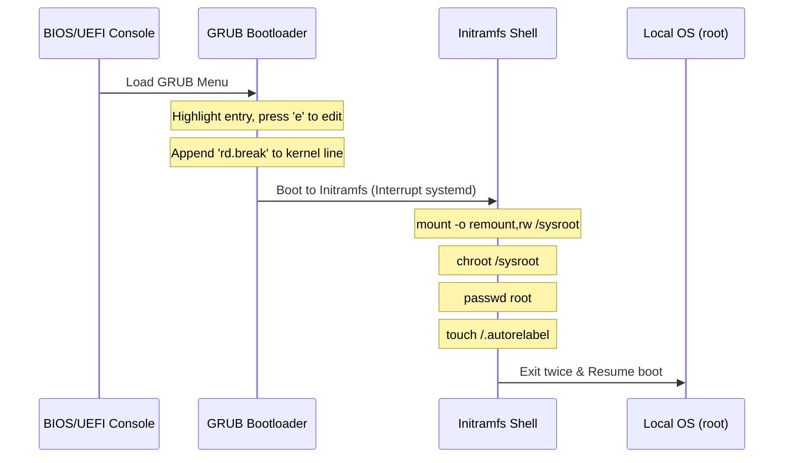

# Project: GRUB Boot Security & Root Password Recovery

**Breadcrumbs:** [[8-Index - Linux and OS|🏠 Linux and OS Index]] > **Projects** > **GRUB Boot Security & Root Password Recovery**

---

## 🎯 Project Objective
This playbook covers boot security hardening and administrative rescue procedures. It walks through configuring bootloader password protections and executing system password recovery using the kernel break execution pipeline.

---

## 💻 Scenario
1.  **Security Mandate:** The company requires that modifying kernel boot parameters in the GRUB menu must be password-protected to prevent unauthorized access.
2.  **Emergency Ticket:** An administrator has lost the root password to a production RHEL node. You must recover access using only console access and the bootloader rescue console.

---

## 🛠️ Step-by-Step Implementation

### Part 1: Locking Down the GRUB2 Bootloader
Secure the GRUB configuration from unauthorized parameter manipulation.
```bash
# 1. Generate a secure PBKDF2 hash of the password (e.g. "SecurePass1!")
# This will output a string starting with grub.pbkdf2.sha512...
grub2-mkpasswd-pbkdf2

# 2. Backup grub configuration files
cp /etc/grub.d/40_custom /etc/grub.d/40_custom.bak

# 3. Add credentials to custom configuration file
# Append user mappings at the end of /etc/grub.d/40_custom:
cat <<EOF >> /etc/grub.d/40_custom
set superusers="admin"
password_pbkdf2 admin grub.pbkdf2.sha512.10000.E4A2... [Insert hash output here]
EOF

# 4. Rebuild the main GRUB configuration file
# On legacy BIOS systems:
grub2-mkconfig -o /boot/grub2/grub.cfg

# On UEFI systems:
grub2-mkconfig -o /boot/efi/EFI/redhat/grub.cfg
```

---

### Part 2: Emergency Root Password Recovery (`rd.break`)
If the root password is lost, execute console recovery using these manual steps:



1.  **Interrupt Boot Sequence:**
    *   Reboot the host system.
    *   On the GRUB kernel selection list, highlight target kernel and press `e` to enter Edit Mode.
    *   Locate the line starting with `linux16` or `linux` (this line contains parameters like `ro crashkernel=auto ...`).
    *   Append `rd.break` at the very end of this line.
    *   Press `Ctrl + x` to boot into the rescue console.

2.  **Mount and Re-label Filesystem:**
    ```sh
    # Re-mount host filesystem (mapped to /sysroot) with read-write permissions
    mount -o remount,rw /sysroot

    # Change root context to sysroot
    chroot /sysroot

    # Update root password credentials
    passwd root

    # Trigger SELinux context synchronization during next boot cycle
    # (If skipped, SELinux prevents system logins under modified user records)
    touch /.autorelabel

    # Exit the chroot redirection shell
    exit

    # Exit the initramfs shell to resume boot execution
    exit
    ```

---

## 🔬 Verification & Diagnostics
1.  **Verify Boot Password Lockout:**
    *   Reboot the host.
    *   Highlight the default kernel entry in the GRUB menu and press `e`.
    *   *Result:* The terminal should block and prompt for username and password (`admin` / `SecurePass1!`) before displaying the configuration screen.
2.  **Verify Password Recovery:**
    *   Allow the system to boot to login prompt.
    *   Authenticate as `root` using the newly configured password.
    *   Verify SELinux status: `sestatus` (should be `Enforcing`).
