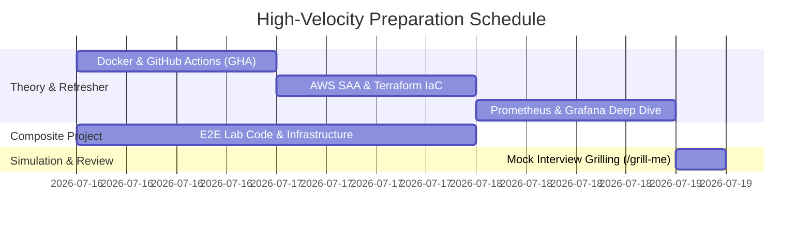

# Project: PwC ETIC DevOps Senior Associate Interview Preparation

**Breadcrumbs:** [[Main Notes/0-Index|🏠 Index]] > Projects > **PwC ETIC DevOps Interview Roadmap**

---

## 🎯 Plan Overview
This workspace is dedicated to preparing Karim Ashour for the **PwC ETIC Platform & Cloud DevOps Senior Associate** interview on **Sunday, July 19th, 2026**. 

The preparation is designed around active recall, theory distillation, and a **comprehensive E2E hands-on project** integrating:
1.  **Docker:** Multi-stage secure packaging.
2.  **GitHub Actions:** Secure CI/CD DevSecOps pipeline (Trivy scanner, ECR push).
3.  **AWS & Terraform:** Custom VPC, Security Groups, IAM Roles, EC2, and ECR.
4.  **Prometheus & Grafana:** Python Flask application instrumentation, Prometheus scraping, Grafana visualization, and custom alerting.

---

## 📅 High-Velocity Study Timeline (July 16th – July 19th)



### 🗓️ Day 1: Docker & GitHub Actions (Thursday, July 16)
*   **Focus:** Core containerization primitives, secure building, and DevSecOps pipelines.
*   **Action Items:**
    1.  Study the distilled theory in `Theory - Distilled DevOps Refreshers.md#1-docker-primitives-and-security`.
    2.  Write a secure, non-root multi-stage Dockerfile for the target Flask application.
    3.  Configure a GitHub Actions workflow with Trivy container image scanning and AWS authentication.
*   **References:** [[Reference Notes/2-Index - Docker]], [[Reference Notes/9-Index - GitHub Actions]].

### 🗓️ Day 2: AWS (SAA) & Terraform IaC (Friday, July 17)
*   **Focus:** Networking (VPC), Identity & Access Management (IAM), and automating infrastructure.
*   **Action Items:**
    1.  Study VPC designs, IAM trust policies, and ECR configuration.
    2.  Write Terraform manifests configuring a private/public subnet VPC, security groups, and an EC2 instance acting as the deployment target.
    3.  Configure Terraform S3 Remote State backend with DynamoDB locking.
*   **References:** [[Reference Notes/3-Index - AWS]], [[Reference Notes/10-Index - Terraform on AWS]].

### 🗓️ Day 3: Prometheus & Grafana Observability (Saturday, July 18)
*   **Focus:** Scraping architectures, PromQL calculations, metrics exposition, and Grafana dashboarding.
*   **Action Items:**
    1.  Study Prometheus pull-model metrics exposition format.
    2.  Instrument the Flask app with the `prometheus_client` library (counters and histograms).
    3.  Deploy Prometheus and Grafana using Docker Compose, scrape the Flask app, write basic PromQL gauges (e.g., CPU, HTTP request latency rate), and build a custom Grafana dashboard.
*   **References:** [[Reference Notes/8-6_monitoring_logs_and_diagnostics]], [[Reference Notes/0-14_cluster_administration_and_observability]].

### 🗓️ Day 4: Mock Interview & Active Recall (Sunday, July 19 - Morning)
*   **Focus:** Simulating the PwC Professional Framework, dry-run questions, and resolving gaps.
*   **Action Items:**
    1.  Trigger the `/grill-me` command to start an interactive question-and-answer session.
    2.  PwC Professional Framework alignment review (Technical & Digital, Whole Leadership, Relationships).

---

## 🛠️ The E2E Composite Project Structure
All hands-on code, configurations, and deployment playbooks for the interview preparation project are stored in:
- **[[Project - End-to-End Clustered Observability Stack]]**

This project integrates the full pipeline from code push to AWS hosting and live telemetry tracking:

```
[ Developer Push ] ──> [ GitHub Actions (Trivy Scan & Build) ] ──> [ Amazon ECR ]
                                                                        │
                                                                  (docker pull)
                                                                        ▼
[ AWS Custom VPC ] ────────────────────────────────────────> [ EC2 Host Target ]
  ├── Public Subnets (NAT / Internet Gateways)                 ├── Flask App Container
  └── Private Subnets (EC2 instances)                          ├── Prometheus Container
                                                               └── Grafana Dashboard
```
